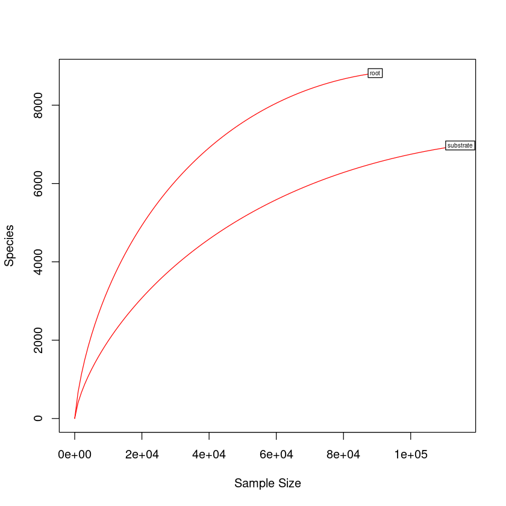
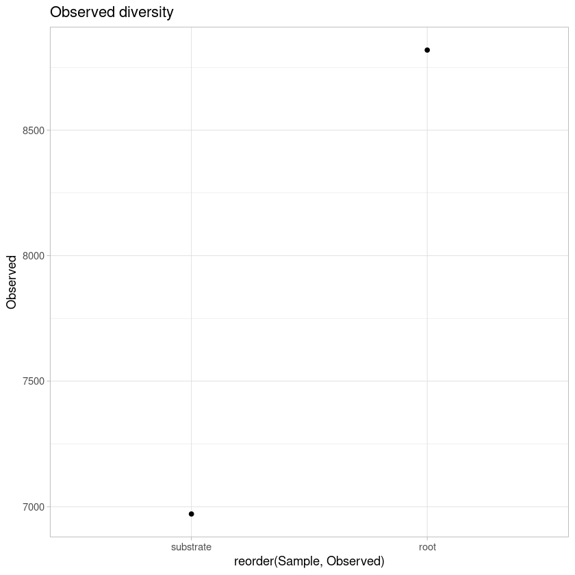
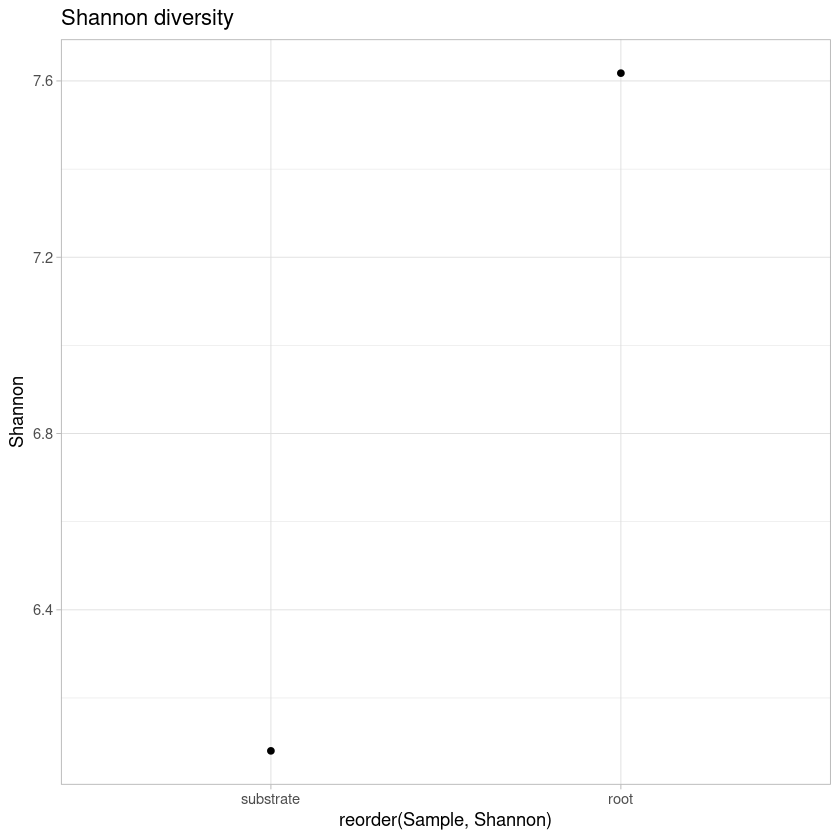
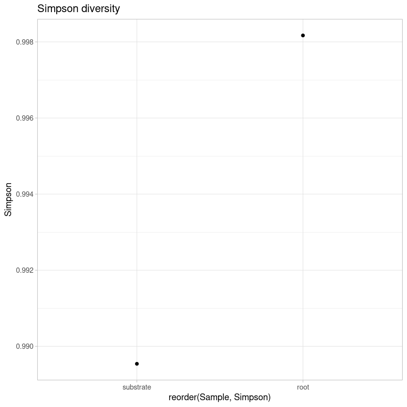
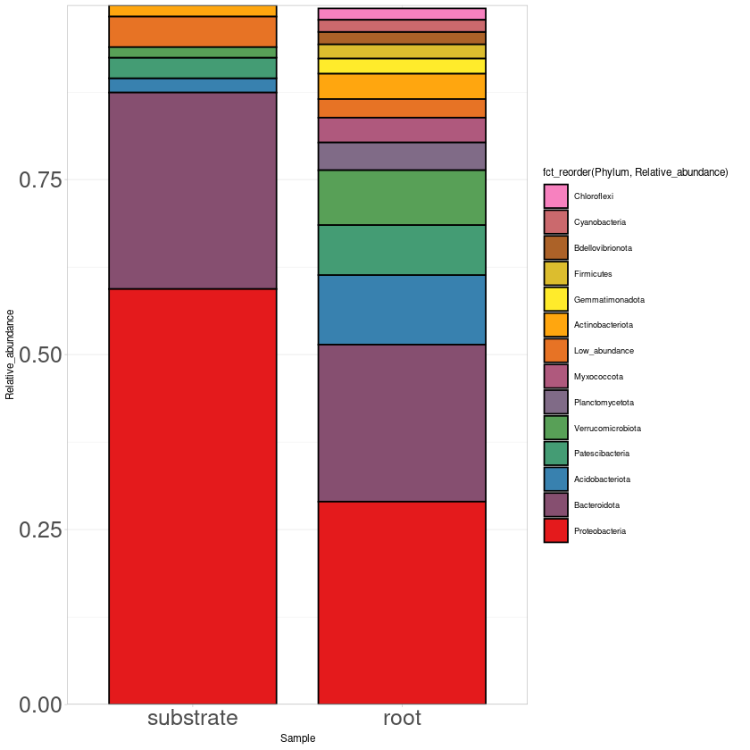
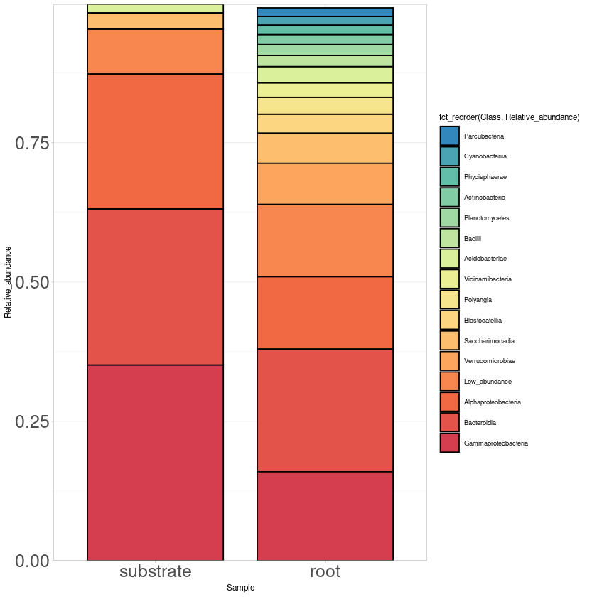
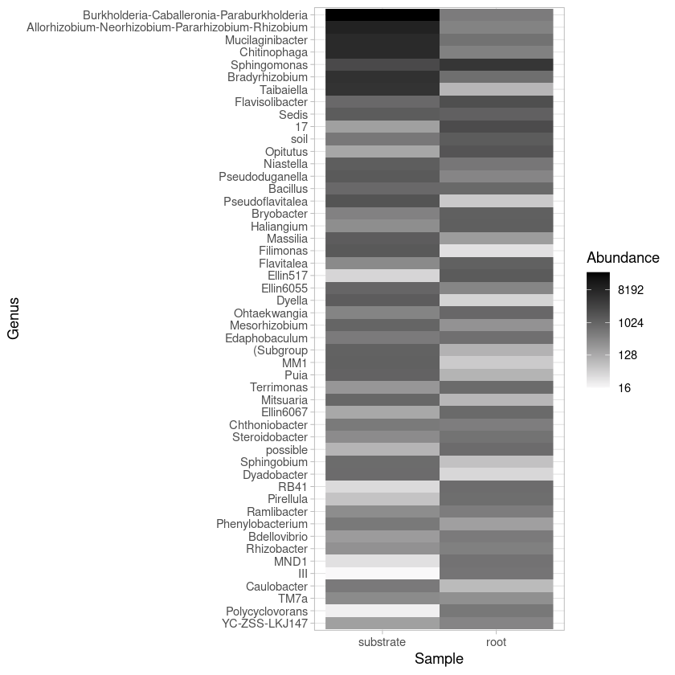
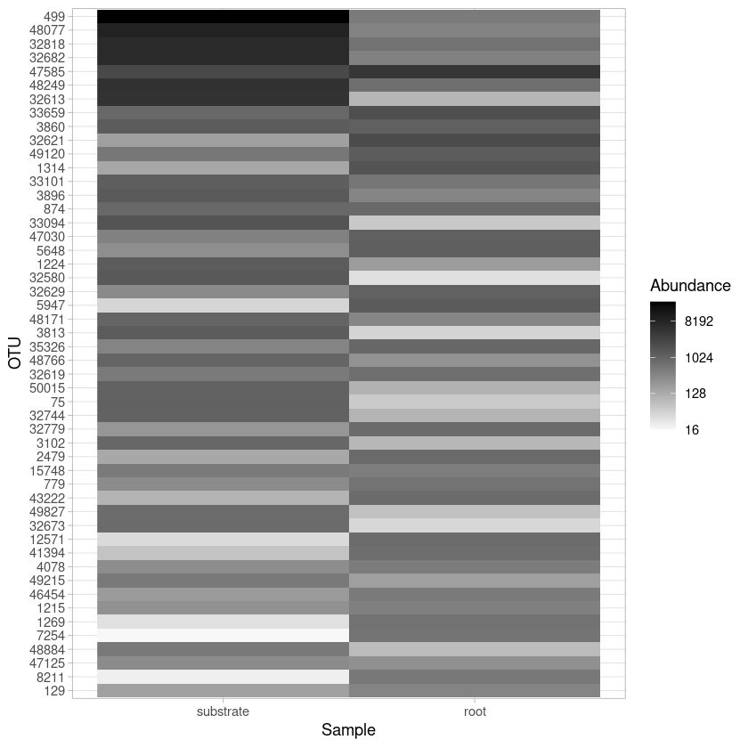

# Analyses of bacterial diversity


```R
#Load libraries
library(scales)
library(phyloseq)
library(phylogeo)
library(ggplot2)
library(ape)
library(vegan)
library(gridExtra)
library(reshape2)
library(RColorBrewer)
library(forcats)
```

    Warning message:
    “replacing previous import ‘dplyr::combine’ by ‘gridExtra::combine’ when loading ‘phylogeo’”
    Loading required package: permute
    
    Loading required package: lattice
    
    This is vegan 2.5-7
    


```R
# Load OTU table
otu <- as.matrix(read.table("biofert_16S_otu.tsv", row.names=1))
colnames(otu) <- c("root","substrate")
otu <- otu[, c("substrate", "root")]
OTU <- otu_table(otu, taxa_are_rows=T)
```


```R
# Load taxonomy table
taxa <- as.matrix(read.table("Silva_taxonomy_clean.tsv", row.names = 1))
TAXA <- tax_table(taxa)
colnames(TAXA) <- c("Kingdom", "Phylum", "Class", "Order", "Family", "Genus")
```


```R
# Create phyloseq object with taxonomy and OTU tables 
bact <-phyloseq(OTU,TAXA)
bact
```


    phyloseq-class experiment-level object
    otu_table()   OTU Table:         [ 12249 taxa and 2 samples ]
    tax_table()   Taxonomy Table:    [ 12249 taxa by 6 taxonomic ranks ]


```R
# Rarefaction curves
pdf("rarefaction.pdf")
rarefaction <- rarecurve(t(otu), step=1000, cex=0.5, col="red")
dev.off()

rarecurve(t(otu), step=1000, cex=0.5, col="red")
```


<strong>png:</strong> 2


    

    


```R
# Shannon diversity estimations
estimate_richness(bact)
write.table(estimate_richness(bact), file="bact_diversity.tsv",append = FALSE, quote = TRUE, sep = "\t")
```


<table class="dataframe">
<caption>A data.frame: 2 × 9</caption>
<thead>
	<tr><th></th><th scope=col>Observed</th><th scope=col>Chao1</th><th scope=col>se.chao1</th><th scope=col>ACE</th><th scope=col>se.ACE</th><th scope=col>Shannon</th><th scope=col>Simpson</th><th scope=col>InvSimpson</th><th scope=col>Fisher</th></tr>
	<tr><th></th><th scope=col>&lt;dbl&gt;</th><th scope=col>&lt;dbl&gt;</th><th scope=col>&lt;dbl&gt;</th><th scope=col>&lt;dbl&gt;</th><th scope=col>&lt;dbl&gt;</th><th scope=col>&lt;dbl&gt;</th><th scope=col>&lt;dbl&gt;</th><th scope=col>&lt;dbl&gt;</th><th scope=col>&lt;dbl&gt;</th></tr>
</thead>
<tbody>
	<tr><th scope=row>substrate</th><td>6971</td><td>7359.233</td><td>29.58714</td><td>7871.580</td><td>39.12867</td><td>6.080002</td><td>0.9895416</td><td> 95.61659</td><td>1634.206</td></tr>
	<tr><th scope=row>root</th><td>8819</td><td>8982.350</td><td>16.48938</td><td>9393.791</td><td>39.29644</td><td>7.617671</td><td>0.9981706</td><td>546.63185</td><td>2426.967</td></tr>
</tbody>
</table>


```R
div <- read.table("bact_diversity.tsv", header=TRUE, row.names = NULL)
colnames(div) <- c("Sample", "Observed", "Chao1", "SE.Chao1", 
                    "ACE", "SE.ACE", "Shannon", "Simpson", "InvSimpson", "Fisher")

observed_plot <- ggplot(div, aes(reorder(Sample, Observed), y=Observed))  + geom_point() + 
                        theme_light() +  ggtitle("Observed diversity") 
ggsave("bact_observed_plot.pdf", width=10, height=5, units="cm")
observed_plot


shannon_plot <- ggplot(div, aes(reorder(Sample, Shannon), y=Shannon))  + geom_point() + 
                        theme_light() + ggtitle("Shannon diversity")
ggsave("bact_shannon_plot.pdf", width=10, height=5, units="cm")
shannon_plot

simpson_plot <- ggplot(div, aes(reorder(Sample, Simpson), y=Simpson))  + geom_point() + 
                        theme_light() + ggtitle("Simpson diversity")
ggsave("bact_simpson_plot.pdf", width=10, height=5, units="cm")
simpson_plot
```


    

    


    

    


    

    


```R
#Estimate relative abundance
rel_bact <- transform_sample_counts(bact, function(x) x / sum(x))
```


```R
#Most abundant phylum
#Tax glom at Phylum level
phy_bact <- tax_glom(rel_bact, "Phylum")
phy_bact
```


    phyloseq-class experiment-level object
    otu_table()   OTU Table:         [ 33 taxa and 2 samples ]
    tax_table()   Taxonomy Table:    [ 33 taxa by 6 taxonomic ranks ]


```R
#Export the file with taxa names and taxa counts
bact_otu_phy <- otu_table(phy_bact)
bact_tax_phy <- tax_table(phy_bact)
phy_bact_tab <- cbind(bact_otu_phy, bact_tax_phy)
phy_bact_tab <- phy_bact_tab[, 1:4]
write.table(phy_bact_tab, "phy_bact_tab.tsv", sep = "\t")
phy_bact_tab <- read.table("phy_bact_tab.tsv", header=TRUE, row.names=1, stringsAsFactors = FALSE)
m_phy_bact_tab <- melt(phy_bact_tab)
colnames(m_phy_bact_tab) <- c("Kingdom", "Phylum", "Sample", "Relative_abundance")
m_phy_bact_tab <- m_phy_bact_tab[, 2:4]

#Collapse Phylum with low abundance
m_phy_bact_tab$Phylum[m_phy_bact_tab$Relative_abundance <= 0.015] <- "Low_abundance"
cm_phy_bact_tab <- aggregate(m_phy_bact_tab$Relative_abundance 
                                          ,by=list(m_phy_bact_tab$Phylum, 
                                           m_phy_bact_tab$Sample),sum)
colnames(cm_phy_bact_tab) <- c("Phylum", "Sample", "Relative_abundance")
cm_phy_bact_tab

#Plot phylum
print("Most abundant Phylum")
phylum_plot <- ggplot(cm_phy_bact_tab, aes(x=Sample, y=Relative_abundance,
                                          fill=fct_reorder(Phylum, Relative_abundance))) + 
       scale_fill_manual(values=rev(colorRampPalette(brewer.pal(n = 8, name = "Set1"))(14))) +
       geom_bar(stat="identity", color="black", width=0.8) + scale_y_continuous(expand = c(0 ,0)) + 
       theme_light(base_size = 7) + theme(axis.text.y = element_text(size = 15),
                                          axis.text.x = element_text(size= 15)) 
ggsave("bact_phylum_plot.pdf", width=20, height=20, units="cm")

phylum_plot
```

    Using Kingdom, Phylum as id variables
    


<table class="dataframe">
<caption>A data.frame: 21 × 3</caption>
<thead>
	<tr><th scope=col>Phylum</th><th scope=col>Sample</th><th scope=col>Relative_abundance</th></tr>
	<tr><th scope=col>&lt;chr&gt;</th><th scope=col>&lt;fct&gt;</th><th scope=col>&lt;dbl&gt;</th></tr>
</thead>
<tbody>
	<tr><td>Acidobacteriota  </td><td>substrate</td><td>0.02046312</td></tr>
	<tr><td>Actinobacteriota </td><td>substrate</td><td>0.01629729</td></tr>
	<tr><td>Bacteroidota     </td><td>substrate</td><td>0.28068815</td></tr>
	<tr><td>Low_abundance    </td><td>substrate</td><td>0.04361922</td></tr>
	<tr><td>Patescibacteria  </td><td>substrate</td><td>0.02942227</td></tr>
	<tr><td>Proteobacteria   </td><td>substrate</td><td>0.59361355</td></tr>
	<tr><td>Verrucomicrobiota</td><td>substrate</td><td>0.01501617</td></tr>
	<tr><td>Acidobacteriota  </td><td>root     </td><td>0.09944659</td></tr>
	<tr><td>Actinobacteriota </td><td>root     </td><td>0.03643580</td></tr>
	<tr><td>Bacteroidota     </td><td>root     </td><td>0.22430544</td></tr>
	<tr><td>Bdellovibrionota </td><td>root     </td><td>0.01783219</td></tr>
	<tr><td>Chloroflexi      </td><td>root     </td><td>0.01635642</td></tr>
	<tr><td>Cyanobacteria    </td><td>root     </td><td>0.01723964</td></tr>
	<tr><td>Firmicutes       </td><td>root     </td><td>0.02028062</td></tr>
	<tr><td>Gemmatimonadota  </td><td>root     </td><td>0.02139862</td></tr>
	<tr><td>Low_abundance    </td><td>root     </td><td>0.02660853</td></tr>
	<tr><td>Myxococcota      </td><td>root     </td><td>0.03549667</td></tr>
	<tr><td>Patescibacteria  </td><td>root     </td><td>0.07148527</td></tr>
	<tr><td>Planctomycetota  </td><td>root     </td><td>0.03953267</td></tr>
	<tr><td>Proteobacteria   </td><td>root     </td><td>0.28985410</td></tr>
	<tr><td>Verrucomicrobiota</td><td>root     </td><td>0.07827156</td></tr>
</tbody>
</table>


    [1] "Most abundant Phylum"


    

    


```R
#Most abundant phylum
#Tax glom at Phylum level
class_bact <- tax_glom(rel_bact, "Class")
class_bact
```


    phyloseq-class experiment-level object
    otu_table()   OTU Table:         [ 76 taxa and 2 samples ]
    tax_table()   Taxonomy Table:    [ 76 taxa by 6 taxonomic ranks ]


```R
#Export the file with taxa names and taxa counts
bact_otu_class <- otu_table(class_bact)
bact_tax_class <- tax_table(class_bact)
class_bact_tab <- cbind(bact_otu_class, bact_tax_class)
head(class_bact_tab)
```


<table class="dataframe">
<caption>A matrix: 6 × 8 of type chr</caption>
<thead>
	<tr><th></th><th scope=col>substrate</th><th scope=col>root</th><th scope=col>Kingdom</th><th scope=col>Phylum</th><th scope=col>Class</th><th scope=col>Order</th><th scope=col>Family</th><th scope=col>Genus</th></tr>
</thead>
<tbody>
	<tr><th scope=row>25</th><td>6.10059001420566e-05</td><td>0.00202358991559059</td><td>Bacteria</td><td>Planctomycetota </td><td>vadinHA49          </td><td>NA</td><td>NA</td><td>NA</td></tr>
	<tr><th scope=row>27</th><td>0.000130726928875836</td><td>0.00619375034937671</td><td>Bacteria</td><td>Gemmatimonadota </td><td>S0134              </td><td>NA</td><td>NA</td><td>NA</td></tr>
	<tr><th scope=row>129</th><td>0.00156872314651003 </td><td>0.00468444295377047</td><td>Bacteria</td><td>Gemmatimonadota </td><td>Longimicrobia      </td><td>NA</td><td>NA</td><td>NA</td></tr>
	<tr><th scope=row>233</th><td>0.00033117488648545 </td><td>0.00163228799821119</td><td>Bacteria</td><td>Acidobacteriota </td><td>Thermoanaerobaculia</td><td>NA</td><td>NA</td><td>NA</td></tr>
	<tr><th scope=row>312</th><td>0.00115039697410735 </td><td>0.0109452736318408 </td><td>Bacteria</td><td>Bdellovibrionota</td><td>Oligoflexia        </td><td>NA</td><td>NA</td><td>NA</td></tr>
	<tr><th scope=row>463</th><td>0.000427041300994396</td><td>0.00402481972161664</td><td>Bacteria</td><td>Myxococcota     </td><td>Myxococcia         </td><td>NA</td><td>NA</td><td>NA</td></tr>
</tbody>
</table>


```R
#Export the file with taxa names and taxa counts
bact_otu_class <- otu_table(class_bact)
bact_tax_class <- tax_table(class_bact)
class_bact_tab <- cbind(bact_otu_class, bact_tax_class)
class_bact_tab <- class_bact_tab[, 1:5]
write.table(class_bact_tab, "class_bact_tab.tsv", sep = "\t")
class_bact_tab <- read.table("class_bact_tab.tsv", header=TRUE, row.names=1, stringsAsFactors = FALSE)
m_class_bact_tab <- melt(class_bact_tab)
colnames(m_class_bact_tab) <- c("Kingdom", "Phylum", "Class", "Sample", "Relative_abundance")

#Collapse Class with low abundance
m_class_bact_tab$Class[m_class_bact_tab$Relative_abundance <= 0.015] <- "Low_abundance"
cm_class_bact_tab <- aggregate(m_class_bact_tab$Relative_abundance 
                                          ,by=list(m_class_bact_tab$Class, 
                                           m_class_bact_tab$Sample),sum)
colnames(cm_class_bact_tab) <- c("Class", "Sample", "Relative_abundance")
cm_class_bact_tab

#Plot Class
print("Most abundant Class")
Class_plot <- ggplot(cm_class_bact_tab, aes(x=Sample, y=Relative_abundance,
                                          fill=fct_reorder(Class, Relative_abundance))) + 
       scale_fill_manual(values=rev(colorRampPalette(brewer.pal(n = 8, name = "Spectral"))(16))) +
       geom_bar(stat="identity", color="black", width=0.8) + scale_y_continuous(expand = c(0 ,0)) + 
       theme_light(base_size = 7) + theme(axis.text.y = element_text(size = 15),
                                          axis.text.x = element_text(size= 15)) 
ggsave("bact_Class_plot.pdf", width=20, height=20, units="cm")

Class_plot
```

    Using Kingdom, Phylum, Class as id variables
    


<table class="dataframe">
<caption>A data.frame: 22 × 3</caption>
<thead>
	<tr><th scope=col>Class</th><th scope=col>Sample</th><th scope=col>Relative_abundance</th></tr>
	<tr><th scope=col>&lt;chr&gt;</th><th scope=col>&lt;fct&gt;</th><th scope=col>&lt;dbl&gt;</th></tr>
</thead>
<tbody>
	<tr><td>Acidobacteriae     </td><td>substrate</td><td>0.01566109</td></tr>
	<tr><td>Alphaproteobacteria</td><td>substrate</td><td>0.24240259</td></tr>
	<tr><td>Bacteroidia        </td><td>substrate</td><td>0.27999094</td></tr>
	<tr><td>Gammaproteobacteria</td><td>substrate</td><td>0.35102795</td></tr>
	<tr><td>Low_abundance      </td><td>substrate</td><td>0.08045807</td></tr>
	<tr><td>Saccharimonadia    </td><td>substrate</td><td>0.02900395</td></tr>
	<tr><td>Acidobacteriae     </td><td>root     </td><td>0.02940354</td></tr>
	<tr><td>Actinobacteria     </td><td>root     </td><td>0.01814523</td></tr>
	<tr><td>Alphaproteobacteria</td><td>root     </td><td>0.13000168</td></tr>
	<tr><td>Bacilli            </td><td>root     </td><td>0.01993404</td></tr>
	<tr><td>Bacteroidia        </td><td>root     </td><td>0.22004584</td></tr>
	<tr><td>Blastocatellia     </td><td>root     </td><td>0.03415507</td></tr>
	<tr><td>Cyanobacteriia     </td><td>root     </td><td>0.01575270</td></tr>
	<tr><td>Gammaproteobacteria</td><td>root     </td><td>0.15958410</td></tr>
	<tr><td>Low_abundance      </td><td>root     </td><td>0.12969982</td></tr>
	<tr><td>Parcubacteria      </td><td>root     </td><td>0.01532786</td></tr>
	<tr><td>Phycisphaerae      </td><td>root     </td><td>0.01683716</td></tr>
	<tr><td>Planctomycetes     </td><td>root     </td><td>0.01943094</td></tr>
	<tr><td>Polyangia          </td><td>root     </td><td>0.03044329</td></tr>
	<tr><td>Saccharimonadia    </td><td>root     </td><td>0.05392140</td></tr>
	<tr><td>Verrucomicrobiae   </td><td>root     </td><td>0.07368774</td></tr>
	<tr><td>Vicinamibacteria   </td><td>root     </td><td>0.02561351</td></tr>
</tbody>
</table>


    [1] "Most abundant Class"


    

    


```R
#Most abundant genus
#Tax glom at genus level
gen_bact <- tax_glom(bact, "Genus")
gen_bact
```


    phyloseq-class experiment-level object
    otu_table()   OTU Table:         [ 485 taxa and 2 samples ]
    tax_table()   Taxonomy Table:    [ 485 taxa by 6 taxonomic ranks ]


```R
#Heat map of top abundant genus in both samples
top50 <- prune_taxa(names(sort(taxa_sums(gen_bact),TRUE)[1:50]), gen_bact)
gen_heat_plot <- plot_heatmap(top50, taxa.label = "Genus", method = NULL, low = "#f9f8f9ff",  trans = log_trans(2),
                              high ="black", na.value = "white", 
                              sample.order = c("substrate", "root"),
                              taxa.order  = names(sort(taxa_sums(top50))))+ theme_light()
ggsave("gen_heat_plot.pdf", width=20, height=22, units="cm")
gen_heat_plot
```


    

    


```R
#Heat map of top abundant genus in both samples
top50 <- prune_taxa(names(sort(taxa_sums(gen_bact),TRUE)[1:50]), gen_bact)
gen_heat_plot <- plot_heatmap(top50, method = NULL, low = "#f9f8f9ff",  trans = log_trans(2),
                              high ="black", na.value = "white", 
                              sample.order = c("substrate", "root"),
                              taxa.order  = names(sort(taxa_sums(top50))))+ theme_light()
ggsave("gen_heat_plot_NL.pdf", width=20, height=22, units="cm")
gen_heat_plot
```


    

    


```R
#Most abundant genus
#Tax glom at genus level
gen_bact <- tax_glom(rel_bact, "Genus")
gen_bact
```


    phyloseq-class experiment-level object
    otu_table()   OTU Table:         [ 485 taxa and 2 samples ]
    tax_table()   Taxonomy Table:    [ 485 taxa by 6 taxonomic ranks ]


```R
options(scipen = 999)
gen_otu <- otu_table(gen_bact)
gen_tax <- tax_table(gen_bact)
gen_fung_tab <- cbind(gen_otu, gen_tax)
gen_fung_tab
write.table(gen_fung_tab, "gen_fung_tab.tsv", sep = "\t")
```


<table class="dataframe">
<caption>A matrix: 485 × 8 of type chr</caption>
<thead>
	<tr><th></th><th scope=col>substrate</th><th scope=col>root</th><th scope=col>Kingdom</th><th scope=col>Phylum</th><th scope=col>Class</th><th scope=col>Order</th><th scope=col>Family</th><th scope=col>Genus</th></tr>
</thead>
<tbody>
	<tr><th scope=row>19</th><td>0.0000871512859172237 </td><td>0.00489686399463357  </td><td>Bacteria</td><td>Proteobacteria   </td><td>Gammaproteobacteria</td><td>Burkholderiales      </td><td>Nitrosomonadaceae     </td><td>IS-44                                     </td></tr>
	<tr><th scope=row>75</th><td>0.00982194992287111   </td><td>0.000603722958242495 </td><td>Bacteria</td><td>Proteobacteria   </td><td>Gammaproteobacteria</td><td>Burkholderiales      </td><td>Methylophilaceae      </td><td>MM1                                       </td></tr>
	<tr><th scope=row>76</th><td>0.00163844417524381   </td><td>0.000491922410419811 </td><td>Bacteria</td><td>Verrucomicrobiota</td><td>Verrucomicrobiae   </td><td>Chthoniobacterales   </td><td>Chthoniobacteraceae   </td><td>LD29                                      </td></tr>
	<tr><th scope=row>95</th><td>0                     </td><td>0.0000223601095645369</td><td>Bacteria</td><td>Gemmatimonadota  </td><td>Longimicrobia      </td><td>Longimicrobiales     </td><td>Longimicrobiaceae     </td><td>Longimicrobium                            </td></tr>
	<tr><th scope=row>129</th><td>0.00154257776073486   </td><td>0.00436022136508469  </td><td>Bacteria</td><td>Gemmatimonadota  </td><td>Longimicrobia      </td><td>Longimicrobiales     </td><td>Longimicrobiaceae     </td><td>YC-ZSS-LKJ147                             </td></tr>
	<tr><th scope=row>233</th><td>0.00033117488648545   </td><td>0.00163228799821119  </td><td>Bacteria</td><td>Acidobacteriota  </td><td>Thermoanaerobaculia</td><td>Thermoanaerobaculales</td><td>Thermoanaerobaculaceae</td><td>Subgroup                                  </td></tr>
	<tr><th scope=row>340</th><td>0.00134212980312525   </td><td>0.00266085303817989  </td><td>Bacteria</td><td>Proteobacteria   </td><td>Gammaproteobacteria</td><td>Burkholderiales      </td><td>Comamonadaceae        </td><td>Kinneretia                                </td></tr>
	<tr><th scope=row>379</th><td>0.000252738729159949  </td><td>0.000704343451282911 </td><td>Bacteria</td><td>Acidobacteriota  </td><td>Vicinamibacteria   </td><td>Vicinamibacterales   </td><td>Vicinamibacteraceae   </td><td>Vicinamibacter                            </td></tr>
	<tr><th scope=row>417</th><td>0.0000522907715503342 </td><td>0.000156520766951758 </td><td>Bacteria</td><td>Bdellovibrionota </td><td>Oligoflexia        </td><td>Silvanigrellales     </td><td>Silvanigrellaceae     </td><td>Silvanigrella                             </td></tr>
	<tr><th scope=row>463</th><td>0.0000261453857751671 </td><td>0.000771423779976522 </td><td>Bacteria</td><td>Myxococcota      </td><td>Myxococcia         </td><td>Myxococcales         </td><td>Myxococcaceae         </td><td>Archangium                                </td></tr>
	<tr><th scope=row>499</th><td>0.218174529165178     </td><td>0.00569064788417463  </td><td>Bacteria</td><td>Proteobacteria   </td><td>Gammaproteobacteria</td><td>Burkholderiales      </td><td>Burkholderiaceae      </td><td>Burkholderia-Caballeronia-Paraburkholderia</td></tr>
	<tr><th scope=row>566</th><td>0.000104581543100668  </td><td>0.001665828162558    </td><td>Bacteria</td><td>Proteobacteria   </td><td>Gammaproteobacteria</td><td>Steroidobacterales   </td><td>Steroidobacteraceae   </td><td>Povalibacter                              </td></tr>
	<tr><th scope=row>587</th><td>0.0000871512859172237 </td><td>0.000245961205209906 </td><td>Bacteria</td><td>Proteobacteria   </td><td>Gammaproteobacteria</td><td>Burkholderiales      </td><td>Oxalobacteraceae      </td><td>Paraherbaspirillum                        </td></tr>
	<tr><th scope=row>645</th><td>0.000296314372118561  </td><td>0.000257141259992174 </td><td>Bacteria</td><td>Proteobacteria   </td><td>Gammaproteobacteria</td><td>Burkholderiales      </td><td>Comamonadaceae        </td><td>Leptothrix                                </td></tr>
	<tr><th scope=row>694</th><td>0.00000871512859172237</td><td>0.000559002739113422 </td><td>Bacteria</td><td>Proteobacteria   </td><td>Gammaproteobacteria</td><td>Burkholderiales      </td><td>Nitrosomonadaceae     </td><td>oc32                                      </td></tr>
	<tr><th scope=row>751</th><td>0.0000610059001420566 </td><td>0.000514282519984348 </td><td>Bacteria</td><td>Firmicutes       </td><td>Bacilli            </td><td>Bacillales           </td><td>Planococcaceae        </td><td>Filibacter                                </td></tr>
	<tr><th scope=row>765</th><td>0.0000784361573255013 </td><td>0.000201240986080832 </td><td>Bacteria</td><td>Myxococcota      </td><td>Myxococcia         </td><td>Myxococcales         </td><td>Myxococcaceae         </td><td>KD3-10                                    </td></tr>
	<tr><th scope=row>779</th><td>0.00275398063498427   </td><td>0.00732293588238582  </td><td>Bacteria</td><td>Proteobacteria   </td><td>Gammaproteobacteria</td><td>Steroidobacterales   </td><td>Steroidobacteraceae   </td><td>Steroidobacter                            </td></tr>
	<tr><th scope=row>825</th><td>0                     </td><td>0.0000223601095645369</td><td>Bacteria</td><td>Proteobacteria   </td><td>Gammaproteobacteria</td><td>Burkholderiales      </td><td>Comamonadaceae        </td><td>Comamonas                                 </td></tr>
	<tr><th scope=row>871</th><td>0.000191732829017892  </td><td>0.00137514673821902  </td><td>Bacteria</td><td>Proteobacteria   </td><td>Gammaproteobacteria</td><td>Burkholderiales      </td><td>Comamonadaceae        </td><td>Caenimonas                                </td></tr>
	<tr><th scope=row>874</th><td>0.0077913249609998    </td><td>0.00986080831796076  </td><td>Bacteria</td><td>Firmicutes       </td><td>Bacilli            </td><td>Bacillales           </td><td>Bacillaceae           </td><td>Bacillus                                  </td></tr>
	<tr><th scope=row>919</th><td>0.00161229878946864   </td><td>0.00401363966683437  </td><td>Bacteria</td><td>Proteobacteria   </td><td>Gammaproteobacteria</td><td>Burkholderiales      </td><td>Oxalobacteraceae      </td><td>Noviherbaspirillum                        </td></tr>
	<tr><th scope=row>1066</th><td>0.0000261453857751671 </td><td>0.000134160657387221 </td><td>Bacteria</td><td>Proteobacteria   </td><td>Gammaproteobacteria</td><td>Xanthomonadales      </td><td>Xanthomonadaceae      </td><td>Luteimonas                                </td></tr>
	<tr><th scope=row>1081</th><td>0.0000958664145089461 </td><td>0.00199004975124378  </td><td>Bacteria</td><td>Proteobacteria   </td><td>Gammaproteobacteria</td><td>Burkholderiales      </td><td>Comamonadaceae        </td><td>Ideonella                                 </td></tr>
	<tr><th scope=row>1125</th><td>0.0000958664145089461 </td><td>0.000178880876516295 </td><td>Bacteria</td><td>Acidobacteriota  </td><td>Vicinamibacteria   </td><td>Vicinamibacterales   </td><td>Vicinamibacteraceae   </td><td>Luteitalea                                </td></tr>
	<tr><th scope=row>1215</th><td>0.00230950907680643   </td><td>0.00497512437810945  </td><td>Bacteria</td><td>Proteobacteria   </td><td>Gammaproteobacteria</td><td>Burkholderiales      </td><td>Comamonadaceae        </td><td>Rhizobacter                               </td></tr>
	<tr><th scope=row>1224</th><td>0.0113209520406474    </td><td>0.00220247079210688  </td><td>Bacteria</td><td>Proteobacteria   </td><td>Gammaproteobacteria</td><td>Burkholderiales      </td><td>Oxalobacteraceae      </td><td>Massilia                                  </td></tr>
	<tr><th scope=row>1269</th><td>0.000261453857751671  </td><td>0.00739001621107943  </td><td>Bacteria</td><td>Proteobacteria   </td><td>Gammaproteobacteria</td><td>Burkholderiales      </td><td>Nitrosomonadaceae     </td><td>MND1                                      </td></tr>
	<tr><th scope=row>1314</th><td>0.00126369364579974   </td><td>0.018782492034211    </td><td>Bacteria</td><td>Verrucomicrobiota</td><td>Verrucomicrobiae   </td><td>Opitutales           </td><td>Opitutaceae           </td><td>Opitutus                                  </td></tr>
	<tr><th scope=row>1370</th><td>0.000200447957609615  </td><td>0.0010285650399687   </td><td>Bacteria</td><td>Proteobacteria   </td><td>Gammaproteobacteria</td><td>Burkholderiales      </td><td>Nitrosomonadaceae     </td><td>mle1-7                                    </td></tr>
	<tr><th scope=row>⋮</th><td>⋮</td><td>⋮</td><td>⋮</td><td>⋮</td><td>⋮</td><td>⋮</td><td>⋮</td><td>⋮</td></tr>
	<tr><th scope=row>51822</th><td>0.00000871512859172237</td><td>0.0000111800547822684</td><td>Bacteria</td><td>Proteobacteria</td><td>Alphaproteobacteria</td><td>Caulobacterales  </td><td>Caulobacteraceae  </td><td>PMMR1           </td></tr>
	<tr><th scope=row>51932</th><td>0.00036603540085234   </td><td>0.000100620493040416 </td><td>Bacteria</td><td>Proteobacteria</td><td>Alphaproteobacteria</td><td>Caulobacterales  </td><td>Caulobacteraceae  </td><td>Asticcacaulis   </td></tr>
	<tr><th scope=row>52058</th><td>0.000113296671692391  </td><td>0.000167700821734026 </td><td>Bacteria</td><td>Proteobacteria</td><td>Alphaproteobacteria</td><td>Acetobacterales  </td><td>Acetobacteraceae  </td><td>Rhodopila       </td></tr>
	<tr><th scope=row>52437</th><td>0                     </td><td>0.0000223601095645369</td><td>Bacteria</td><td>Cyanobacteria </td><td>Cyanobacteriia     </td><td>Cyanobacteriales </td><td>Nostocaceae       </td><td>Anabaena        </td></tr>
	<tr><th scope=row>52478</th><td>0.0000174302571834447 </td><td>0.0000111800547822684</td><td>Bacteria</td><td>Proteobacteria</td><td>Alphaproteobacteria</td><td>Rhizobiales      </td><td>Beijerinckiaceae  </td><td>Roseiarcus      </td></tr>
	<tr><th scope=row>52588</th><td>0.0000174302571834447 </td><td>0.0000111800547822684</td><td>Bacteria</td><td>Chloroflexi   </td><td>Chloroflexia       </td><td>Chloroflexales   </td><td>Herpetosiphonaceae</td><td>Herpetosiphon   </td></tr>
	<tr><th scope=row>52650</th><td>0                     </td><td>0.0000223601095645369</td><td>Bacteria</td><td>Chloroflexi   </td><td>Chloroflexia       </td><td>Chloroflexales   </td><td>Chloroflexaceae   </td><td>Chloronema      </td></tr>
	<tr><th scope=row>52793</th><td>0.00000871512859172237</td><td>0.0000111800547822684</td><td>Bacteria</td><td>Proteobacteria</td><td>Alphaproteobacteria</td><td>Rhodobacterales  </td><td>Rhodobacteraceae  </td><td>Falsirhodobacter</td></tr>
	<tr><th scope=row>52801</th><td>0                     </td><td>0.0000223601095645369</td><td>Bacteria</td><td>Proteobacteria</td><td>Alphaproteobacteria</td><td>Defluviicoccales </td><td>Defluviicoccaceae </td><td>Defluviicoccus  </td></tr>
	<tr><th scope=row>52823</th><td>0.00000871512859172237</td><td>0.0000111800547822684</td><td>Bacteria</td><td>Proteobacteria</td><td>Alphaproteobacteria</td><td>Sphingomonadales </td><td>Sphingomonadaceae </td><td>DSSF69          </td></tr>
	<tr><th scope=row>53151</th><td>0.0000435756429586119 </td><td>0.0000223601095645369</td><td>Bacteria</td><td>Proteobacteria</td><td>Alphaproteobacteria</td><td>Acetobacterales  </td><td>Acetobacteraceae  </td><td>Roseomonas      </td></tr>
	<tr><th scope=row>53276</th><td>0.000104581543100668  </td><td>0.0000111800547822684</td><td>Bacteria</td><td>Proteobacteria</td><td>Alphaproteobacteria</td><td>Caulobacterales  </td><td>Hyphomonadaceae   </td><td>Hirschia        </td></tr>
	<tr><th scope=row>53393</th><td>0.000130726928875836  </td><td>0.0000894404382581475</td><td>Bacteria</td><td>Proteobacteria</td><td>Alphaproteobacteria</td><td>Rhizobiales      </td><td>Devosiaceae       </td><td>Arsenicitalea   </td></tr>
	<tr><th scope=row>53642</th><td>0.0000174302571834447 </td><td>0.0000223601095645369</td><td>Bacteria</td><td>Proteobacteria</td><td>Alphaproteobacteria</td><td>Sphingomonadales </td><td>Sphingomonadaceae </td><td>Parablastomonas </td></tr>
	<tr><th scope=row>53692</th><td>0.00000871512859172237</td><td>0.0000111800547822684</td><td>Bacteria</td><td>Proteobacteria</td><td>Alphaproteobacteria</td><td>Rhizobiales      </td><td>Rhizobiaceae      </td><td>Ochrobactrum    </td></tr>
	<tr><th scope=row>53820</th><td>0.000226593343384782  </td><td>0.0000111800547822684</td><td>Bacteria</td><td>Proteobacteria</td><td>Alphaproteobacteria</td><td>Caedibacterales  </td><td>Caedibacteraceae  </td><td>Caedibacter     </td></tr>
	<tr><th scope=row>54317</th><td>0.000156872314651003  </td><td>0.000078260383475879 </td><td>Bacteria</td><td>Proteobacteria</td><td>Alphaproteobacteria</td><td>Rhizobiales      </td><td>Xanthobacteraceae </td><td>Variibacter     </td></tr>
	<tr><th scope=row>54326</th><td>0.000174302571834447  </td><td>0.0000111800547822684</td><td>Bacteria</td><td>Proteobacteria</td><td>Alphaproteobacteria</td><td>Rhizobiales      </td><td>Rhizobiaceae      </td><td>[Rhizobium]     </td></tr>
	<tr><th scope=row>54340</th><td>0.000357320272260617  </td><td>0.0000335401643468053</td><td>Bacteria</td><td>Proteobacteria</td><td>Alphaproteobacteria</td><td>Sphingomonadales </td><td>Sphingomonadaceae </td><td>Stakelama       </td></tr>
	<tr><th scope=row>54410</th><td>0.0000871512859172237 </td><td>0.0000111800547822684</td><td>Bacteria</td><td>Proteobacteria</td><td>Gammaproteobacteria</td><td>Burkholderiales  </td><td>Oxalobacteraceae  </td><td>s3t2d-1089      </td></tr>
	<tr><th scope=row>54426</th><td>0.000113296671692391  </td><td>0.0000111800547822684</td><td>Bacteria</td><td>Proteobacteria</td><td>Alphaproteobacteria</td><td>Rhizobiales      </td><td>Rhizobiaceae      </td><td>Ciceribacter    </td></tr>
	<tr><th scope=row>54465</th><td>0.0000871512859172237 </td><td>0                    </td><td>Bacteria</td><td>Proteobacteria</td><td>Alphaproteobacteria</td><td>Rhizobiales      </td><td>Kaistiaceae       </td><td>Kaistia         </td></tr>
	<tr><th scope=row>54655</th><td>0.000418326172402674  </td><td>0.0000335401643468053</td><td>Bacteria</td><td>Proteobacteria</td><td>Alphaproteobacteria</td><td>Rhizobiales      </td><td>Xanthobacteraceae </td><td>Oligotropha     </td></tr>
	<tr><th scope=row>54675</th><td>0.0000261453857751671 </td><td>0                    </td><td>Bacteria</td><td>Proteobacteria</td><td>Alphaproteobacteria</td><td>Holosporales     </td><td>Holosporaceae     </td><td>Candidatus      </td></tr>
	<tr><th scope=row>54761</th><td>0.0000348605143668895 </td><td>0                    </td><td>Bacteria</td><td>Proteobacteria</td><td>Alphaproteobacteria</td><td>Acetobacterales  </td><td>Acetobacteraceae  </td><td>Roseococcus     </td></tr>
	<tr><th scope=row>54770</th><td>0.0000174302571834447 </td><td>0                    </td><td>Bacteria</td><td>Proteobacteria</td><td>Alphaproteobacteria</td><td>Rhizobiales      </td><td>Xanthobacteraceae </td><td>Rhodopseudomonas</td></tr>
	<tr><th scope=row>54948</th><td>0.0000871512859172237 </td><td>0.0000111800547822684</td><td>Bacteria</td><td>Proteobacteria</td><td>Gammaproteobacteria</td><td>Burkholderiales  </td><td>Alcaligenaceae    </td><td>Ampullimonas    </td></tr>
	<tr><th scope=row>55028</th><td>0.0000174302571834447 </td><td>0                    </td><td>Bacteria</td><td>Proteobacteria</td><td>Alphaproteobacteria</td><td>Tistrellales     </td><td>Geminicoccaceae   </td><td>Candidatus      </td></tr>
	<tr><th scope=row>56529</th><td>0                     </td><td>0.0000894404382581475</td><td>Bacteria</td><td>Deinococcota  </td><td>Deinococci         </td><td>Deinococcales    </td><td>Trueperaceae      </td><td>Truepera        </td></tr>
	<tr><th scope=row>56887</th><td>0                     </td><td>0.0000335401643468053</td><td>Archaea </td><td>Crenarchaeota </td><td>Nitrososphaeria    </td><td>Nitrososphaerales</td><td>Nitrososphaeraceae</td><td>Candidatus      </td></tr>
</tbody>
</table>


```R
#Venn diagram
otu_list <- otu_table(gen_bact)

substrate <- otu_list[, 1]
substrate[substrate==0] <- NA
substrate2 <- substrate[complete.cases(substrate),]
write.table(rownames(substrate2) ,"bac_substrate_list.txt", quote = FALSE, row.names = FALSE, col.names = FALSE)

root <- otu_list[, 2]
root[root==0] <- NA
root2 <- root[complete.cases(root),]
write.table(rownames(root2),"bac_root_list.txt", quote = FALSE,  row.names= FALSE, col.names = FALSE)


head(substrate2)
head(root2)

#The files are used as input list to make Venn diagrams with the online tool:
#http://bioinformatics.psb.ugent.be/webtools/Venn/

```


<table class="dataframe">
<caption>A otu_table: 6 × 1 of type dbl</caption>
<thead>
	<tr><th></th><th scope=col>substrate</th></tr>
</thead>
<tbody>
	<tr><th scope=row>19</th><td>0.00008715129</td></tr>
	<tr><th scope=row>75</th><td>0.00982194992</td></tr>
	<tr><th scope=row>76</th><td>0.00163844418</td></tr>
	<tr><th scope=row>129</th><td>0.00154257776</td></tr>
	<tr><th scope=row>233</th><td>0.00033117489</td></tr>
	<tr><th scope=row>340</th><td>0.00134212980</td></tr>
</tbody>
</table>


<table class="dataframe">
<caption>A otu_table: 6 × 1 of type dbl</caption>
<thead>
	<tr><th></th><th scope=col>root</th></tr>
</thead>
<tbody>
	<tr><th scope=row>19</th><td>0.00489686399</td></tr>
	<tr><th scope=row>75</th><td>0.00060372296</td></tr>
	<tr><th scope=row>76</th><td>0.00049192241</td></tr>
	<tr><th scope=row>95</th><td>0.00002236011</td></tr>
	<tr><th scope=row>129</th><td>0.00436022137</td></tr>
	<tr><th scope=row>233</th><td>0.00163228800</td></tr>
</tbody>
</table>


```R

```
