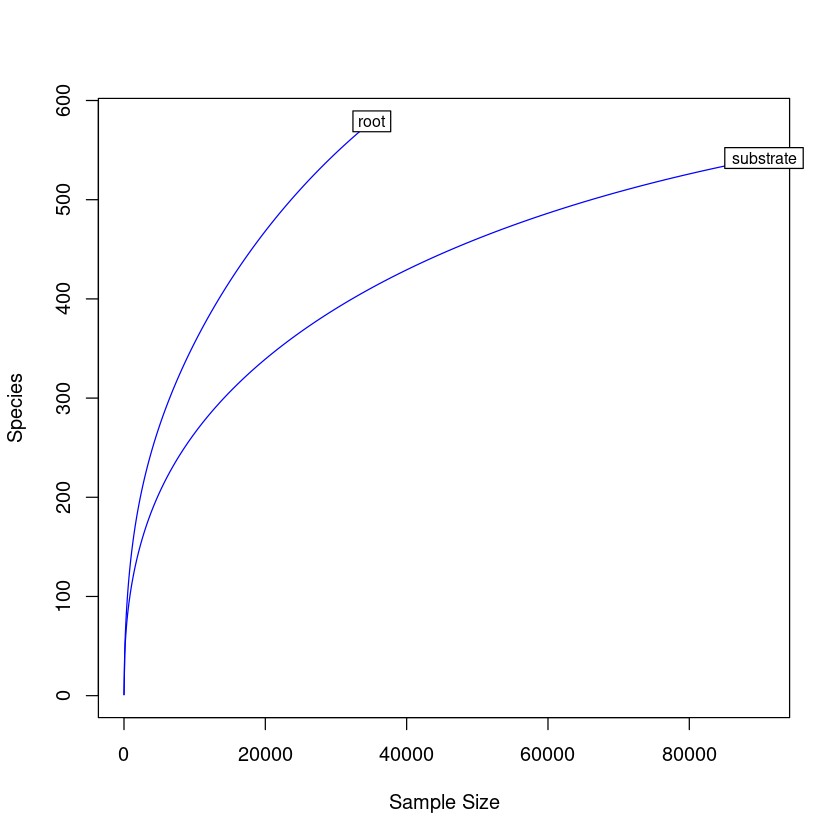
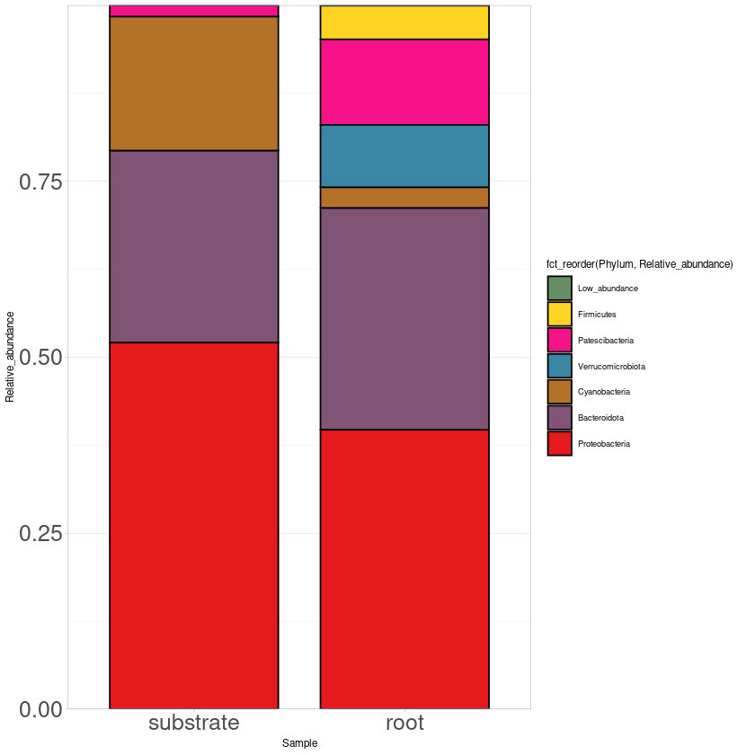
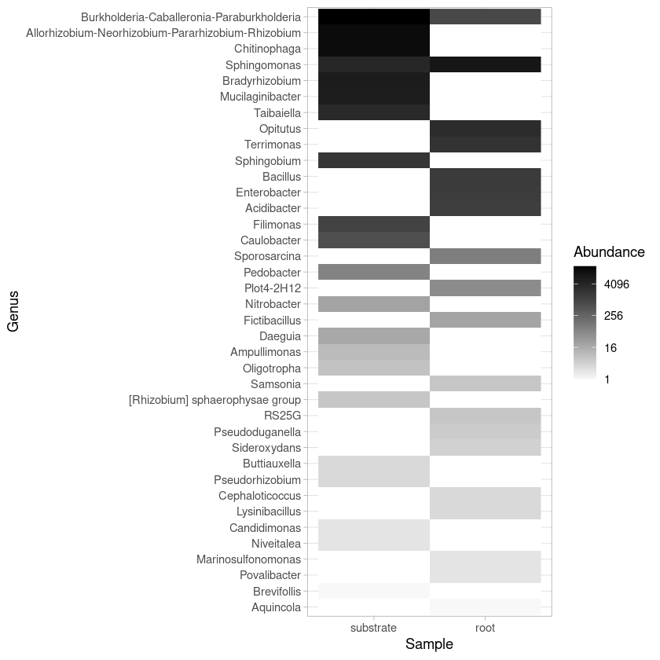

# ASV processing


```R
library(dada2)
library(ggplot2)
```


```R
#Load samples and get the lists of the forward and reverse sequences
fnFs = sort(list.files(getwd(), pattern="_R1.fastq", full.names = TRUE))
fnRs = sort(list.files(getwd(), pattern="_R2.fastq", full.names = TRUE))
```


```R
#Visualize quality
plotQualityProfile(fnFs[1:2])
plotQualityProfile(fnRs[1:2])

#Save plot
pdf(file = "quality_plot.pdf")
plotQualityProfile(fnFs[1:2])
plotQualityProfile(fnRs[1:2])
dev.off()
```


```R
#Extract sample names
sample.names = sapply(strsplit(basename(fnFs), "_R"), `[`, 1)
sample.names
```


```R
#Trimming sequences
#Place filtered files in filtered/ subdirectory
filtFs = file.path(getwd(), "filtered", paste0(sample.names, "_F_filt.fastq.gz"))
filtRs = file.path(getwd(), "filtered", paste0(sample.names, "_R_filt.fastq.gz"))
names(filtFs) = sample.names
names(filtRs) = sample.names

out = filterAndTrim(fnFs, filtFs, fnRs, filtRs, trimLeft=c(15,0), truncLen=c(235,250),
              maxN=0, maxEE=c(6,6), truncQ=2, rm.phix=TRUE,
              compress=TRUE, multithread=TRUE) 
write.csv(out, file="trimm_sq.csv")
```


```R
#Plotting error rates using a parametric error model
errF = learnErrors(filtFs, multithread=TRUE)
write.csv(errF, file="errF.csv")
errR = learnErrors(filtRs, multithread=TRUE)
write.csv(errR, file="errR.csv")

errFplot=plotErrors(errF, nominalQ=TRUE)
pdf("errF_plot.pdf", height=25, width=25)
errFplot
dev.off()

errRplot=plotErrors(errR, nominalQ=TRUE)
pdf("errR_plot.pdf", height=25, width=25)
errRplot
dev.off()
```


```R
#Applying the core sample inference algorithm to the filtered and trimmed sequence data
dadaFs = dada(filtFs, err=errF, multithread=TRUE)
```


```R
dadaRs = dada(filtRs, err=errR, multithread=TRUE)
```


```R
#Merging paired reads
mergers = mergePairs(dadaFs, filtFs, dadaRs, filtRs, verbose=TRUE, returnRejects=TRUE, minOverlap = 5)
```


```R
# Inspect distribution of sequence lengths
seqtab = makeSequenceTable(mergers)
dim(seqtab)
```


```R
#Removing chimeras and determining frequency of chimeric sequences
seqtab.nochim = removeBimeraDenovo(seqtab, method="consensus", multithread=TRUE, verbose=TRUE)
dim(seqtab.nochim)
sum(seqtab.nochim)/sum(seqtab)
```


```R
#Looking at the number of reads that made it through each step in the pipeline
getN = function(x) sum(getUniques(x))
track = cbind(out, sapply(dadaFs, getN), sapply(dadaRs, getN), sapply(mergers, getN), rowSums(seqtab.nochim))
colnames(track) = c("input", "filtered", "denoisedF", "denoisedR", "merged", "nonchim")
rownames(track) = sample.names
track
```


```R
#Assign taxonomy using SILVA database
taxa = assignTaxonomy(seqtab.nochim, "/home/kristov/Documents/Biofertilizante/ASV/silva_nr99_v138.1_train_set.fa.gz", multithread=TRUE)
head(taxa)
```


```R
#Assign taxonomy to species level using SILVA database
taxa_sp = addSpecies(taxa, "/home/kristov/Documents/Biofertilizante/ASV/silva_species_assignment_v138.1.fa.gz")
head(taxa_sp)
```


```R
#Inspecting taxonomic assignments at species level
taxa.print = taxa_sp
```


```R
# Removing sequence rownames for display only
rownames(taxa.print) = NULL
write.csv(taxa.print, file="taxa_print.csv")
```


```R
# Giving our seq headers more manageable names (ASV_1, ASV_2...)
theme_set(theme_bw())
asv_seqs = colnames(seqtab.nochim)
asv_headers = vector(dim(seqtab.nochim)[2], mode="character")

for (i in 1:dim(seqtab.nochim)[2]) { asv_headers[i] = paste(">ASV", i, sep="_")}
```


```R
#Count table
asv_tab = t(seqtab.nochim)
row.names(asv_tab) = sub(">", "", asv_headers)
write.table(asv_tab, "ASVs_bac_counts.tsv", sep="\t", quote=F, col.names=NA)
```


```R
#Tax table
asv_tax = taxa_sp
row.names(asv_tax) = sub(">", "", asv_headers)
write.table(asv_tax, "ASVs_bac_taxonomy.tsv", sep="\t", quote=F, col.names=NA)
```

# ASV diversity analyses


```R
#Load libraries
library(phyloseq)
library(scales)
library(vegan)
library(tidyverse)
library(ggplot2)
library(reshape2)
library(RColorBrewer)
```

    Loading required package: permute
    
    Loading required package: lattice
    
    This is vegan 2.5-7
    
    ── Attaching packages ────────────────────────────────── tidyverse 1.3.2.9000 ──
    ✔ ggplot2   3.3.6      ✔ dplyr     1.0.10
    ✔ tibble    3.1.8      ✔ stringr   1.4.1 
    ✔ tidyr     1.2.1      ✔ forcats   0.5.2 
    ✔ readr     2.1.2      ✔ lubridate 1.8.0 
    ✔ purrr     0.3.4      
    ── Conflicts ────────────────────────────────────────── tidyverse_conflicts() ──
    ✖ readr::col_factor() masks scales::col_factor()
    ✖ purrr::discard()    masks scales::discard()
    ✖ dplyr::filter()     masks stats::filter()
    ✖ dplyr::lag()        masks stats::lag()
    
    Attaching package: ‘reshape2’
    
    
    The following object is masked from ‘package:tidyr’:
    
        smiths
    
    


```R
# Load OTU table
asv_tab <- read.table(as.matrix(("ASVs_bac_counts.tsv")))
colnames(asv_tab) <- c("root","substrate")
asv_tab <- asv_tab[, c("substrate", "root")]
OTU <- otu_table(asv_tab, taxa_are_rows=T)
```


```R
# Load taxonomy table
asv_tax <- as.matrix(read.table("ASVs_bac_taxonomy.tsv", sep="\t", row.names= 1, header = T))
#colnames(asv_tax) <- c("Kingdom", "Phylum", "Class", "Order", "Family", "Genus", "Specie")
TAXA <- tax_table(asv_tax)
```


```R
# Create phyloseq object with taxonomy and OTU tables 
bact <-phyloseq(OTU,TAXA)
bact
```


    phyloseq-class experiment-level object
    otu_table()   OTU Table:         [ 1121 taxa and 2 samples ]
    tax_table()   Taxonomy Table:    [ 1121 taxa by 7 taxonomic ranks ]


```R
# Rarefaction curve
rarecurve(t(OTU), step=100, label=T, col="blue")
```


    

    


```R
# Shannon diversity estimations
estimate_richness(bact)
write.table(estimate_richness(bact), file="bact_diversity.tsv",append = FALSE, quote = TRUE, sep = "\t")
```


<table class="dataframe">
<caption>A data.frame: 2 × 9</caption>
<thead>
	<tr><th></th><th scope=col>Observed</th><th scope=col>Chao1</th><th scope=col>se.chao1</th><th scope=col>ACE</th><th scope=col>se.ACE</th><th scope=col>Shannon</th><th scope=col>Simpson</th><th scope=col>InvSimpson</th><th scope=col>Fisher</th></tr>
	<tr><th></th><th scope=col>&lt;dbl&gt;</th><th scope=col>&lt;dbl&gt;</th><th scope=col>&lt;dbl&gt;</th><th scope=col>&lt;dbl&gt;</th><th scope=col>&lt;dbl&gt;</th><th scope=col>&lt;dbl&gt;</th><th scope=col>&lt;dbl&gt;</th><th scope=col>&lt;dbl&gt;</th><th scope=col>&lt;dbl&gt;</th></tr>
</thead>
<tbody>
	<tr><th scope=row>substrate</th><td>542</td><td>618.7327</td><td>18.01066</td><td>657.7404</td><td>13.16182</td><td>3.871004</td><td>0.9609730</td><td>25.62332</td><td>76.59485</td></tr>
	<tr><th scope=row>root</th><td>579</td><td>784.0000</td><td>37.90756</td><td>872.7035</td><td>17.35083</td><td>3.879798</td><td>0.9315856</td><td>14.61680</td><td>98.50596</td></tr>
</tbody>
</table>


```R
#Estimate relative abundance
rel_bact <- transform_sample_counts(bact, function(x) x / sum(x))
rel_bact                              
```


    phyloseq-class experiment-level object
    otu_table()   OTU Table:         [ 1121 taxa and 2 samples ]
    tax_table()   Taxonomy Table:    [ 1121 taxa by 7 taxonomic ranks ]


```R
#Most abundant phylum
#Tax glom at Phylum level
phy_bact <- tax_glom(rel_bact, "Phylum")
phy_bact
```


    phyloseq-class experiment-level object
    otu_table()   OTU Table:         [ 8 taxa and 2 samples ]
    tax_table()   Taxonomy Table:    [ 8 taxa by 7 taxonomic ranks ]


```R
#Export the file with taxa names and taxa counts
bact_otu_phy <- otu_table(phy_bact)
bact_tax_phy <- tax_table(phy_bact)
phy_bact_tab <- cbind(bact_otu_phy, bact_tax_phy)
phy_bact_tab <- phy_bact_tab[, 1:4]
write.table(phy_bact_tab, "phy_bact_tab.tsv", sep = "\t")
phy_bact_tab <- read.table("phy_bact_tab.tsv", header=TRUE, row.names=1, stringsAsFactors = FALSE)
m_phy_bact_tab <- melt(phy_bact_tab)
colnames(m_phy_bact_tab) <- c("Kingdom", "Phylum", "Sample", "Relative_abundance")
m_phy_bact_tab <- m_phy_bact_tab[, 2:4]

#Collapse Phylum with low abundance
m_phy_bact_tab$Phylum[m_phy_bact_tab$Relative_abundance <= 0.015] <- "Low_abundance"
cm_phy_bact_tab <- aggregate(m_phy_bact_tab$Relative_abundance 
                                          ,by=list(m_phy_bact_tab$Phylum, 
                                           m_phy_bact_tab$Sample),sum)
colnames(cm_phy_bact_tab) <- c("Phylum", "Sample", "Relative_abundance")
#cm_phy_bact_tab

#Plot phylum
print("Most abundant Phylum")
phylum_plot <- ggplot(cm_phy_bact_tab, aes(x=Sample, y=Relative_abundance,
                                          fill=fct_reorder(Phylum, Relative_abundance))) + 
                     scale_fill_manual(values = c("Low_abundance" = "#658e67ff",
                                  "Firmicutes" = "#ffd422ff",
                                  "Patescibacteria" = "#f7128aff",
                                   "Verrucomicrobiota" = "#3a86a5ff",
                                    "Cyanobacteria" = "#b47229ff",
                                     "Bacteroidota" = "#7f5477ff",
                                     "Proteobacteria" = "#e41a1cff")) + 
       geom_bar(stat="identity", color="black", width=0.8) + scale_y_continuous(expand = c(0 ,0)) + 
       theme_light(base_size = 7) + theme(axis.text.y = element_text(size = 15),
                                          axis.text.x = element_text(size= 15)) 
ggsave("bact_phylum_plot.pdf", width=20, height=20, units="cm")

phylum_plot
```

    Using Kingdom, Phylum as id variables
    


    [1] "Most abundant Phylum"


    

    


```R
#Most abundant genus
#Tax glom at genus level
g_bact <- tax_glom(bact, "Genus")
g_bact
```


    phyloseq-class experiment-level object
    otu_table()   OTU Table:         [ 38 taxa and 2 samples ]
    tax_table()   Taxonomy Table:    [ 38 taxa by 7 taxonomic ranks ]


```R
#Heat map of top abundant species in both samples
top50 <- prune_taxa(names(sort(taxa_sums(g_bact),TRUE)[1:50]), g_bact)
gen_heat_plot <- plot_heatmap(top50, taxa.label = "Genus", method = NULL, low = "#f9f8f9ff",  trans = log_trans(2),
                              high ="black", na.value = "white", 
                              sample.order = c("substrate", "root"),
                              taxa.order  = names(sort(taxa_sums(top50))))+ theme_light()
ggsave("gen_heat_plot.pdf", width=20, height=22, units="cm")
gen_heat_plot
```

    Warning message:
    “Transformation introduced infinite values in discrete y-axis”
    Warning message:
    “Transformation introduced infinite values in discrete y-axis”


    

    


```R
#Most abundant genus
#Tax glom at genus level
gen_bact <- tax_glom(rel_bact, "Genus")
gen_bact
```


    phyloseq-class experiment-level object
    otu_table()   OTU Table:         [ 38 taxa and 2 samples ]
    tax_table()   Taxonomy Table:    [ 38 taxa by 7 taxonomic ranks ]


```R
#Export table from all bacterial genera
gen_otu <- otu_table(gen_bact)
gen_tax <- tax_table(gen_bact)
gen_bact_tab <- cbind(gen_otu, gen_tax)
gen_bact_tab
write.table(gen_bact_tab, "gen_bact_asv_tab.tsv", sep = "\t")
```


<table class="dataframe">
<caption>A matrix: 38 × 9 of type chr</caption>
<thead>
	<tr><th></th><th scope=col>substrate</th><th scope=col>root</th><th scope=col>Kingdom</th><th scope=col>Phylum</th><th scope=col>Class</th><th scope=col>Order</th><th scope=col>Family</th><th scope=col>Genus</th><th scope=col>Species</th></tr>
</thead>
<tbody>
	<tr><th scope=row>ASV_2</th><td>0.0427845865076736  </td><td>0.263322973396824   </td><td>Bacteria</td><td>Proteobacteria   </td><td>Alphaproteobacteria</td><td>Sphingomonadales                  </td><td>Sphingomonadaceae  </td><td>Sphingomonas                                      </td><td>NA</td></tr>
	<tr><th scope=row>ASV_3</th><td>0.0755106547421884  </td><td>0                   </td><td>Bacteria</td><td>Proteobacteria   </td><td>Alphaproteobacteria</td><td>Rhizobiales                       </td><td>Xanthobacteraceae  </td><td>Bradyrhizobium                                    </td><td>NA</td></tr>
	<tr><th scope=row>ASV_4</th><td>0.155879430274925   </td><td>0                   </td><td>Bacteria</td><td>Proteobacteria   </td><td>Alphaproteobacteria</td><td>Rhizobiales                       </td><td>Rhizobiaceae       </td><td>Allorhizobium-Neorhizobium-Pararhizobium-Rhizobium</td><td>NA</td></tr>
	<tr><th scope=row>ASV_7</th><td>0.209230429502043   </td><td>0.0241795215420148  </td><td>Bacteria</td><td>Proteobacteria   </td><td>Gammaproteobacteria</td><td>Burkholderiales                   </td><td>Burkholderiaceae   </td><td>Burkholderia-Caballeronia-Paraburkholderia        </td><td>NA</td></tr>
	<tr><th scope=row>ASV_8</th><td>0.148802031577785   </td><td>0                   </td><td>Bacteria</td><td>Bacteroidota     </td><td>Bacteroidia        </td><td>Chitinophagales                   </td><td>Chitinophagaceae   </td><td>Chitinophaga                                      </td><td>NA</td></tr>
	<tr><th scope=row>ASV_16</th><td>0.0398365904824997  </td><td>0                   </td><td>Bacteria</td><td>Bacteroidota     </td><td>Bacteroidia        </td><td>Chitinophagales                   </td><td>Chitinophagaceae   </td><td>Taibaiella                                        </td><td>NA</td></tr>
	<tr><th scope=row>ASV_19</th><td>0.0701667218725847  </td><td>0                   </td><td>Bacteria</td><td>Bacteroidota     </td><td>Bacteroidia        </td><td>Sphingobacteriales                </td><td>Sphingobacteriaceae</td><td>Mucilaginibacter                                  </td><td>NA</td></tr>
	<tr><th scope=row>ASV_20</th><td>0.0215744727834824  </td><td>0                   </td><td>Bacteria</td><td>Proteobacteria   </td><td>Alphaproteobacteria</td><td>Sphingomonadales                  </td><td>Sphingomonadaceae  </td><td>Sphingobium                                       </td><td>NA</td></tr>
	<tr><th scope=row>ASV_36</th><td>0                   </td><td>0.0434832197542129  </td><td>Bacteria</td><td>Firmicutes       </td><td>Bacilli            </td><td>Bacillales                        </td><td>Bacillaceae        </td><td>Bacillus                                          </td><td>NA</td></tr>
	<tr><th scope=row>ASV_40</th><td>0                   </td><td>0.0871660346154943  </td><td>Bacteria</td><td>Verrucomicrobiota</td><td>Verrucomicrobiae   </td><td>Opitutales                        </td><td>Opitutaceae        </td><td>Opitutus                                          </td><td>NA</td></tr>
	<tr><th scope=row>ASV_41</th><td>0                   </td><td>0.0642696244760628  </td><td>Bacteria</td><td>Bacteroidota     </td><td>Bacteroidia        </td><td>Chitinophagales                   </td><td>Chitinophagaceae   </td><td>Terrimonas                                        </td><td>NA</td></tr>
	<tr><th scope=row>ASV_43</th><td>0                   </td><td>0.0423426762852499  </td><td>Bacteria</td><td>Proteobacteria   </td><td>Gammaproteobacteria</td><td>Enterobacterales                  </td><td>Enterobacteriaceae </td><td>Enterobacter                                      </td><td>NA</td></tr>
	<tr><th scope=row>ASV_46</th><td>0.00695594567737661 </td><td>0                   </td><td>Bacteria</td><td>Proteobacteria   </td><td>Alphaproteobacteria</td><td>Caulobacterales                   </td><td>Caulobacteraceae   </td><td>Caulobacter                                       </td><td>NA</td></tr>
	<tr><th scope=row>ASV_78</th><td>0.0116374075300872  </td><td>0                   </td><td>Bacteria</td><td>Bacteroidota     </td><td>Bacteroidia        </td><td>Chitinophagales                   </td><td>Chitinophagaceae   </td><td>Filimonas                                         </td><td>NA</td></tr>
	<tr><th scope=row>ASV_84</th><td>0                   </td><td>0.0383792877306036  </td><td>Bacteria</td><td>Proteobacteria   </td><td>Gammaproteobacteria</td><td>Gammaproteobacteria Incertae Sedis</td><td>Unknown Family     </td><td>Acidibacter                                       </td><td>NA</td></tr>
	<tr><th scope=row>ASV_127</th><td>0                   </td><td>0.00265176356533888 </td><td>Bacteria</td><td>Firmicutes       </td><td>Bacilli            </td><td>Bacillales                        </td><td>Planococcaceae     </td><td>Sporosarcina                                      </td><td>NA</td></tr>
	<tr><th scope=row>ASV_231</th><td>0.000828088771116264</td><td>0                   </td><td>Bacteria</td><td>Bacteroidota     </td><td>Bacteroidia        </td><td>Sphingobacteriales                </td><td>Sphingobacteriaceae</td><td>Pedobacter                                        </td><td>NA</td></tr>
	<tr><th scope=row>ASV_233</th><td>0                   </td><td>0.00148270650965185 </td><td>Bacteria</td><td>Proteobacteria   </td><td>Alphaproteobacteria</td><td>Sphingomonadales                  </td><td>Sphingomonadaceae  </td><td>Plot4-2H12                                        </td><td>NA</td></tr>
	<tr><th scope=row>ASV_252</th><td>0                   </td><td>0.000598785321205554</td><td>Bacteria</td><td>Firmicutes       </td><td>Bacilli            </td><td>Bacillales                        </td><td>Bacillaceae        </td><td>Fictibacillus                                     </td><td>NA</td></tr>
	<tr><th scope=row>ASV_340</th><td>0.000242906039527437</td><td>0                   </td><td>Bacteria</td><td>Proteobacteria   </td><td>Alphaproteobacteria</td><td>Rhizobiales                       </td><td>Xanthobacteraceae  </td><td>Nitrobacter                                       </td><td>NA</td></tr>
	<tr><th scope=row>ASV_367</th><td>9.93706525339516e-05</td><td>0                   </td><td>Bacteria</td><td>Proteobacteria   </td><td>Gammaproteobacteria</td><td>Burkholderiales                   </td><td>Alcaligenaceae     </td><td>Ampullimonas                                      </td><td>NA</td></tr>
	<tr><th scope=row>ASV_400</th><td>7.72882853041846e-05</td><td>0                   </td><td>Bacteria</td><td>Proteobacteria   </td><td>Alphaproteobacteria</td><td>Rhizobiales                       </td><td>Xanthobacteraceae  </td><td>Oligotropha                                       </td><td>NA</td></tr>
	<tr><th scope=row>ASV_438</th><td>0                   </td><td>0.00014256793362037 </td><td>Bacteria</td><td>Proteobacteria   </td><td>Gammaproteobacteria</td><td>Burkholderiales                   </td><td>Oxalobacteraceae   </td><td>Pseudoduganella                                   </td><td>NA</td></tr>
	<tr><th scope=row>ASV_472</th><td>0                   </td><td>0.000171081520344444</td><td>Bacteria</td><td>Verrucomicrobiota</td><td>Verrucomicrobiae   </td><td>Pedosphaerales                    </td><td>Pedosphaeraceae    </td><td>RS25G                                             </td><td>NA</td></tr>
	<tr><th scope=row>ASV_481</th><td>0                   </td><td>0.000114054346896296</td><td>Bacteria</td><td>Proteobacteria   </td><td>Gammaproteobacteria</td><td>Burkholderiales                   </td><td>Gallionellaceae    </td><td>Sideroxydans                                      </td><td>NA</td></tr>
	<tr><th scope=row>ASV_521</th><td>0                   </td><td>8.55407601722221e-05</td><td>Bacteria</td><td>Firmicutes       </td><td>Bacilli            </td><td>Bacillales                        </td><td>Planococcaceae     </td><td>Lysinibacillus                                    </td><td>NA</td></tr>
	<tr><th scope=row>ASV_523</th><td>0                   </td><td>8.55407601722221e-05</td><td>Bacteria</td><td>Verrucomicrobiota</td><td>Verrucomicrobiae   </td><td>Opitutales                        </td><td>Opitutaceae        </td><td>Cephaloticoccus                                   </td><td>NA</td></tr>
	<tr><th scope=row>ASV_579</th><td>0.000198741305067903</td><td>0                   </td><td>Bacteria</td><td>Proteobacteria   </td><td>Alphaproteobacteria</td><td>Rhizobiales                       </td><td>Rhizobiaceae       </td><td>Daeguia                                           </td><td>NA</td></tr>
	<tr><th scope=row>ASV_621</th><td>0                   </td><td>5.7027173448148e-05 </td><td>Bacteria</td><td>Proteobacteria   </td><td>Gammaproteobacteria</td><td>Steroidobacterales                </td><td>Steroidobacteraceae</td><td>Povalibacter                                      </td><td>NA</td></tr>
	<tr><th scope=row>ASV_639</th><td>0                   </td><td>5.7027173448148e-05 </td><td>Bacteria</td><td>Proteobacteria   </td><td>Alphaproteobacteria</td><td>Rhodobacterales                   </td><td>Rhodobacteraceae   </td><td>Marinosulfonomonas                                </td><td>NA</td></tr>
	<tr><th scope=row>ASV_713</th><td>2.2082367229767e-05 </td><td>0                   </td><td>Bacteria</td><td>Bacteroidota     </td><td>Bacteroidia        </td><td>Chitinophagales                   </td><td>Chitinophagaceae   </td><td>Niveitalea                                        </td><td>NA</td></tr>
	<tr><th scope=row>ASV_743</th><td>3.31235508446505e-05</td><td>0                   </td><td>Bacteria</td><td>Proteobacteria   </td><td>Alphaproteobacteria</td><td>Rhizobiales                       </td><td>Rhizobiaceae       </td><td>Pseudorhizobium                                   </td><td>NA</td></tr>
	<tr><th scope=row>ASV_744</th><td>6.62471016893011e-05</td><td>0                   </td><td>Bacteria</td><td>Proteobacteria   </td><td>Alphaproteobacteria</td><td>Rhizobiales                       </td><td>Rhizobiaceae       </td><td>[Rhizobium] sphaerophysae group                   </td><td>NA</td></tr>
	<tr><th scope=row>ASV_843</th><td>0                   </td><td>0.000171081520344444</td><td>Bacteria</td><td>Proteobacteria   </td><td>Gammaproteobacteria</td><td>Enterobacterales                  </td><td>Yersiniaceae       </td><td>Samsonia                                          </td><td>NA</td></tr>
	<tr><th scope=row>ASV_926</th><td>0                   </td><td>2.8513586724074e-05 </td><td>Bacteria</td><td>Proteobacteria   </td><td>Gammaproteobacteria</td><td>Burkholderiales                   </td><td>Comamonadaceae     </td><td>Aquincola                                         </td><td>NA</td></tr>
	<tr><th scope=row>ASV_1013</th><td>1.10411836148835e-05</td><td>0                   </td><td>Bacteria</td><td>Verrucomicrobiota</td><td>Verrucomicrobiae   </td><td>Verrucomicrobiales                </td><td>Verrucomicrobiaceae</td><td>Brevifollis                                       </td><td>NA</td></tr>
	<tr><th scope=row>ASV_1016</th><td>3.31235508446505e-05</td><td>0                   </td><td>Bacteria</td><td>Proteobacteria   </td><td>Gammaproteobacteria</td><td>Enterobacterales                  </td><td>Enterobacteriaceae </td><td>Buttiauxella                                      </td><td>NA</td></tr>
	<tr><th scope=row>ASV_1120</th><td>2.2082367229767e-05 </td><td>0                   </td><td>Bacteria</td><td>Proteobacteria   </td><td>Gammaproteobacteria</td><td>Burkholderiales                   </td><td>Alcaligenaceae     </td><td>Candidimonas                                      </td><td>NA</td></tr>
</tbody>
</table>


