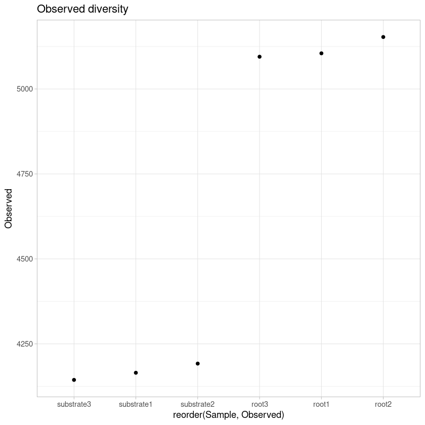
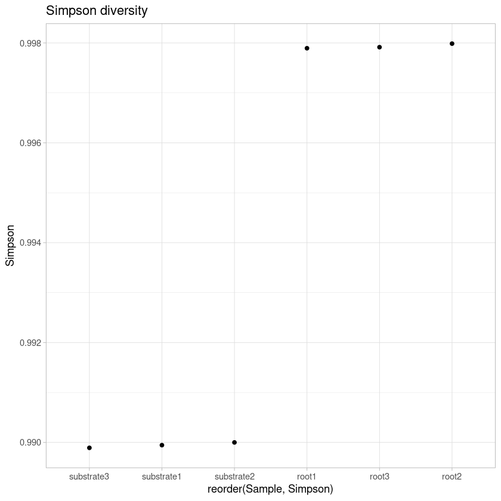
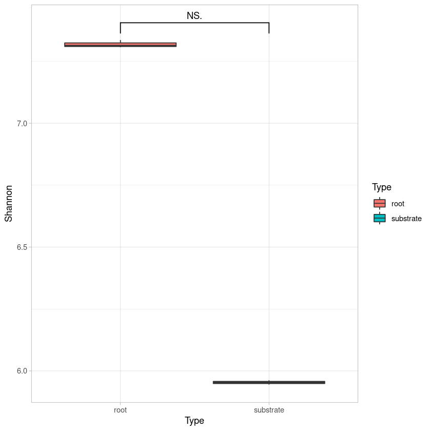
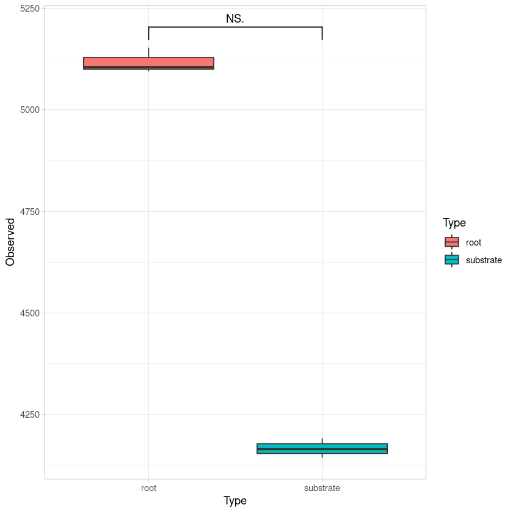

# Sequence processing


```R
#Subsampling root samples

seqtk sample -s100 rhizosphere_R1.fastq 300000 > submuestreos/rhizosphere1_R1.fastq
seqtk sample -s100 rhizosphere_R2.fastq 300000 > submuestreos/rhizosphere1_R2.fastq

seqtk sample -s200 rhizosphere_R1.fastq 300000 > submuestreos/rhizosphere2_R1.fastq
seqtk sample -s200 rhizosphere_R2.fastq 300000 > submuestreos/rhizosphere2_R2.fastq

seqtk sample -s300 rhizosphere_R1.fastq 300000 > submuestreos/rhizosphere3_R1.fastq
seqtk sample -s300 rhizosphere_R2.fastq 300000 > submuestreos/rhizosphere3_R2.fastq

#Subsampling substrate samples

seqtk sample -s100 substrate_R1.fastq 300000 > submuestreos/substrate1_R1.fastq
seqtk sample -s100 substrate_R2.fastq 300000 > submuestreos/substrate1_R2.fastq

seqtk sample -s200 substrate_R1.fastq 300000 > submuestreos/substrate2_R1.fastq
seqtk sample -s200 substrate_R2.fastq 300000 > submuestreos/substrate2_R2.fastq

seqtk sample -s300 substrate_R1.fastq 300000 > submuestreos/substrate3_R1.fastq
seqtk sample -s300 substrate_R2.fastq 300000 > submuestreos/substrate3_R2.fastq
```


```R
#A list of files to assembly is generated.
ls *.fastq.gz | perl -pe 's/_R.*.fastq.gz//g' | sort | uniq >lista
```


```R
#Use assembly sh script
The "assembly.sh" scrip generates the works to assembly files from list.
```


```R
# assembly.sh

#!/bin/bash

SEQS=$(pwd)
SALIDAS=$(pwd)
BIN=/usr/bin
BIN2=/usr/bin
COUNT=0
for FAA in `cat lista`
do
let COUNT=COUNT+1
echo "#!/bin/bash" >$*.$COUNT.scr
echo "#$ -cwd" >>$*.$COUNT.scr
echo "#$ -j y" >>$*.$COUNT.scr
echo "#$ -S /bin/bash" >>$*.$COUNT.scr
echo "$SEQS/$FAA"_R1.fastq" | $BIN2/fastx_trimmer -l 250 > $SEQS/$FAA"tr_R1.fastq" &" >>$*.$COUNT.scr mo
echo "$SEQS/$FAA"_R2.fastq" | $BIN2/fastx_trimmer -l 250 > $SEQS/$FAA"tr_R2.fastq"" >>$*.$COUNT.scr
echo "$BIN/pandaseq -B -f $SEQS/$FAA"tr_R1.fastq" -r $SEQS/$FAA"tr_R2.fastq" -t 0.95 -l 250 -L 470 -o 15 -w $SALIDAS/$FAA"_$*.fasta" -G $SALIDAS/$FAA"-$*.log.bz2"" >>$*.$COUNT.scr

done
```


```R
Preceding script utilices “fastx_trimmer” that crop sequence to a size that is defined with -l. 
The obtained file is assembled with “pandaseq”, -t can take values for 0 to 1 and alignments with lower values 
are discarded; -l is the minimum sequence length -L maximum sequence length; -o minimum overlap between assembled 
sequences.
```


```R
#Run script to generate works
bash assembly.sh ensamble
```


```R
#Running works in the cluster:
for N in `ls *.scr`; do qsub $N; done
```


```R
#Sequences names are changed with “header.fasta.numbers.pl”.

# Luis David Alcaraz 2013-04-11

my $prefix = $ARGV[0]; chomp $prefix;
my $f =  1;

my $fasta_file = $ARGV [1]; chomp $fasta_file;

my $fh;
open($fh, $fasta_file) or die "can't open $fasta_file: $!\n";
open(OUT, ">$fasta_file.numbered.fas") || die "can't open $fasta_file.numbered.f
as\n";

my %sequence_data;
while (read_fasta_sequence($fh, \%sequence_data)) {
   print OUT ">$sequence_data{header}\n$sequence_data{seq}\n";
}

close $fh;
close OUT;

sub read_fasta_sequence {
   my ($fh, $seq_info) = @_;

$seq_info->{seq} = undef; # clear out previous sequence

   # put the header into place
   $seq_info->{header} = $seq_info->{next_header} if $seq_info->{next_header};

   my $file_not_empty = 0;
   while (<$fh>) {
      $file_not_empty = 1;
      next if /^\s*$/;  # skip blank lines
      chomp;    

      if (/^>/) { # fasta header line
         my $h = $_;    
         $h =~ s/>/$prefix\_$f\ /;
     $f++;
         if ($seq_info->{header}) {
            $seq_info->{next_header} = $h;
            return $seq_info;
       
         }              
         else { # first time through only
            $seq_info->{header} = $h;
         }              
      }         
      else {    
         s/\s+//;  # remove any white space
         s/\n\n/\n/;
         $seq_info->{seq} .= $_;
      }         
   }    

   if ($file_not_empty) {
      return $seq_info;
   }    
   else {
      # clean everything up
      $seq_info->{header} = $seq_info->{seq} = $seq_info->{next_header} = undef;

      return;   
   }    
}
```


```R
#Run the script for each sample
perl header.fasta.numbers.pl substrate1 substrate1_ensamble.fasta
perl header.fasta.numbers.pl substrate2 substrate2_ensamble.fasta
perl header.fasta.numbers.pl substrate3 substrate3_ensamble.fasta

perl header.fasta.numbers.pl rhizosphere1 rhizosphere1_ensamble.fasta
perl header.fasta.numbers.pl rhizosphere2 rhizosphere2_ensamble.fasta
perl header.fasta.numbers.pl rhizosphere3 rhizosphere3_ensamble.fasta
```


```R
#Concatenate all samples
cat *.numbered.fas > biofert.fas
```


```R
#Edit sequence name to leave only the first part, which refers to sample name. 
perl -i.bak -pe "s/\ .*//g" biofert.fas
```


```R
#Sequence clustering of OTUs at 97%  of identity was done with cd-hit-est, -c indicates the identity for clustering.

cd-hit-est -i biofert.fas -c 0.97 -o biofert.fasout -T 20 -M 0
```


```R
#The clustering file is converted in a file that can be read by QIIME.
perl -pne 's/\t//g;s/^.*,//g;s/\.\.\..*$//g;s/\n/\t/g;s/\>Cluster\ /\n/g;s/\>//g; eof && do{chomp; print "$_ \n"; exit}' biofert.fasout.clstr > biofert.otu
sed -i '1d' biofert.otu
```


```R
#Extract representative OTUs, -i indicates input file, -f is the fasta file with the sequences to be extracted. 

pick_rep_set.py -i biofert.otu -f biofert.fas -o biofert.rep.fna
```


```R
#Filter sequences that are not 16S by blasting against a smaller DB (OTUs 70% id).


parallel_assign_taxonomy_blast.py -i biofert.rep.fna -o no16S_screen -r /qiime/gg_otus-13_8-release/rep_set/70_otus.fasta -t /qiime/gg_otus-13_8-release/taxonomy/70_otu_taxonomy.txt

cat no16S_screen/biofert.rep_tax_assignments.txt | grep -c "No blast hit"
cat no16S_screen/biofert.rep_tax_assignments.txt | grep -v "No blast hit" | cut -f1 >ids_screened.txt
cat no16S_screen/biofert.rep_tax_assignments.txt | grep "No blast hit" | cut -f1 >ids_REMOVE_biom.txt

#Extract 16S sequences and make a new representative file
perl -ne 'if(/^>(\S+)/){$c=$i{$1}}$c?print:chomp;$i{$_}=1 if @ARGV' ids_screened.txt biofert.rep.fna > biofert.screened.fna
```


```R
#Taxonomic assignment
#Taxonomic assignment was done with QIIME using Silva database as reference.

parallel_assign_taxonomy_blast.py -i biofert.screened.fna -o taxonomy -r /home/cristobal/DB/SILVA_128_QIIME_release/rep_set/rep_set_16S_only/97/97_otus_16S.fasta -t /home/cristobal/DB/SILVA_128_QIIME_release/taxonomy/16S_only/97/consensus_taxonomy_7_levels.txt
                                                                                                                                                                                                                                                               

cat taxonomy/biofert.screened_tax_assignments.txt | grep "No blast hit" | cut -f1 >>ids_REMOVE_biom.txt
cat taxonomy/biofert.screened_tax_assignments.txt | grep -i "mitochondria" | cut -f1 >>ids_REMOVE_biom.txt
cat taxonomy/biofert.screened_tax_assignments.txt | grep -i "chloroplast" | cut -f1 >>ids_REMOVE_biom.txt
```


```R
#Make otu table
sed -i 's/ /_/g' taxonomy/biofert.screened_tax_assignments.txt

#!/bin/bash
#$ -cwd
#$ -j y
#$ -S /bin/bash
make_otu_table.py -i biofert.otu -t taxonomy/biofert.screened_tax_assignments.txt -o biofert.biom 

#Remove singletons and non 16S sequences

#!/bin/bash
#$ -cwd
#$ -j y
#$ -S /bin/bash
filter_otus_from_otu_table.py -i biofert.biom -e ids_REMOVE_biom.txt -o biofert_screened.biom -n 2 -s 3; mv biofert_screened.biom biofert.biom
```


```R
#Remove chimeras

#Align sequences

#!/bin/bash
#$ -cwd
#$ -j y
#$ -S /bin/bash
parallel_align_seqs_pynast.py -i biofert.screened.fna -o chimalign -X biofert

#Identify chimeric sequences

#!/bin/bash
#$ -cwd
#$ -j y
#$ -S /bin/bash
parallel_identify_chimeric_seqs.py -m blast_fragments -i biofert.screened.fna -a chimalign/biofert.screened_aligned.fasta -o biofert.chimera.txt -X biofertblast --id_to_taxonomy_fp /qiime/gg_otus-13_8-release/taxonomy/70_otu_taxonomy.txt -r /qiime/gg_otus-13_8-release/rep_set/70_otus.fasta

#Filter OTUs

#!/bin/bash
#$ -cwd
#$ -j y
#$ -S /bin/bash
filter_otus_from_otu_table.py -i biofert.biom -e biofert.chimera.txt -o biofert_chimera.biom; mv biofert_chimera.biom biofert.biom

```


```R
#Transform biom table to tabular format

#!/bin/bash
#$ -cwd
#$ -j y
#$ -S /bin/bash
biom convert --to-tsv -i biofert.biom -o biofert.biom.tsv --header-key=taxonomy

```


```R
#Split taxonomy table from OTU table.
perl -pe 's/\; /\;/g' biofert.biom.tsv | awk '{print $1,"\t",$NF}' | perl -pe 's/\;/\t/g' > biofert_16S_tax.tsv

#Split OTU abundance for sample from OTU table: 
cut -f 1-7 biofert.biom.tsv > biofert_16S_otu.tsv
sed -i -e "1d" biofert_16S_otu.tsv
```

# Analyses of bacterial diversity


```R
#Load libraries
library(scales)
library(phyloseq)
library(phylogeo)
library(ggplot2)
library(ape)
library(vegan)
library(gridExtra)
library(reshape2)
library(RColorBrewer)
library(forcats)
library(ggsignif)
```

    Warning message:
    “replacing previous import ‘dplyr::combine’ by ‘gridExtra::combine’ when loading ‘phylogeo’”
    Loading required package: permute
    
    Loading required package: lattice
    
    This is vegan 2.5-7
    


```R
# Load OTU table
otu <- as.matrix(read.table("biofert_16S_otu.tsv", header=T, row.names=1))
colnames(otu) <- c("root1","root2", "root3", "substrate1", "substrate2", "substrate3")
otu <- otu[, c("root1","root2", "root3", "substrate1", "substrate2", "substrate3")]
OTU <- otu_table(otu, taxa_are_rows=T)
```


```R
# Load taxonomy table
taxa <- as.matrix(read.table("biofert_16S_tax.tsv", row.names = 1))
TAXA <- tax_table(taxa)
colnames(TAXA) <- c("Kingdom", "Phylum", "Class", "Order", "Family", "Genus", "Specie")
```


```R
# Create phyloseq object with taxonomy and OTU tables 
bact <-phyloseq(OTU,TAXA)
bact
```


    phyloseq-class experiment-level object
    otu_table()   OTU Table:         [ 7779 taxa and 6 samples ]
    tax_table()   Taxonomy Table:    [ 7779 taxa by 7 taxonomic ranks ]


```R
# Rarefaction curves
pdf("rarefaction.pdf")
rarefaction <- rarecurve(t(otu), step=1000, cex=0.5, col="red")
dev.off()

rarecurve(t(otu), step=1000, cex=0.5, col="red")
```


<strong>png:</strong> 2


    

    


```R
# Shannon diversity estimations
estimate_richness(bact)
write.table(estimate_richness(bact), file="bact_diversity.tsv",append = FALSE, quote = TRUE, sep = "\t")
```


<table class="dataframe">
<caption>A data.frame: 6 × 9</caption>
<thead>
	<tr><th></th><th scope=col>Observed</th><th scope=col>Chao1</th><th scope=col>se.chao1</th><th scope=col>ACE</th><th scope=col>se.ACE</th><th scope=col>Shannon</th><th scope=col>Simpson</th><th scope=col>InvSimpson</th><th scope=col>Fisher</th></tr>
	<tr><th></th><th scope=col>&lt;dbl&gt;</th><th scope=col>&lt;dbl&gt;</th><th scope=col>&lt;dbl&gt;</th><th scope=col>&lt;dbl&gt;</th><th scope=col>&lt;dbl&gt;</th><th scope=col>&lt;dbl&gt;</th><th scope=col>&lt;dbl&gt;</th><th scope=col>&lt;dbl&gt;</th><th scope=col>&lt;dbl&gt;</th></tr>
</thead>
<tbody>
	<tr><th scope=row>root1</th><td>5105</td><td>8714.272</td><td>200.8142</td><td>8883.364</td><td>56.44440</td><td>7.312528</td><td>0.9978940</td><td>474.82461</td><td>1818.208</td></tr>
	<tr><th scope=row>root2</th><td>5153</td><td>8883.501</td><td>207.1684</td><td>8982.627</td><td>56.56213</td><td>7.335910</td><td>0.9979863</td><td>496.60434</td><td>1832.156</td></tr>
	<tr><th scope=row>root3</th><td>5095</td><td>8657.167</td><td>197.2964</td><td>8980.774</td><td>57.12986</td><td>7.306862</td><td>0.9979152</td><td>479.65828</td><td>1811.637</td></tr>
	<tr><th scope=row>substrate1</th><td>4165</td><td>8410.471</td><td>253.5152</td><td>8667.542</td><td>59.95723</td><td>5.953283</td><td>0.9899455</td><td> 99.45785</td><td>1167.866</td></tr>
	<tr><th scope=row>substrate2</th><td>4192</td><td>8307.163</td><td>243.5088</td><td>8706.110</td><td>60.36262</td><td>5.962053</td><td>0.9900002</td><td>100.00190</td><td>1175.495</td></tr>
	<tr><th scope=row>substrate3</th><td>4144</td><td>7986.040</td><td>226.8391</td><td>8637.525</td><td>60.00217</td><td>5.944937</td><td>0.9898917</td><td> 98.92897</td><td>1159.049</td></tr>
</tbody>
</table>


```R
div <- read.table("bact_diversity.tsv", header=TRUE, row.names = NULL)
colnames(div) <- c("Sample", "Observed", "Chao1", "SE.Chao1", 
                    "ACE", "SE.ACE", "Shannon", "Simpson", "InvSimpson", "Fisher")

observed_plot <- ggplot(div, aes(reorder(Sample, Observed), y=Observed))  + geom_point() + 
                        theme_light() +  ggtitle("Observed diversity") 
ggsave("bact_observed_plot.pdf", width=10, height=5, units="cm")
observed_plot


shannon_plot <- ggplot(div, aes(reorder(Sample, Shannon), y=Shannon))  + geom_point() + 
                        theme_light() + ggtitle("Shannon diversity")
ggsave("bact_shannon_plot.pdf", width=10, height=5, units="cm")
shannon_plot

simpson_plot <- ggplot(div, aes(reorder(Sample, Simpson), y=Simpson))  + geom_point() + 
                        theme_light() + ggtitle("Simpson diversity")
ggsave("bact_simpson_plot.pdf", width=10, height=5, units="cm")
simpson_plot
```


    

    


    

    


    

    


```R
#Add sample type
div$Type <- c("root","root", "root", "substrate", "substrate", "substrate")

#Shapiro test for nomality in diversity
shapiro.test(div$Shannon)

#Shapiro test for nomality in diversity
shapiro.test(div$Observed)
```


    
    	Shapiro-Wilk normality test
    
    data:  div$Shannon
    W = 0.69573, p-value = 0.005571


    
    	Shapiro-Wilk normality test
    
    data:  div$Observed
    W = 0.72472, p-value = 0.01114


```R
#Plot Shannon diversity
shannon_plot <- ggplot(div, aes(Type, Shannon, fill=Type)) + geom_boxplot() + 
                            stat_signif(test = wilcox.test, map_signif_level = TRUE, 
                                        comparisons = list(c("root", "substrate"))) + theme_light()
shannon_plot
```


    

    


```R
#Plot Shannon diversity
shannon_plot <- ggplot(div, aes(Type, Shannon, fill=Type)) + geom_boxplot() + 
                            stat_signif(test = wilcox.test, map_signif_level = TRUE, 
                                        comparisons = list(c("root", "substrate"))) + theme_light()
ggsave("bact_shannon_plot.pdf")
shannon_plot
```

    Saving 6.67 x 6.67 in image
    


    

    


```R
#Plot Observed diversity
Observed_plot <- ggplot(div, aes(Type, Observed, fill=Type)) + geom_boxplot() + 
                            stat_signif(test = wilcox.test, map_signif_level = TRUE, 
                                        comparisons = list(c("root", "substrate"))) + theme_light()
ggsave("bact_observed_plot.pdf")
Observed_plot
```

    Saving 6.67 x 6.67 in image
    


    

    


```R

```
