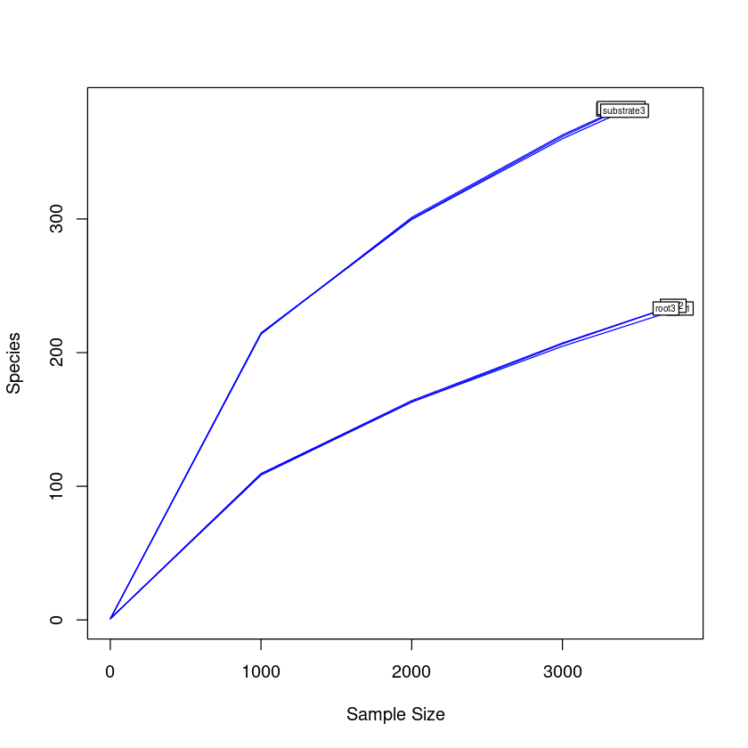
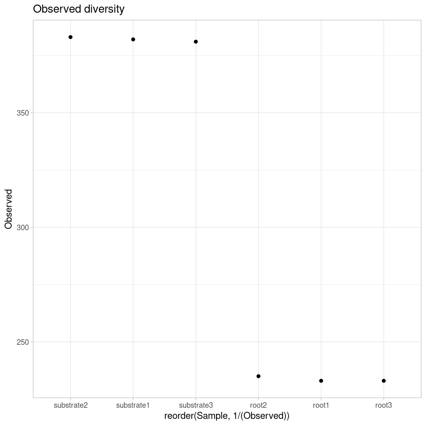
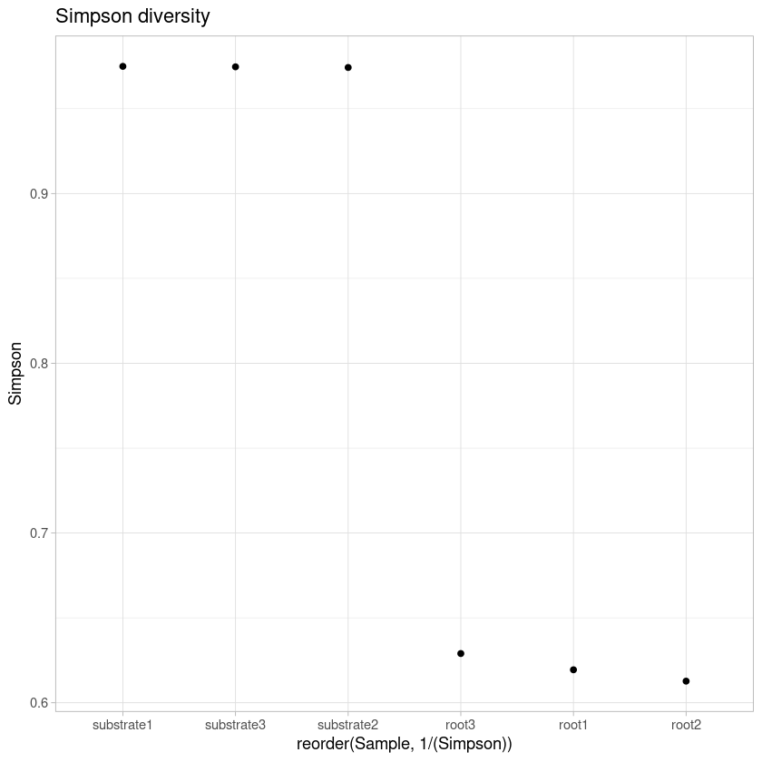
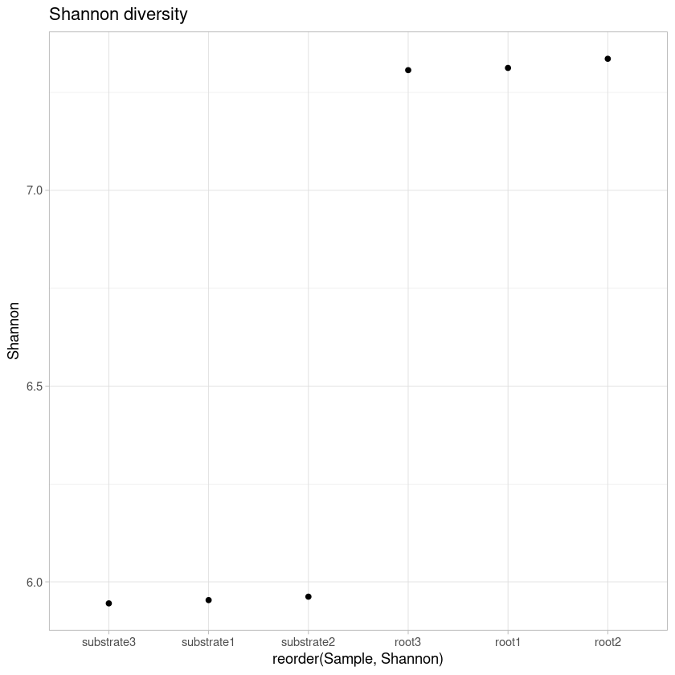
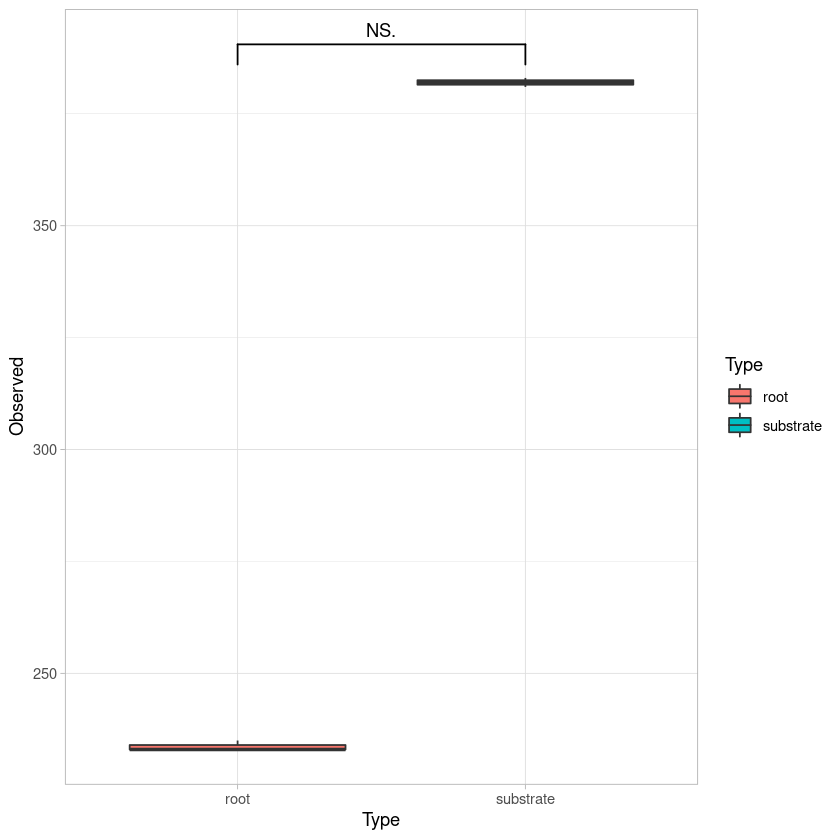

# Sequence processing


```R
#Subsampling root samples

#Subsampling root samples

seqtk sample -s100 rhizosphere_R1.fastq.gz 20000 > submuestreos/rhizosphere1_R1.fastq.gz
seqtk sample -s100 rhizosphere_R2.fastq.gz 20000 > submuestreos/rhizosphere1_R2.fastq.gz

seqtk sample -s200 rhizosphere_R1.fastq.gz 20000 > submuestreos/rhizosphere2_R1.fastq.gz
seqtk sample -s200 rhizosphere_R2.fastq.gz 20000 > submuestreos/rhizosphere2_R2.fastq.gz

seqtk sample -s300 rhizosphere_R1.fastq.gz 20000 > submuestreos/rhizosphere3_R1.fastq.gz
seqtk sample -s300 rhizosphere_R2.fastq.gz 20000 > submuestreos/rhizosphere3_R2.fastq.gz

#Subsampling substrate samples

seqtk sample -s100 substrate_R1.fastq.gz 20000 > submuestreos/substrate1_R1.fastq.gz
seqtk sample -s100 substrate_R2.fastq.gz 20000 > submuestreos/substrate1_R2.fastq.gz

seqtk sample -s200 substrate_R1.fastq.gz 20000 > submuestreos/substrate2_R1.fastq.gz
seqtk sample -s200 substrate_R2.fastq.gz 20000 > submuestreos/substrate2_R2.fastq.gz

seqtk sample -s300 substrate_R1.fastq.gz 20000 > submuestreos/substrate3_R1.fastq.gz
seqtk sample -s300 substrate_R2.fastq.gz 20000 > submuestreos/substrate3_R2.fa
```


```R
#A list of files to assembly is generated.
ls *.fastq.gz | perl -pe 's/_R.*.fastq.gz//g' | sort | uniq > lista
```


```R
#Use assembly sh script
The "assemblyCASPER.sh" scrip generates the works to assembly files from list.
```


```R
#!/bin/bash
# Use: bash assemblyCASPER.sh NOMBRE_TRABAJO

SEQS=$(pwd)
SALIDAS=$(pwd)
BIN=/usr/local/bin
COUNT=0

for FAA in `cat lista`
do
let COUNT=COUNT+1
echo "#!/bin/bash" >$*.$COUNT.scr
echo "#$ -cwd" >>$*.$COUNT.scr
echo "#$ -j y" >>$*.$COUNT.scr
echo "#$ -S /bin/bash" >>$*.$COUNT.scr

echo "$BIN/casper <(cat $SEQS/$FAA"_R1.fastq") <(cat($SEQS/$FAA"_R2.fastq") -o $FAA.assembly.fastq -o $FAA"_assembly"" >>$*.$COUNT.scr

done
```


```R
#Quality filter, remove sequence with Quality score lower than 20. 
#This step is made to remove low quality assemblies

#!/bin/bash
SEQS=$(pwd)
SALIDAS=$(pwd)
for FAA in `cat lista`
do
let COUNT=COUNT+1
echo "#!/bin/bash" >$*.$COUNT.scr
echo "#$ -cwd" >>$*.$COUNT.scr
echo "#$ -j y" >>$*.$COUNT.scr
echo "#$ -S /bin/bash" >>$*.$COUNT.scr

echo fastq_quality_filter -q 20 -p 80 -i "$SEQS/$FAA".fastq -o "$SEQS/$FAA"_tr.fastq >>$*.$COUNT.scr

done
```


```R
#Transform filtered sequences to fasta
for x in `cat lista`; do sed -n '1~4s/^@/>/p;2~4p' "$x"_tr.fastq > "$x"_ensamble.fasta; done
```


```R
Sequences names are changed with “header.fasta.numbers.pl”.

# Luis David Alcaraz 2013-04-11

my $prefix = $ARGV[0]; chomp $prefix;
my $f =  1;

my $fasta_file = $ARGV [1]; chomp $fasta_file;

my $fh;
open($fh, $fasta_file) or die "can't open $fasta_file: $!\n";
open(OUT, ">$fasta_file.numbered.fas") || die "can't open $fasta_file.numbered.f
as\n";

my %sequence_data;
while (read_fasta_sequence($fh, \%sequence_data)) {
   print OUT ">$sequence_data{header}\n$sequence_data{seq}\n";
}

close $fh;
close OUT;

sub read_fasta_sequence {
   my ($fh, $seq_info) = @_;

$seq_info->{seq} = undef; # clear out previous sequence

   # put the header into place
   $seq_info->{header} = $seq_info->{next_header} if $seq_info->{next_header};

   my $file_not_empty = 0;
   while (<$fh>) {
      $file_not_empty = 1;
      next if /^\s*$/;  # skip blank lines
      chomp;    

      if (/^>/) { # fasta header line
         my $h = $_;    
         $h =~ s/>/$prefix\_$f\ /;
     $f++;
         if ($seq_info->{header}) {
            $seq_info->{next_header} = $h;
            return $seq_info;
       
         }              
         else { # first time through only
            $seq_info->{header} = $h;
         }              
      }         
      else {    
         s/\s+//;  # remove any white space
         s/\n\n/\n/;
         $seq_info->{seq} .= $_;
      }         
   }    

   if ($file_not_empty) {
      return $seq_info;
   }    
   else {
      # clean everything up
      $seq_info->{header} = $seq_info->{seq} = $seq_info->{next_header} = undef;

      return;   
   }    
}
```


```R
#Run the script for each sample
perl header.fasta.numbers.pl substrate1 substrate1_ensamble.fasta
perl header.fasta.numbers.pl substrate2 substrate2_ensamble.fasta
perl header.fasta.numbers.pl substrate3 substrate3_ensamble.fasta

perl header.fasta.numbers.pl rhizosphere1 rhizosphere1_ensamble.fasta
perl header.fasta.numbers.pl rhizosphere2 rhizosphere2_ensamble.fasta
perl header.fasta.numbers.pl rhizosphere3 rhizosphere3_ensamble.fasta
```


```R
#Concatenate all samples
cat *.numbered.fas > biofert.fas
```


```R
#Edit sequence name to leave only the first part, which refers to sample name. 
perl -i.bak -pe "s/\ .*//g" biofert.fas
```


```R
#Sequence clustering of OTUs at 97%  of identity was done with cd-hit-est, -c indicates the identity for clustering.

cd-hit-est -i biofert.fas -c 0.97 -o biofert.fasout -T 20 -M 0
```


```R
#The clustering file is converted in a file that can be read by QIIME.
perl -pne 's/\t//g;s/^.*,//g;s/\.\.\..*$//g;s/\n/\t/g;s/\>Cluster\ /\n/g;s/\>//g; eof && do{chomp; print "$_ \n"; exit}' biofert.fasout.clstr > biofert.otu
sed -i '1d' biofert.otu
```


```R
## Extract representative OTUs, -i indicates input file, -f is the fasta file with the sequences to be extracted. 

pick_rep_set.py -i biofert.otu -f biofert.fas -o biofert.rep.fna
```


```R
#Assign taxonomy against most recent UNITE database. We use the complete database to accuretly assign non fungal taxa

parallel_assign_taxonomy_blast.py -i biofert.rep.fna -o taxonomy -r /home/cristobal/DB/UNITE_9_all/sh_refs_qiime_ver9_97_all_29.11.2022.fasta -t /home/cristobal/DB/UNITE_9_all/sh_taxonomy_qiime_ver9_97_all_29.11.2022.txt

#Create a list of fungal ITS sequences, this step removes sequences without hits
cat taxonomy/biofert.rep_tax_assignments.txt | grep "k__Fungi" | cut -f1 > ids_screened.txt

#Create a list of sequences that are not fungi
cat taxonomy/biofert.rep_tax_assignments.txt | grep -v "k__Fungi" | cut -f1 > ids_REMOVE_biom.txt

#Extract ITS sequences from ITS list and make a new representative file
perl -ne 'if(/^>(\S+)/){$c=$i{$1}}$c?print:chomp;$i{$_}=1 if @ARGV' ids_screened.txt biofert.rep.fna > biofert.screened.fna
```


```R
#Make biom object

make_otu_table.py -i biofert.otu -t taxonomy/biofert.rep_tax_assignments.txt -o biofert.biom 

#Remove singletons and non fungal sequences. Chimeras are removed later

filter_otus_from_otu_table.py -i biofert.biom -e ids_REMOVE_biom.txt -o biofert_screened.biom  -n 2 -s 2
```


```R
#Remove chimeras from representative sequences

#Identify chimera

parallel_identify_chimeric_seqs.py -m blast_fragments -i biofert.screened.fna -o biofert.chimera.txt -X biofertblast --id_to_taxonomy_fp /home/cristobal/DB/UNITE_9/sh_taxonomy_qiime_ver9_97_16.10.2022.txt -r /home/cristobal/DB/UNITE_9/sh_refs_qiime_ver9_97_16.10.2022.fasta


#Filter chimeric sequences from biom table

filter_otus_from_otu_table.py -i biofert_screened.biom -e biofert.chimera.txt -o biofert_chimera.biom
```


```R
#Create tables
biom convert --to-tsv -i biofert_chimera.biom -o biofert.biom.tsv --table-type "Taxon table" --header-key=taxonomy

#Remove OTUs labeled as "None"
grep -v 'None' biofert.biom.tsv > biofert_filt.biom.tsv; mv biofert_filt.biom.tsv biofert.biom.tsv
```


```R
#Split taxonomy table from OTU table.
perl -pe 's/\; /\;/g' biofert.biom.tsv | awk '{print $1,"\t",$NF}' | perl -pe 's/\;/\t/g' > biofert_ITS_tax.tsv

#Split OTU abundance for sample from OTU table: 
cut -f 1-7 biofert.biom.tsv > biofert_ITS_otu.tsv
```

# Analyses of fungal diversity


```R
#Load libraries
library(phyloseq)
library(ggplot2)
library(ape)
library(vegan)
library(gridExtra)
library(phylogeo)
library(ggrepel)
library(reshape2)
library(RColorBrewer)
library(forcats)
library(ggsignif)
```

    Loading required package: permute
    
    Loading required package: lattice
    
    This is vegan 2.5-7
    
    Warning message:
    “replacing previous import ‘dplyr::combine’ by ‘gridExtra::combine’ when loading ‘phylogeo’”


```R
# Load OTU table
otu <- as.matrix(read.table("biofert_ITS_otu.tsv", header=T, row.names=1))
colnames(otu) <- c("root1","root2", "root3", "substrate1", "substrate2", "substrate3")
OTU <- otu_table(otu, taxa_are_rows=T)
```


```R
# Load taxonomy table
taxa <- as.matrix(read.table("biofert_ITS_tax.tsv", row.names=1))
TAXA <- tax_table(taxa)
colnames(TAXA) <- c("Kingdom", "Phylum", "Class", "Order", "Family", "Genus", "Specie")
```


```R
# Create phyloseq object with taxonomy and OTU tables 
its <-phyloseq(OTU,TAXA)
its
```


    phyloseq-class experiment-level object
    otu_table()   OTU Table:         [ 505 taxa and 6 samples ]
    tax_table()   Taxonomy Table:    [ 505 taxa by 7 taxonomic ranks ]


```R
# Rarefaction curves
pdf("rarefaction.pdf")
rarefaction <- rarecurve(t(otu), step=1000, cex=0.5, col="blue")
dev.off()

rarecurve(t(otu), step=1000, cex=0.5, col="blue")
```


<strong>png:</strong> 2


    

    


```R
# Shannon diversity estimations
estimate_richness(its)
write.table(estimate_richness(its), file="its_diversity.tsv",append = FALSE, quote = TRUE, sep = "\t")

```


<table class="dataframe">
<caption>A data.frame: 6 × 9</caption>
<thead>
	<tr><th></th><th scope=col>Observed</th><th scope=col>Chao1</th><th scope=col>se.chao1</th><th scope=col>ACE</th><th scope=col>se.ACE</th><th scope=col>Shannon</th><th scope=col>Simpson</th><th scope=col>InvSimpson</th><th scope=col>Fisher</th></tr>
	<tr><th></th><th scope=col>&lt;dbl&gt;</th><th scope=col>&lt;dbl&gt;</th><th scope=col>&lt;dbl&gt;</th><th scope=col>&lt;dbl&gt;</th><th scope=col>&lt;dbl&gt;</th><th scope=col>&lt;dbl&gt;</th><th scope=col>&lt;dbl&gt;</th><th scope=col>&lt;dbl&gt;</th><th scope=col>&lt;dbl&gt;</th></tr>
</thead>
<tbody>
	<tr><th scope=row>root1</th><td>233</td><td>522.1379</td><td>75.26314</td><td>503.1522</td><td>14.24230</td><td>2.224325</td><td>0.6194093</td><td> 2.627495</td><td> 54.85242</td></tr>
	<tr><th scope=row>root2</th><td>235</td><td>546.8966</td><td>80.33854</td><td>544.0906</td><td>15.07109</td><td>2.214287</td><td>0.6127190</td><td> 2.582105</td><td> 55.67770</td></tr>
	<tr><th scope=row>root3</th><td>233</td><td>560.8571</td><td>84.93690</td><td>560.0426</td><td>15.18408</td><td>2.251166</td><td>0.6289820</td><td> 2.695287</td><td> 55.27772</td></tr>
	<tr><th scope=row>substrate1</th><td>382</td><td>628.3559</td><td>51.82256</td><td>643.1545</td><td>14.27294</td><td>4.561802</td><td>0.9749418</td><td>39.907119</td><td>110.61164</td></tr>
	<tr><th scope=row>substrate2</th><td>383</td><td>599.5781</td><td>45.47829</td><td>620.0691</td><td>14.14905</td><td>4.533806</td><td>0.9742717</td><td>38.867732</td><td>110.96320</td></tr>
	<tr><th scope=row>substrate3</th><td>381</td><td>617.1207</td><td>50.32252</td><td>630.1280</td><td>14.40597</td><td>4.553672</td><td>0.9746696</td><td>39.478260</td><td>109.88254</td></tr>
</tbody>
</table>


```R
div <- read.table("its_diversity.tsv", header=TRUE, row.names = NULL)
colnames(div) <- c("Sample", "Observed", "Chao1", "SE.Chao1", 
                    "ACE", "SE.ACE", "Shannon", "Simpson", "InvSimpson", "Fisher")

observed_plot <- ggplot(div, aes(reorder(Sample, 1/(Observed)), y=Observed))  + geom_point() + 
                        theme_light() +  ggtitle("Observed diversity") 
ggsave("observed_plot.pdf", width=10, height=5, units="cm")
observed_plot


shannon_plot <- ggplot(div, aes(reorder(Sample, 1/(Shannon)), y=Shannon))  + geom_point() + 
                        theme_light() + ggtitle("Shannon diversity")
ggsave("shannon_plot.pdf", width=10, height=5, units="cm")
shannon_plot

simpson_plot <- ggplot(div, aes(reorder(Sample, 1/(Simpson)), y=Simpson))  + geom_point() + 
                        theme_light() + ggtitle("Simpson diversity")
ggsave("simpson_plot.pdf", width=10, height=5, units="cm")
simpson_plot
```


    

    


    

    


    

    


```R
#Add sample type
div$Type <- c("root","root", "root", "substrate", "substrate", "substrate")

#Shapiro test for nomality in diversity
shapiro.test(div$Shannon)

#Shapiro test for nomality in diversity
shapiro.test(div$Observed)
```


    
    	Shapiro-Wilk normality test
    
    data:  div$Shannon
    W = 0.69261, p-value = 0.005162


    
    	Shapiro-Wilk normality test
    
    data:  div$Observed
    W = 0.69219, p-value = 0.005109


```R
#Plot Shannon diversity
shannon_plot <- ggplot(div, aes(Type, Shannon, fill=Type)) + geom_boxplot() + 
                            stat_signif(test = wilcox.test, map_signif_level = TRUE, 
                                        comparisons = list(c("root", "substrate"))) + theme_light()
ggsave("fung_shannon_plot.pdf")
shannon_plot
```

    Saving 6.67 x 6.67 in image
    


    

    


```R
#Plot Observed diversity
Observed_plot <- ggplot(div, aes(Type, Observed, fill=Type)) + geom_boxplot() + 
                            stat_signif(test = wilcox.test, map_signif_level = TRUE, 
                                        comparisons = list(c("root", "substrate"))) + theme_light()
ggsave("fung_observed_plot.pdf")
Observed_plot
```

    Saving 6.67 x 6.67 in image
    
    Warning message in wilcox.test.default(c(233, 235, 233), c(382, 383, 381)):
    “cannot compute exact p-value with ties”
    Warning message in wilcox.test.default(c(233, 235, 233), c(382, 383, 381)):
    “cannot compute exact p-value with ties”


    

    

