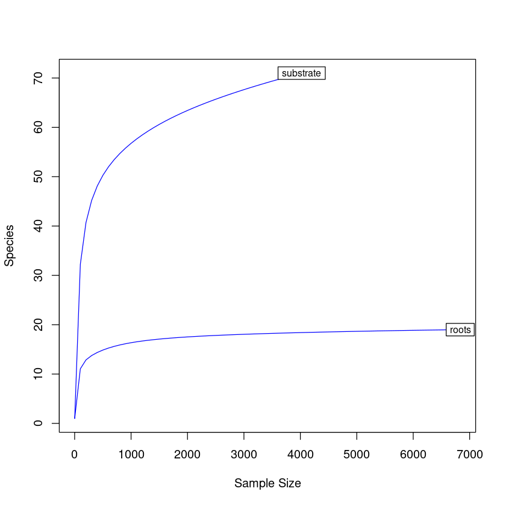
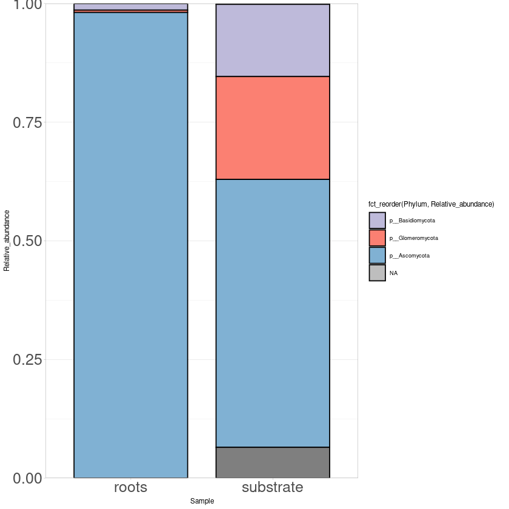
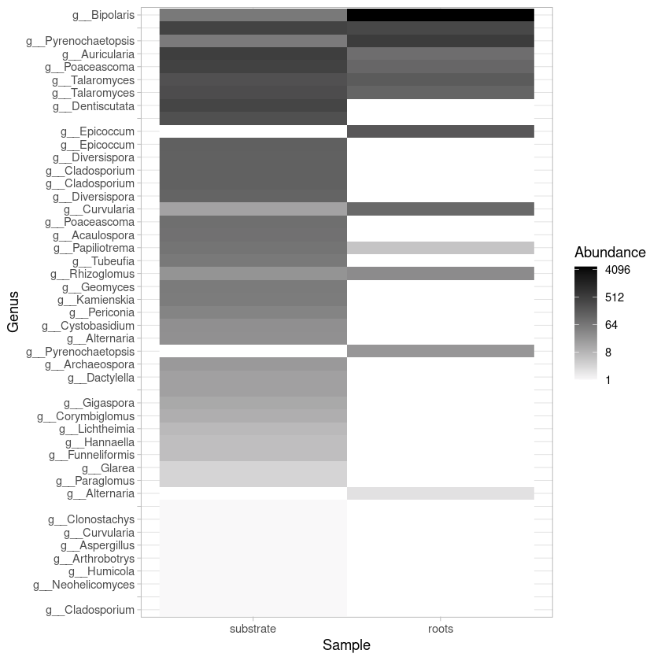
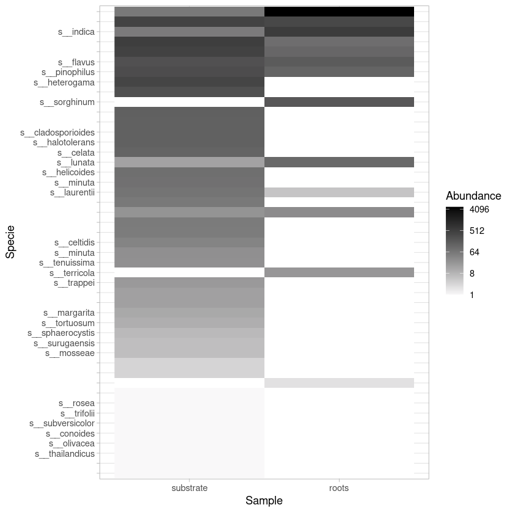
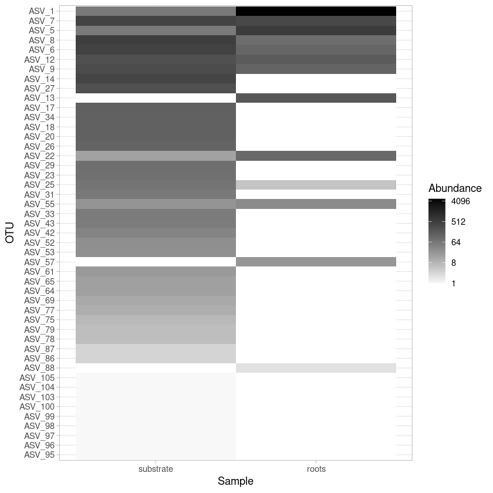

# ASV processing


```R
library(dada2)
library(ShortRead)
library(Biostrings)
library(tidyverse)
```

    Loading required package: Rcpp
    
    Loading required package: BiocGenerics
    
    Loading required package: parallel
    
    
    Attaching package: ‘BiocGenerics’
    
    
    The following objects are masked from ‘package:parallel’:
    
        clusterApply, clusterApplyLB, clusterCall, clusterEvalQ,
        clusterExport, clusterMap, parApply, parCapply, parLapply,
        parLapplyLB, parRapply, parSapply, parSapplyLB
    
    
    The following objects are masked from ‘package:stats’:
    
        IQR, mad, sd, var, xtabs
    
    
    The following objects are masked from ‘package:base’:
    
        anyDuplicated, append, as.data.frame, basename, cbind, colnames,
        dirname, do.call, duplicated, eval, evalq, Filter, Find, get, grep,
        grepl, intersect, is.unsorted, lapply, Map, mapply, match, mget,
        order, paste, pmax, pmax.int, pmin, pmin.int, Position, rank,
        rbind, Reduce, rownames, sapply, setdiff, sort, table, tapply,
        union, unique, unsplit, which, which.max, which.min
    
    
    Loading required package: BiocParallel
    
    Loading required package: Biostrings
    
    Loading required package: S4Vectors
    
    Loading required package: stats4
    
    
    Attaching package: ‘S4Vectors’
    
    
    The following object is masked from ‘package:base’:
    
        expand.grid
    
    
    Loading required package: IRanges
    
    Loading required package: XVector
    
    
    Attaching package: ‘Biostrings’
    
    
    The following object is masked from ‘package:base’:
    
        strsplit
    
    
    Loading required package: Rsamtools
    
    Loading required package: GenomeInfoDb
    
    Loading required package: GenomicRanges
    
    Loading required package: GenomicAlignments
    
    Loading required package: SummarizedExperiment
    
    Loading required package: Biobase
    
    Welcome to Bioconductor
    
        Vignettes contain introductory material; view with
        'browseVignettes()'. To cite Bioconductor, see
        'citation("Biobase")', and for packages 'citation("pkgname")'.
    
    
    Loading required package: DelayedArray
    
    Loading required package: matrixStats
    
    
    Attaching package: ‘matrixStats’
    
    
    The following objects are masked from ‘package:Biobase’:
    
        anyMissing, rowMedians
    
    
    
    Attaching package: ‘DelayedArray’
    
    
    The following objects are masked from ‘package:matrixStats’:
    
        colMaxs, colMins, colRanges, rowMaxs, rowMins, rowRanges
    
    
    The following objects are masked from ‘package:base’:
    
        aperm, apply, rowsum
    
    
    ── Attaching packages ────────────────────────────────── tidyverse 1.3.2.9000 ──
    ✔ ggplot2   3.3.6      ✔ dplyr     1.0.10
    ✔ tibble    3.1.8      ✔ stringr   1.4.1 
    ✔ tidyr     1.2.1      ✔ forcats   0.5.2 
    ✔ readr     2.1.2      ✔ lubridate 1.8.0 
    ✔ purrr     0.3.4      
    ── Conflicts ────────────────────────────────────────── tidyverse_conflicts() ──
    ✖ lubridate::%within%() masks IRanges::%within%()
    ✖ dplyr::collapse()     masks Biostrings::collapse(), IRanges::collapse()
    ✖ dplyr::combine()      masks Biobase::combine(), BiocGenerics::combine()
    ✖ purrr::compact()      masks XVector::compact()
    ✖ purrr::compose()      masks ShortRead::compose()
    ✖ dplyr::count()        masks matrixStats::count()
    ✖ dplyr::desc()         masks IRanges::desc()
    ✖ tidyr::expand()       masks S4Vectors::expand()
    ✖ dplyr::filter()       masks stats::filter()
    ✖ dplyr::first()        masks GenomicAlignments::first(), S4Vectors::first()
    ✖ dplyr::id()           masks ShortRead::id()
    ✖ dplyr::lag()          masks stats::lag()
    ✖ dplyr::last()         masks GenomicAlignments::last()
    ✖ ggplot2::Position()   masks BiocGenerics::Position(), base::Position()
    ✖ purrr::reduce()       masks GenomicRanges::reduce(), IRanges::reduce()
    ✖ dplyr::rename()       masks S4Vectors::rename()
    ✖ lubridate::second()   masks GenomicAlignments::second(), S4Vectors::second()
    ✖ lubridate::second<-() masks S4Vectors::second<-()
    ✖ purrr::simplify()     masks DelayedArray::simplify()
    ✖ dplyr::slice()        masks XVector::slice(), IRanges::slice()
    ✖ tibble::view()        masks ShortRead::view()


```R
#Load samples and get the lists of the forward and reverse sequences
fnFs = sort(list.files(getwd(), pattern="ITS_R1.fastq", full.names = TRUE))
fnRs = sort(list.files(getwd(), pattern="ITS_R2.fastq", full.names = TRUE))
```


```R
#Identify primers
#Verify presence and orientation
FWD="TCCGTAGGTGAACCTGCGG"
REV="TCCTCCGCTTATTGATATGC"

allOrients <- function(primer) {
    require(Biostrings)
     dna <- DNAString(primer) 
     orients <- c(Forward = dna, Complement = complement(dna), Reverse = reverse(dna), 
         RevComp = reverseComplement(dna))
     return(sapply(orients, toString))}
FWD.orients <- allOrients(FWD)
REV.orients <- allOrients(REV)
FWD.orients
```


<style>
.dl-inline {width: auto; margin:0; padding: 0}
.dl-inline>dt, .dl-inline>dd {float: none; width: auto; display: inline-block}
.dl-inline>dt::after {content: ":\0020"; padding-right: .5ex}
.dl-inline>dt:not(:first-of-type) {padding-left: .5ex}
</style><dl class=dl-inline><dt>Forward</dt><dd>'TCCGTAGGTGAACCTGCGG'</dd><dt>Complement</dt><dd>'AGGCATCCACTTGGACGCC'</dd><dt>Reverse</dt><dd>'GGCGTCCAAGTGGATGCCT'</dd><dt>RevComp</dt><dd>'CCGCAGGTTCACCTACGGA'</dd></dl>


```R
#Removing sequences with N’s (they complicate primer location)
fnFs.filtN <- file.path(getwd(), "filtN", basename(fnFs))
fnRs.filtN <- file.path(getwd(), "filtN", basename(fnRs))
filterAndTrim(fnFs, fnFs.filtN, fnRs, fnRs.filtN, maxN = 0, multithread = TRUE)
```

    Creating output directory: /home/kristov/Documents/Biofertilizante/ASV_Fungi_2023/filtN
    


```R
#Locating primers in sequences
primerHits <- function(primer, fn) {
     nhits <- vcountPattern(primer, sread(readFastq(fn)), fixed = FALSE)
     return(sum(nhits > 0))}

rbind(FWD.ForwardReads = sapply(FWD.orients, primerHits, fn = fnFs.filtN[[1]]), 
     FWD.ReverseReads = sapply(FWD.orients, primerHits, fn = fnRs.filtN[[1]]), 
     REV.ForwardReads = sapply(REV.orients, primerHits, fn = fnFs.filtN[[1]]), 
     REV.ReverseReads = sapply(REV.orients, primerHits, fn = fnRs.filtN[[1]]))
```


<table class="dataframe">
<caption>A matrix: 4 × 4 of type int</caption>
<thead>
	<tr><th></th><th scope=col>Forward</th><th scope=col>Complement</th><th scope=col>Reverse</th><th scope=col>RevComp</th></tr>
</thead>
<tbody>
	<tr><th scope=row>FWD.ForwardReads</th><td>47729</td><td>0</td><td>0</td><td>  6</td></tr>
	<tr><th scope=row>FWD.ReverseReads</th><td>   91</td><td>0</td><td>0</td><td> 43</td></tr>
	<tr><th scope=row>REV.ForwardReads</th><td>  119</td><td>0</td><td>0</td><td>103</td></tr>
	<tr><th scope=row>REV.ReverseReads</th><td>47316</td><td>0</td><td>0</td><td>  0</td></tr>
</tbody>
</table>


```R
#Removing primers
cutadapt = "/home/kristov/anaconda3/envs/cutadaptenv/bin/cutadapt"
system2(cutadapt, args = "--version")

path.cut <- file.path(getwd(), "cutadapt")
if(!dir.exists(path.cut)) dir.create(path.cut)
fnFs.cut <- file.path(path.cut, basename(fnFs))
fnRs.cut <- file.path(path.cut, basename(fnRs))
FWD.RC <- dada2:::rc(FWD)
REV.RC <- dada2:::rc(REV)


# Trim FWD and the reverse-complement of REV off of R1 (forward reads)
R1.flags <- paste("-g", FWD, "-a", REV.RC) 

# Trim REV and the reverse-complement of FWD off of R2 (reverse reads)
R2.flags <- paste("-G", REV, "-A", FWD.RC) 

#Running cutadapt
for(i in seq_along(fnFs)) {
  system2(cutadapt, args = c(R1.flags, R2.flags, "-n", 2, 
                             "-o", fnFs.cut[i], "-p", fnRs.cut[i], 
                             fnFs.filtN[i], fnRs.filtN[i]))}
```


```R
#Arranging sample names
cutFs <- sort(list.files(path.cut, pattern = "ITS_R1.fastq", full.names = TRUE))
cutRs <- sort(list.files(path.cut, pattern = "ITS_R2.fastq", full.names = TRUE))
get.sample.name <- function(fname) strsplit(basename(fname), "_")[[1]][1]
sample.names <- unname(sapply(cutFs, get.sample.name))
sample.names


#Quality profiles and filtering
filtFs <- file.path(path.cut, "filtered", basename(cutFs))
filtRs <- file.path(path.cut, "filtered", basename(cutRs))

```


<style>
.list-inline {list-style: none; margin:0; padding: 0}
.list-inline>li {display: inline-block}
.list-inline>li:not(:last-child)::after {content: "\00b7"; padding: 0 .5ex}
</style>
<ol class=list-inline><li>'roots'</li><li>'substrate'</li></ol>


```R
out <- filterAndTrim(cutFs, filtFs, cutRs, filtRs, maxN = 0, maxEE = c(6, 6), 
    truncQ = 2, minLen = 150, rm.phix = TRUE, compress = TRUE, multithread = TRUE)

```

    Creating output directory: /home/kristov/Documents/Biofertilizante/ASV_Fungi_2023/cutadapt/filtered
    


```R
errF <- learnErrors(filtFs, multithread = TRUE)
errR <- learnErrors(filtRs, multithread = TRUE)
```

    14518790 total bases in 51581 reads from 2 samples will be used for learning the error rates.
    14283939 total bases in 51581 reads from 2 samples will be used for learning the error rates.


```R
#Dereplicate sequences
derepFs <- derepFastq(filtFs, verbose = TRUE)
derepRs <- derepFastq(filtRs, verbose = TRUE)

names(derepFs) <- sample.names
names(derepRs) <- sample.names
```

    Dereplicating sequence entries in Fastq file: /home/kristov/Documents/Biofertilizante/ASV_Fungi_2023/cutadapt/filtered/roots_ITS_R1.fastq
    
    Encountered 12341 unique sequences from 25132 total sequences read.
    
    Dereplicating sequence entries in Fastq file: /home/kristov/Documents/Biofertilizante/ASV_Fungi_2023/cutadapt/filtered/substrate_ITS_R1.fastq
    
    Encountered 15048 unique sequences from 26449 total sequences read.
    
    Dereplicating sequence entries in Fastq file: /home/kristov/Documents/Biofertilizante/ASV_Fungi_2023/cutadapt/filtered/roots_ITS_R2.fastq
    
    Encountered 20021 unique sequences from 25132 total sequences read.
    
    Dereplicating sequence entries in Fastq file: /home/kristov/Documents/Biofertilizante/ASV_Fungi_2023/cutadapt/filtered/substrate_ITS_R2.fastq
    
    Encountered 21947 unique sequences from 26449 total sequences read.
    


```R
#Sample inference 
dadaFs <- dada(derepFs, err = errF, multithread = TRUE)
dadaRs <- dada(derepRs, err = errR, multithread = TRUE)
```

    Sample 1 - 25132 reads in 12341 unique sequences.
    Sample 2 - 26449 reads in 15048 unique sequences.
    Sample 1 - 25132 reads in 20021 unique sequences.
    Sample 2 - 26449 reads in 21947 unique sequences.


```R
#Merging pair-end reads
mergers <- mergePairs(dadaFs, derepFs, dadaRs, derepRs, verbose=TRUE)
```

    7325 paired-reads (in 52 unique pairings) successfully merged out of 24235 (in 410 pairings) input.
    
    7795 paired-reads (in 128 unique pairings) successfully merged out of 24394 (in 1004 pairings) input.
    


```R
#Sequence table
seqtab <- makeSequenceTable(mergers)
dim(seqtab)
```


<style>
.list-inline {list-style: none; margin:0; padding: 0}
.list-inline>li {display: inline-block}
.list-inline>li:not(:last-child)::after {content: "\00b7"; padding: 0 .5ex}
</style>
<ol class=list-inline><li>2</li><li>161</li></ol>


```R
#Remove chimeras
seqtab.nochim <- removeBimeraDenovo(seqtab, method="consensus", multithread=TRUE, verbose=TRUE)
table(nchar(getSequences(seqtab.nochim)))

```

    Identified 55 bimeras out of 161 input sequences.
    


    
    215 242 264 280 286 350 366 378 416 448 452 454 455 456 458 494 495 496 497 498 
      1   1   1   1   1   1   1   1   1   1   1   1   1   1   2   1   2   1   3   1 
    499 501 504 505 506 508 509 512 513 514 515 516 517 518 519 523 524 525 526 527 
      1   1   3   4   5   1   1   1   2   2   1   1   2   2   2   2   2   2   1   1 
    528 529 530 531 532 534 535 536 537 538 540 541 543 544 545 546 547 548 
      1   2   2   1   1   2   1   4   2   3   3   5   2   2   1   6   5   2 


```R
#Summary
getN <- function(x) sum(getUniques(x))
track <- cbind(out, sapply(dadaFs, getN), sapply(dadaRs, getN), sapply(mergers, 
    getN), rowSums(seqtab.nochim))
colnames(track) <- c("input", "filtered", "denoisedF", "denoisedR", "merged", 
     "nonchim")
 rownames(track) <- sample.names
track

```


<table class="dataframe">
<caption>A matrix: 2 × 6 of type dbl</caption>
<thead>
	<tr><th></th><th scope=col>input</th><th scope=col>filtered</th><th scope=col>denoisedF</th><th scope=col>denoisedR</th><th scope=col>merged</th><th scope=col>nonchim</th></tr>
</thead>
<tbody>
	<tr><th scope=row>roots</th><td>56436</td><td>25132</td><td>24848</td><td>24327</td><td>7325</td><td>7043</td></tr>
	<tr><th scope=row>substrate</th><td>62025</td><td>26449</td><td>25566</td><td>24707</td><td>7795</td><td>7732</td></tr>
</tbody>
</table>


```R
#Taxonomic assignment
unite.ref <- "/home/kristov/Documents/Biofertilizante/ASV_Fungi_2023/UNITE_9_all/sh_general_release_dynamic_s_all_16.10.2022.fasta"
taxa <- assignTaxonomy(seqtab.nochim, unite.ref, multithread = TRUE, tryRC = TRUE)
taxa.print <- taxa  
```

    UNITE fungal taxonomic reference detected.


```R
#Inspecting the taxonomic assignments:
taxa.print <- taxa 
rownames(taxa.print) <- NULL
head(taxa.print)
nrow(taxa.print)
```


<table class="dataframe">
<caption>A matrix: 6 × 7 of type chr</caption>
<thead>
	<tr><th scope=col>Kingdom</th><th scope=col>Phylum</th><th scope=col>Class</th><th scope=col>Order</th><th scope=col>Family</th><th scope=col>Genus</th><th scope=col>Species</th></tr>
</thead>
<tbody>
	<tr><td>k__Fungi    </td><td>p__Ascomycota</td><td>c__Dothideomycetes</td><td>o__Pleosporales   </td><td>f__Pleosporaceae   </td><td>g__Bipolaris       </td><td>NA            </td></tr>
	<tr><td>k__Alveolata</td><td>p__Ciliophora</td><td>c__Spirotrichea   </td><td>o__Sporadotrichida</td><td>f__Oxytrichidae    </td><td>NA                 </td><td>NA            </td></tr>
	<tr><td>k__Alveolata</td><td>p__Ciliophora</td><td>c__Spirotrichea   </td><td>o__Sporadotrichida</td><td>f__Halteriidae     </td><td>g__Halteria        </td><td>s__grandinella</td></tr>
	<tr><td>k__Fungi    </td><td>p__Ascomycota</td><td>c__Dothideomycetes</td><td>o__Pleosporales   </td><td>f__Pleosporaceae   </td><td>g__Bipolaris       </td><td>NA            </td></tr>
	<tr><td>k__Fungi    </td><td>p__Ascomycota</td><td>c__Dothideomycetes</td><td>o__Pleosporales   </td><td>f__Cucurbitariaceae</td><td>g__Pyrenochaetopsis</td><td>s__indica     </td></tr>
	<tr><td>k__Fungi    </td><td>p__Ascomycota</td><td>c__Dothideomycetes</td><td>o__Pleosporales   </td><td>f__Lentitheciaceae </td><td>g__Poaceascoma     </td><td>NA            </td></tr>
</tbody>
</table>


106


```R
#Changing headers to ASV_num
theme_set(theme_bw())
asv_seqs = colnames(seqtab.nochim)
asv_headers = vector(dim(seqtab.nochim)[2], mode="character")
for (i in 1:dim(seqtab.nochim)[2]) { asv_headers[i] = paste(">ASV", i, sep="_")}

theme_set(theme_bw())
asvf_seqs = colnames(seqtab.nochim)
asvf_headers = vector(dim(seqtab.nochim)[2], mode="character")
for (i in 1:dim(seqtab.nochim)[2]) { asvf_headers[i] = paste(">ASV", i, sep="_")}

```


```R
#Making and writing out a fasta of our final ASV seqs
asv_fasta = c(rbind(asv_headers, asv_seqs))
write(asv_fasta, "ASVs_fungi.fa")

asvf_fasta = c(rbind(asvf_headers, asvf_seqs))
write(asvf_fasta, "ASVsf_fungi.fa")

```


```R
#Count table
asv_tab = t(seqtab.nochim)
row.names(asv_tab) = sub(">", "", asv_headers)
write.table(asv_tab, "ASVs_fun_counts.tsv", sep="\t", quote=F, col.names=NA)
```


```R
#Tax table
asv_tax = taxa
row.names(asv_tax) = sub(">", "", asv_headers)
write.table(asv_tax, "ASVs_fun_tax.tsv", sep="\t", quote=F, col.names=NA)

```

## ASV Analyses


```R
#Load libraries
library(phyloseq)
library(ggplot2)
library(ape)
library(vegan)
library(reshape2)
library(RColorBrewer)
```

    
    Attaching package: ‘phyloseq’
    
    
    The following object is masked from ‘package:SummarizedExperiment’:
    
        distance
    
    
    The following object is masked from ‘package:Biobase’:
    
        sampleNames
    
    
    The following object is masked from ‘package:GenomicRanges’:
    
        distance
    
    
    The following object is masked from ‘package:IRanges’:
    
        distance
    
    
    
    Attaching package: ‘ape’
    
    
    The following object is masked from ‘package:ShortRead’:
    
        zoom
    
    
    The following object is masked from ‘package:Biostrings’:
    
        complement
    
    
    Loading required package: permute
    
    Loading required package: lattice
    
    This is vegan 2.5-7
    
    
    Attaching package: ‘reshape2’
    
    
    The following object is masked from ‘package:tidyr’:
    
        smiths
    
    


```R
# Load otu table
OTU <- otu_table(asv_tab, taxa_are_rows=T)
```


```R
# Load taxonomy table
TAXA <- tax_table(asv_tax)
colnames(TAXA) <- c("Kingdom", "Phylum", "Class", "Order", "Family", "Genus", "Specie")
```


```R
# Create phyloseq object with taxonomy and OTU tables 
fung <-phyloseq(OTU,TAXA)
fung
```


    phyloseq-class experiment-level object
    otu_table()   OTU Table:         [ 106 taxa and 2 samples ]
    tax_table()   Taxonomy Table:    [ 106 taxa by 7 taxonomic ranks ]


```R
f_fung <- subset_taxa(fung, Kingdom == "k__Fungi")
```


```R
estimate_richness(f_fung)
write.table(estimate_richness(f_fung), file="fung_diversity.tsv",append = FALSE, quote = TRUE, sep = "\t")
```


<table class="dataframe">
<caption>A data.frame: 2 × 9</caption>
<thead>
	<tr><th></th><th scope=col>Observed</th><th scope=col>Chao1</th><th scope=col>se.chao1</th><th scope=col>ACE</th><th scope=col>se.ACE</th><th scope=col>Shannon</th><th scope=col>Simpson</th><th scope=col>InvSimpson</th><th scope=col>Fisher</th></tr>
	<tr><th></th><th scope=col>&lt;dbl&gt;</th><th scope=col>&lt;dbl&gt;</th><th scope=col>&lt;dbl&gt;</th><th scope=col>&lt;dbl&gt;</th><th scope=col>&lt;dbl&gt;</th><th scope=col>&lt;dbl&gt;</th><th scope=col>&lt;dbl&gt;</th><th scope=col>&lt;dbl&gt;</th><th scope=col>&lt;dbl&gt;</th></tr>
</thead>
<tbody>
	<tr><th scope=row>roots</th><td>19</td><td>19.0</td><td> 0.2433321</td><td>19.67911</td><td>1.744147</td><td>1.426298</td><td>0.5636085</td><td> 2.291521</td><td> 2.386983</td></tr>
	<tr><th scope=row>substrate</th><td>71</td><td>84.2</td><td>10.2168133</td><td>82.81235</td><td>4.140195</td><td>3.402849</td><td>0.9519049</td><td>20.792127</td><td>12.246483</td></tr>
</tbody>
</table>


```R
rarecurve(t(otu_table(f_fung)), step=100, label=T, col="blue")
```


    

    


```R
#Estimate relative abundance
rel_fung <- transform_sample_counts(f_fung, function(x) x / sum(x))
```


```R
#Most abundant phylum
#Tax glom at Phylum level
phy_fung <- tax_glom(rel_fung, "Phylum", NArm = FALSE)
phy_fung
```


    phyloseq-class experiment-level object
    otu_table()   OTU Table:         [ 5 taxa and 2 samples ]
    tax_table()   Taxonomy Table:    [ 5 taxa by 7 taxonomic ranks ]


```R
#Export the file with taxa names and taxa counts
fung_otu_phy <- otu_table(phy_fung)
fung_tax_phy <- tax_table(phy_fung)
phy_fung_tab <- cbind(fung_otu_phy, fung_tax_phy)
phy_fung_tab <- phy_fung_tab[, 1:4]
write.table(phy_fung_tab, "phy_fung_tab.tsv", sep = "\t")
phy_fung_tab <- read.table("phy_fung_tab.tsv", header=TRUE, row.names=1, stringsAsFactors = FALSE)
m_phy_fung_tab <- melt(phy_fung_tab)
colnames(m_phy_fung_tab) <- c("Kingdom", "Phylum", "Sample", "Relative_abundance")
m_phy_fung_tab <- m_phy_fung_tab[, 2:4]

#Plot phylum
print("Most abundant Phylum")
phylum_plot <- ggplot(m_phy_fung_tab, aes(x=Sample, y=Relative_abundance,
                                          fill=fct_reorder(Phylum, Relative_abundance))) + 
       scale_fill_manual(values = c("p__Basidiomycota" = "#bebadaff",
                                  "p__Glomeromycota" = "#fb8072ff",
                                  "p__Ascomycota" = "#80b1d3ff",
                                   "NA" = "gray")) +
       geom_bar(stat="identity", color="black", width=0.8) + scale_y_continuous(expand = c(0 ,0)) + 
       theme_light(base_size = 7) + theme(axis.text.y = element_text(size = 15),
                                          axis.text.x = element_text(size= 15)) 
ggsave("fung_phylum_plot.pdf", width=20, height=20, units="cm")

phylum_plot
```

    Using Kingdom, Phylum as id variables
    


    [1] "Most abundant Phylum"


    

    


```R
#Most abundant genus
#Tax glom at genus level
sp_fung <- tax_glom(f_fung, "Specie", NArm = FALSE)
sp_fung
```


    phyloseq-class experiment-level object
    otu_table()   OTU Table:         [ 47 taxa and 2 samples ]
    tax_table()   Taxonomy Table:    [ 47 taxa by 7 taxonomic ranks ]


```R
#Heat map of top abundant species in both samples
top50 <- prune_taxa(names(sort(taxa_sums(sp_fung),TRUE)[1:50]), sp_fung)
sp_heat_plot <- plot_heatmap(top50, taxa.label = "Genus", method = NULL, low = "#f9f8f9ff", 
                              trans = "log2", high ="black", na.value = "white", 
                              sample.order = c("substrate", "roots"),
                              taxa.order  = names(sort(taxa_sums(top50))))+ theme_light()
ggsave("spg_heat_plot.pdf", width=20, height=22, units="cm")
sp_heat_plot
```

    Warning message:
    “Transformation introduced infinite values in discrete y-axis”
    Warning message:
    “Transformation introduced infinite values in discrete y-axis”


    

    


```R
#Heat map of top abundant species in both samples
top50 <- prune_taxa(names(sort(taxa_sums(sp_fung),TRUE)[1:50]), sp_fung)
sp_heat_plot <- plot_heatmap(top50, taxa.label = "Specie", method = NULL, low = "#f9f8f9ff", 
                              trans = "log2", high ="black", na.value = "white", 
                              sample.order = c("substrate", "roots"),
                              taxa.order  = names(sort(taxa_sums(top50))))+ theme_light()
ggsave("sps_heat_plot.pdf", width=20, height=22, units="cm")
sp_heat_plot
```

    Warning message:
    “Transformation introduced infinite values in discrete y-axis”
    Warning message:
    “Transformation introduced infinite values in discrete y-axis”


    

    


```R
#Heat map of top abundant species in both samples
top50 <- prune_taxa(names(sort(taxa_sums(sp_fung),TRUE)[1:50]), sp_fung)
sp_heat_plot <- plot_heatmap(top50, method = NULL, low = "#f9f8f9ff", 
                              trans = "log2", high ="black", na.value = "white", 
                              sample.order = c("substrate", "roots"),
                              taxa.order  = names(sort(taxa_sums(top50))))+ theme_light()
ggsave("spa_heat_plot.pdf", width=20, height=22, units="cm")
sp_heat_plot
```

    Warning message:
    “Transformation introduced infinite values in discrete y-axis”
    Warning message:
    “Transformation introduced infinite values in discrete y-axis”


    

    


```R
its_gen_otu <- otu_table(rel_fung)
its_gen_tax <- tax_table(rel_fung)
gen_fung_tab <- cbind(its_gen_otu, its_gen_tax)
gen_fung_tab
write.table(gen_fung_tab, "sp_fung_asv_tab.tsv", sep = "\t")
```


<table class="dataframe">
<caption>A matrix: 82 × 9 of type chr</caption>
<thead>
	<tr><th></th><th scope=col>roots</th><th scope=col>substrate</th><th scope=col>Kingdom</th><th scope=col>Phylum</th><th scope=col>Class</th><th scope=col>Order</th><th scope=col>Family</th><th scope=col>Genus</th><th scope=col>Specie</th></tr>
</thead>
<tbody>
	<tr><th scope=row>ASV_1</th><td>0.646129079467291   </td><td>0.0149142431021626 </td><td>k__Fungi</td><td>p__Ascomycota   </td><td>c__Dothideomycetes</td><td>o__Pleosporales   </td><td>f__Pleosporaceae        </td><td>g__Bipolaris       </td><td>NA                </td></tr>
	<tr><th scope=row>ASV_4</th><td>0.0932240597102298  </td><td>0                  </td><td>k__Fungi</td><td>p__Ascomycota   </td><td>c__Dothideomycetes</td><td>o__Pleosporales   </td><td>f__Pleosporaceae        </td><td>g__Bipolaris       </td><td>NA                </td></tr>
	<tr><th scope=row>ASV_5</th><td>0.0800526854968535  </td><td>0.0141685309470544 </td><td>k__Fungi</td><td>p__Ascomycota   </td><td>c__Dothideomycetes</td><td>o__Pleosporales   </td><td>f__Cucurbitariaceae     </td><td>g__Pyrenochaetopsis</td><td>s__indica         </td></tr>
	<tr><th scope=row>ASV_6</th><td>0.0168300892726474  </td><td>0.105393984588615  </td><td>k__Fungi</td><td>p__Ascomycota   </td><td>c__Dothideomycetes</td><td>o__Pleosporales   </td><td>f__Lentitheciaceae      </td><td>g__Poaceascoma     </td><td>NA                </td></tr>
	<tr><th scope=row>ASV_7</th><td>0.0213668959461437  </td><td>0.0867511807109123 </td><td>k__Fungi</td><td>p__Ascomycota   </td><td>c__Dothideomycetes</td><td>o__Pleosporales   </td><td>NA                      </td><td>NA                 </td><td>NA                </td></tr>
	<tr><th scope=row>ASV_8</th><td>0.0131713742133763  </td><td>0.0551826994780015 </td><td>k__Fungi</td><td>p__Basidiomycota</td><td>c__Agaricomycetes </td><td>o__Auriculariales </td><td>f__Auriculariaceae      </td><td>g__Auricularia     </td><td>NA                </td></tr>
	<tr><th scope=row>ASV_9</th><td>0                   </td><td>0.0735769326373353 </td><td>k__Fungi</td><td>p__Ascomycota   </td><td>c__Eurotiomycetes </td><td>o__Eurotiales     </td><td>f__Aspergillaceae       </td><td>g__Talaromyces     </td><td>s__pinophilus     </td></tr>
	<tr><th scope=row>ASV_10</th><td>0                   </td><td>0.0708426547352722 </td><td>k__Fungi</td><td>p__Basidiomycota</td><td>c__Agaricomycetes </td><td>o__Auriculariales </td><td>f__Auriculariaceae      </td><td>g__Auricularia     </td><td>NA                </td></tr>
	<tr><th scope=row>ASV_11</th><td>0.0286843260646861  </td><td>0.017151379567487  </td><td>k__Fungi</td><td>p__Ascomycota   </td><td>c__Dothideomycetes</td><td>o__Pleosporales   </td><td>NA                      </td><td>NA                 </td><td>NA                </td></tr>
	<tr><th scope=row>ASV_12</th><td>0                   </td><td>0.0631369624658215 </td><td>k__Fungi</td><td>p__Ascomycota   </td><td>c__Eurotiomycetes </td><td>o__Eurotiales     </td><td>f__Aspergillaceae       </td><td>g__Talaromyces     </td><td>s__flavus         </td></tr>
	<tr><th scope=row>ASV_13</th><td>0.0286843260646861  </td><td>0                  </td><td>k__Fungi</td><td>p__Ascomycota   </td><td>c__Dothideomycetes</td><td>o__Pleosporales   </td><td>f__Didymellaceae        </td><td>g__Epicoccum       </td><td>s__sorghinum      </td></tr>
	<tr><th scope=row>ASV_14</th><td>0                   </td><td>0.048222719363659  </td><td>k__Fungi</td><td>p__Glomeromycota</td><td>c__Glomeromycetes </td><td>o__Gigasporales   </td><td>f__Gigasporaceae        </td><td>g__Dentiscutata    </td><td>s__heterogama     </td></tr>
	<tr><th scope=row>ASV_15</th><td>0.0254646568125274  </td><td>0                  </td><td>k__Fungi</td><td>p__Ascomycota   </td><td>c__Eurotiomycetes </td><td>o__Eurotiales     </td><td>f__Aspergillaceae       </td><td>g__Talaromyces     </td><td>s__flavus         </td></tr>
	<tr><th scope=row>ASV_16</th><td>0                   </td><td>0.0422570221227939 </td><td>k__Fungi</td><td>p__Glomeromycota</td><td>c__Glomeromycetes </td><td>o__Gigasporales   </td><td>f__Gigasporaceae        </td><td>g__Dentiscutata    </td><td>s__heterogama     </td></tr>
	<tr><th scope=row>ASV_17</th><td>0                   </td><td>0.0360427541635595 </td><td>k__Fungi</td><td>p__Ascomycota   </td><td>c__Dothideomycetes</td><td>o__Pleosporales   </td><td>f__Didymellaceae        </td><td>g__Epicoccum       </td><td>NA                </td></tr>
	<tr><th scope=row>ASV_18</th><td>0                   </td><td>0.0347999005717127 </td><td>k__Fungi</td><td>p__Ascomycota   </td><td>c__Dothideomycetes</td><td>o__Capnodiales    </td><td>f__Cladosporiaceae      </td><td>g__Cladosporium    </td><td>s__cladosporioides</td></tr>
	<tr><th scope=row>ASV_20</th><td>0                   </td><td>0.033059905543127  </td><td>k__Fungi</td><td>p__Ascomycota   </td><td>c__Dothideomycetes</td><td>o__Capnodiales    </td><td>f__Cladosporiaceae      </td><td>g__Cladosporium    </td><td>s__halotolerans   </td></tr>
	<tr><th scope=row>ASV_21</th><td>0.0182935752963559  </td><td>0                  </td><td>k__Fungi</td><td>p__Ascomycota   </td><td>c__Eurotiomycetes </td><td>o__Eurotiales     </td><td>f__Aspergillaceae       </td><td>g__Talaromyces     </td><td>s__pinophilus     </td></tr>
	<tr><th scope=row>ASV_22</th><td>0.015366603248939   </td><td>0.00372856077554064</td><td>k__Fungi</td><td>p__Ascomycota   </td><td>c__Dothideomycetes</td><td>o__Pleosporales   </td><td>f__Pleosporaceae        </td><td>g__Curvularia      </td><td>s__lunata         </td></tr>
	<tr><th scope=row>ASV_23</th><td>0                   </td><td>0.0198856574695501 </td><td>k__Fungi</td><td>p__Glomeromycota</td><td>c__Glomeromycetes </td><td>o__Diversisporales</td><td>f__Acaulosporaceae      </td><td>g__Acaulospora     </td><td>s__minuta         </td></tr>
	<tr><th scope=row>ASV_25</th><td>0.000731743011854237</td><td>0.0176485210042257 </td><td>k__Fungi</td><td>p__Basidiomycota</td><td>c__Tremellomycetes</td><td>o__Tremellales    </td><td>f__Rhynchogastremataceae</td><td>g__Papiliotrema    </td><td>s__laurentii      </td></tr>
	<tr><th scope=row>ASV_26</th><td>0                   </td><td>0.0183942331593338 </td><td>k__Fungi</td><td>p__Glomeromycota</td><td>c__Glomeromycetes </td><td>o__Diversisporales</td><td>f__Diversisporaceae     </td><td>g__Diversispora    </td><td>s__celata         </td></tr>
	<tr><th scope=row>ASV_27</th><td>0                   </td><td>0.0183942331593338 </td><td>k__Fungi</td><td>NA              </td><td>NA                </td><td>NA                </td><td>NA                      </td><td>NA                 </td><td>NA                </td></tr>
	<tr><th scope=row>ASV_29</th><td>0                   </td><td>0.0159085259756401 </td><td>k__Fungi</td><td>p__Ascomycota   </td><td>c__Dothideomycetes</td><td>o__Pleosporales   </td><td>f__Lentitheciaceae      </td><td>g__Poaceascoma     </td><td>s__helicoides     </td></tr>
	<tr><th scope=row>ASV_31</th><td>0                   </td><td>0.0149142431021626 </td><td>k__Fungi</td><td>p__Ascomycota   </td><td>c__Dothideomycetes</td><td>o__Tubeufiales    </td><td>f__Tubeufiaceae         </td><td>g__Tubeufia        </td><td>NA                </td></tr>
	<tr><th scope=row>ASV_32</th><td>0                   </td><td>0.0141685309470544 </td><td>k__Fungi</td><td>NA              </td><td>NA                </td><td>NA                </td><td>NA                      </td><td>NA                 </td><td>NA                </td></tr>
	<tr><th scope=row>ASV_33</th><td>0                   </td><td>0.0139199602286851 </td><td>k__Fungi</td><td>p__Ascomycota   </td><td>c__Leotiomycetes  </td><td>o__Thelebolales   </td><td>f__Pseudeurotiaceae     </td><td>g__Geomyces        </td><td>NA                </td></tr>
	<tr><th scope=row>ASV_34</th><td>0                   </td><td>0.0131742480735769 </td><td>k__Fungi</td><td>p__Glomeromycota</td><td>c__Glomeromycetes </td><td>o__Diversisporales</td><td>f__Diversisporaceae     </td><td>g__Diversispora    </td><td>NA                </td></tr>
	<tr><th scope=row>ASV_37</th><td>0                   </td><td>0.0126771066368382 </td><td>k__Fungi</td><td>p__Glomeromycota</td><td>c__Glomeromycetes </td><td>o__Diversisporales</td><td>f__Diversisporaceae     </td><td>g__Diversispora    </td><td>s__celata         </td></tr>
	<tr><th scope=row>ASV_38</th><td>0                   </td><td>0.0124285359184688 </td><td>k__Fungi</td><td>p__Glomeromycota</td><td>c__Glomeromycetes </td><td>o__Diversisporales</td><td>f__Diversisporaceae     </td><td>g__Diversispora    </td><td>NA                </td></tr>
	<tr><th scope=row>⋮</th><td>⋮</td><td>⋮</td><td>⋮</td><td>⋮</td><td>⋮</td><td>⋮</td><td>⋮</td><td>⋮</td><td>⋮</td></tr>
	<tr><th scope=row>ASV_73</th><td>0.00117078881896678 </td><td>0                   </td><td>k__Fungi</td><td>p__Glomeromycota</td><td>c__Glomeromycetes    </td><td>o__Glomerales     </td><td>f__Glomeraceae       </td><td>g__Rhizoglomus     </td><td>NA              </td></tr>
	<tr><th scope=row>ASV_74</th><td>0                   </td><td>0.00173999502858563 </td><td>k__Fungi</td><td>p__Glomeromycota</td><td>c__Glomeromycetes    </td><td>o__Gigasporales   </td><td>f__Gigasporaceae     </td><td>g__Dentiscutata    </td><td>s__heterogama   </td></tr>
	<tr><th scope=row>ASV_75</th><td>0                   </td><td>0.00173999502858563 </td><td>k__Fungi</td><td>p__Mucoromycota </td><td>c__Mucoromycetes     </td><td>o__Mucorales      </td><td>f__Lichtheimiaceae   </td><td>g__Lichtheimia     </td><td>s__sphaerocystis</td></tr>
	<tr><th scope=row>ASV_77</th><td>0                   </td><td>0.00149142431021626 </td><td>k__Fungi</td><td>p__Glomeromycota</td><td>c__Glomeromycetes    </td><td>o__Diversisporales</td><td>f__Diversisporaceae  </td><td>g__Corymbiglomus   </td><td>s__tortuosum    </td></tr>
	<tr><th scope=row>ASV_78</th><td>0                   </td><td>0.00149142431021626 </td><td>k__Fungi</td><td>p__Glomeromycota</td><td>c__Glomeromycetes    </td><td>o__Glomerales     </td><td>f__Glomeraceae       </td><td>g__Funneliformis   </td><td>s__mosseae      </td></tr>
	<tr><th scope=row>ASV_79</th><td>0                   </td><td>0.00149142431021626 </td><td>k__Fungi</td><td>p__Basidiomycota</td><td>c__Tremellomycetes   </td><td>o__Tremellales    </td><td>f__Bulleribasidiaceae</td><td>g__Hannaella       </td><td>s__surugaensis  </td></tr>
	<tr><th scope=row>ASV_80</th><td>0                   </td><td>0.00149142431021626 </td><td>k__Fungi</td><td>p__Glomeromycota</td><td>c__Glomeromycetes    </td><td>o__Glomerales     </td><td>f__Glomeraceae       </td><td>g__Rhizoglomus     </td><td>NA              </td></tr>
	<tr><th scope=row>ASV_81</th><td>0                   </td><td>0.000994282873477504</td><td>k__Fungi</td><td>p__Ascomycota   </td><td>c__Dothideomycetes   </td><td>o__Pleosporales   </td><td>f__Lentitheciaceae   </td><td>g__Poaceascoma     </td><td>NA              </td></tr>
	<tr><th scope=row>ASV_82</th><td>0                   </td><td>0.000994282873477504</td><td>k__Fungi</td><td>p__Ascomycota   </td><td>c__Dothideomycetes   </td><td>o__Capnodiales    </td><td>f__Cladosporiaceae   </td><td>g__Cladosporium    </td><td>s__halotolerans </td></tr>
	<tr><th scope=row>ASV_84</th><td>0                   </td><td>0.000994282873477504</td><td>k__Fungi</td><td>p__Glomeromycota</td><td>c__Glomeromycetes    </td><td>o__Diversisporales</td><td>f__Diversisporaceae  </td><td>g__Corymbiglomus   </td><td>s__tortuosum    </td></tr>
	<tr><th scope=row>ASV_86</th><td>0                   </td><td>0.000745712155108128</td><td>k__Fungi</td><td>p__Glomeromycota</td><td>c__Paraglomeromycetes</td><td>o__Paraglomerales </td><td>f__Paraglomeraceae   </td><td>g__Paraglomus      </td><td>NA              </td></tr>
	<tr><th scope=row>ASV_87</th><td>0                   </td><td>0.000745712155108128</td><td>k__Fungi</td><td>p__Ascomycota   </td><td>c__Leotiomycetes     </td><td>o__Helotiales     </td><td>f__Helotiaceae       </td><td>g__Glarea          </td><td>NA              </td></tr>
	<tr><th scope=row>ASV_88</th><td>0.000292697204741695</td><td>0                   </td><td>k__Fungi</td><td>p__Ascomycota   </td><td>c__Dothideomycetes   </td><td>o__Pleosporales   </td><td>f__Pleosporaceae     </td><td>g__Alternaria      </td><td>NA              </td></tr>
	<tr><th scope=row>ASV_89</th><td>0                   </td><td>0.000497141436738752</td><td>k__Fungi</td><td>p__Ascomycota   </td><td>c__Dothideomycetes   </td><td>o__Pleosporales   </td><td>f__Lentitheciaceae   </td><td>g__Poaceascoma     </td><td>NA              </td></tr>
	<tr><th scope=row>ASV_90</th><td>0                   </td><td>0.000497141436738752</td><td>k__Fungi</td><td>p__Glomeromycota</td><td>c__Glomeromycetes    </td><td>o__Gigasporales   </td><td>f__Gigasporaceae     </td><td>g__Dentiscutata    </td><td>s__heterogama   </td></tr>
	<tr><th scope=row>ASV_91</th><td>0                   </td><td>0.000497141436738752</td><td>k__Fungi</td><td>p__Ascomycota   </td><td>c__Dothideomycetes   </td><td>o__Pleosporales   </td><td>f__Lentitheciaceae   </td><td>g__Poaceascoma     </td><td>NA              </td></tr>
	<tr><th scope=row>ASV_93</th><td>0                   </td><td>0.000497141436738752</td><td>k__Fungi</td><td>p__Ascomycota   </td><td>c__Dothideomycetes   </td><td>o__Pleosporales   </td><td>f__Lentitheciaceae   </td><td>g__Poaceascoma     </td><td>NA              </td></tr>
	<tr><th scope=row>ASV_94</th><td>0.000146348602370847</td><td>0                   </td><td>k__Fungi</td><td>p__Ascomycota   </td><td>c__Dothideomycetes   </td><td>o__Pleosporales   </td><td>f__Cucurbitariaceae  </td><td>g__Pyrenochaetopsis</td><td>s__indica       </td></tr>
	<tr><th scope=row>ASV_95</th><td>0                   </td><td>0.000248570718369376</td><td>k__Fungi</td><td>p__Ascomycota   </td><td>c__Dothideomycetes   </td><td>o__Capnodiales    </td><td>f__Cladosporiaceae   </td><td>g__Cladosporium    </td><td>NA              </td></tr>
	<tr><th scope=row>ASV_96</th><td>0                   </td><td>0.000248570718369376</td><td>k__Fungi</td><td>p__Ascomycota   </td><td>c__Dothideomycetes   </td><td>o__Pleosporales   </td><td>f__Didymellaceae     </td><td>NA                 </td><td>NA              </td></tr>
	<tr><th scope=row>ASV_97</th><td>0                   </td><td>0.000248570718369376</td><td>k__Fungi</td><td>p__Ascomycota   </td><td>c__Dothideomycetes   </td><td>o__Tubeufiales    </td><td>f__Tubeufiaceae      </td><td>g__Neohelicomyces  </td><td>s__thailandicus </td></tr>
	<tr><th scope=row>ASV_98</th><td>0                   </td><td>0.000248570718369376</td><td>k__Fungi</td><td>p__Ascomycota   </td><td>c__Sordariomycetes   </td><td>o__Sordariales    </td><td>f__Chaetomiaceae     </td><td>g__Humicola        </td><td>s__olivacea     </td></tr>
	<tr><th scope=row>ASV_99</th><td>0                   </td><td>0.000248570718369376</td><td>k__Fungi</td><td>p__Ascomycota   </td><td>c__Orbiliomycetes    </td><td>o__Orbiliales     </td><td>f__Orbiliaceae       </td><td>g__Arthrobotrys    </td><td>s__conoides     </td></tr>
	<tr><th scope=row>ASV_100</th><td>0                   </td><td>0.000248570718369376</td><td>k__Fungi</td><td>p__Ascomycota   </td><td>c__Eurotiomycetes    </td><td>o__Eurotiales     </td><td>f__Aspergillaceae    </td><td>g__Aspergillus     </td><td>s__subversicolor</td></tr>
	<tr><th scope=row>ASV_101</th><td>0                   </td><td>0.000248570718369376</td><td>k__Fungi</td><td>p__Ascomycota   </td><td>c__Dothideomycetes   </td><td>o__Capnodiales    </td><td>f__Cladosporiaceae   </td><td>g__Cladosporium    </td><td>s__halotolerans </td></tr>
	<tr><th scope=row>ASV_102</th><td>0                   </td><td>0.000248570718369376</td><td>k__Fungi</td><td>p__Ascomycota   </td><td>c__Dothideomycetes   </td><td>o__Pleosporales   </td><td>f__Lentitheciaceae   </td><td>g__Poaceascoma     </td><td>NA              </td></tr>
	<tr><th scope=row>ASV_103</th><td>0                   </td><td>0.000248570718369376</td><td>k__Fungi</td><td>p__Ascomycota   </td><td>c__Dothideomycetes   </td><td>o__Pleosporales   </td><td>f__Pleosporaceae     </td><td>g__Curvularia      </td><td>s__trifolii     </td></tr>
	<tr><th scope=row>ASV_104</th><td>0                   </td><td>0.000248570718369376</td><td>k__Fungi</td><td>p__Ascomycota   </td><td>c__Sordariomycetes   </td><td>o__Hypocreales    </td><td>f__Bionectriaceae    </td><td>g__Clonostachys    </td><td>s__rosea        </td></tr>
	<tr><th scope=row>ASV_105</th><td>0                   </td><td>0.000248570718369376</td><td>k__Fungi</td><td>p__Ascomycota   </td><td>NA                   </td><td>NA                </td><td>NA                   </td><td>NA                 </td><td>NA              </td></tr>
	<tr><th scope=row>ASV_106</th><td>0                   </td><td>0.000248570718369376</td><td>k__Fungi</td><td>p__Ascomycota   </td><td>c__Dothideomycetes   </td><td>o__Capnodiales    </td><td>f__Cladosporiaceae   </td><td>g__Cladosporium    </td><td>s__halotolerans </td></tr>
</tbody>
</table>


