# Analyses of fungal diversity


```R
#Load libraries
library(scales)
library(phyloseq)
library(ggplot2)
library(ape)
library(vegan)
library(gridExtra)
library(phylogeo)
library(ggrepel)
library(reshape2)
library(RColorBrewer)
library(forcats)
```

    Loading required package: permute
    
    Loading required package: lattice
    
    This is vegan 2.5-7
    
    Warning message:
    “replacing previous import ‘dplyr::combine’ by ‘gridExtra::combine’ when loading ‘phylogeo’”


```R
# Load OTU table
otu <- as.matrix(read.table("biofert_ITS_otu.tsv", header=T, row.names=1))
colnames(otu) <- c("root","substrate")
otu <- otu[, c("substrate", "root")]
OTU <- otu_table(otu, taxa_are_rows=T)
```


```R
# Load taxonomy table
taxa <- as.matrix(read.table("biofert_ITS_tax.tsv", row.names=1))
TAXA <- tax_table(taxa)
colnames(TAXA) <- c("Kingdom", "Phylum", "Class", "Order", "Family", "Genus", "Specie")
```


```R
# Create phyloseq object with taxonomy and OTU tables 
its <-phyloseq(OTU,TAXA)
its
```


    phyloseq-class experiment-level object
    otu_table()   OTU Table:         [ 744 taxa and 2 samples ]
    tax_table()   Taxonomy Table:    [ 744 taxa by 7 taxonomic ranks ]


```R
# Rarefaction curves
pdf("rarefaction.pdf")
rarefaction <- rarecurve(t(otu), step=1000, cex=0.5, col="blue")
dev.off()

rarecurve(t(otu), step=1000, cex=0.5, col="blue")
```


<strong>png:</strong> 2


    
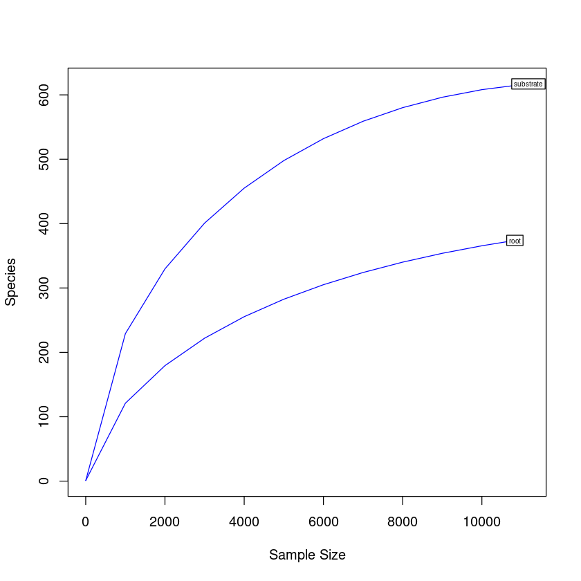
    


```R
# Shannon diversity estimations
estimate_richness(its)
write.table(estimate_richness(its), file="its_diversity.tsv",append = FALSE, quote = TRUE, sep = "\t")

```


<table class="dataframe">
<caption>A data.frame: 2 × 9</caption>
<thead>
	<tr><th></th><th scope=col>Observed</th><th scope=col>Chao1</th><th scope=col>se.chao1</th><th scope=col>ACE</th><th scope=col>se.ACE</th><th scope=col>Shannon</th><th scope=col>Simpson</th><th scope=col>InvSimpson</th><th scope=col>Fisher</th></tr>
	<tr><th></th><th scope=col>&lt;dbl&gt;</th><th scope=col>&lt;dbl&gt;</th><th scope=col>&lt;dbl&gt;</th><th scope=col>&lt;dbl&gt;</th><th scope=col>&lt;dbl&gt;</th><th scope=col>&lt;dbl&gt;</th><th scope=col>&lt;dbl&gt;</th><th scope=col>&lt;dbl&gt;</th><th scope=col>&lt;dbl&gt;</th></tr>
</thead>
<tbody>
	<tr><th scope=row>substrate</th><td>617</td><td>625.3945</td><td> 3.662563</td><td>646.3184</td><td>10.86122</td><td>4.655779</td><td>0.9740618</td><td>38.553220</td><td>140.6131</td></tr>
	<tr><th scope=row>root</th><td>374</td><td>429.3871</td><td>14.474562</td><td>455.5778</td><td>10.16927</td><td>2.906114</td><td>0.8301679</td><td> 5.888168</td><td> 75.1299</td></tr>
</tbody>
</table>


```R
div <- read.table("its_diversity.tsv", header=TRUE, row.names = NULL)
colnames(div) <- c("Sample", "Observed", "Chao1", "SE.Chao1", 
                    "ACE", "SE.ACE", "Shannon", "Simpson", "InvSimpson", "Fisher")

observed_plot <- ggplot(div, aes(reorder(Sample, 1/(Observed)), y=Observed))  + geom_point() + 
                        theme_light() +  ggtitle("Observed diversity") 
ggsave("observed_plot.pdf", width=10, height=5, units="cm")
observed_plot


shannon_plot <- ggplot(div, aes(reorder(Sample, 1/(Shannon)), y=Shannon))  + geom_point() + 
                        theme_light() + ggtitle("Shannon diversity")
ggsave("shannon_plot.pdf", width=10, height=5, units="cm")
shannon_plot

simpson_plot <- ggplot(div, aes(reorder(Sample, 1/(Simpson)), y=Simpson))  + geom_point() + 
                        theme_light() + ggtitle("Simpson diversity")
ggsave("simpson_plot.pdf", width=10, height=5, units="cm")
simpson_plot
```


    
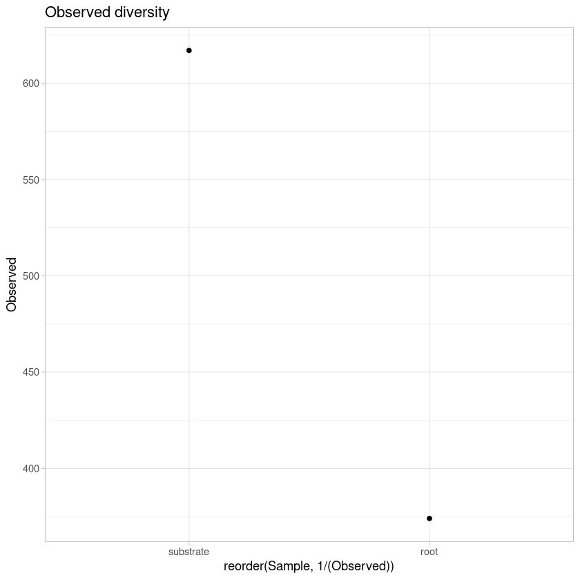
    


    
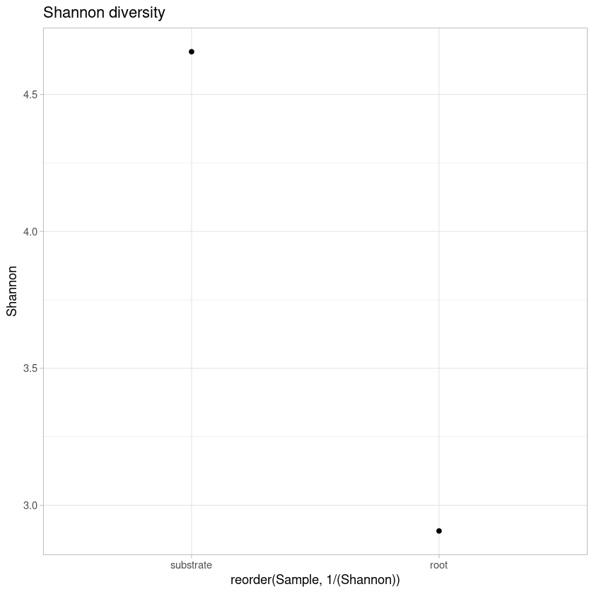
    


    
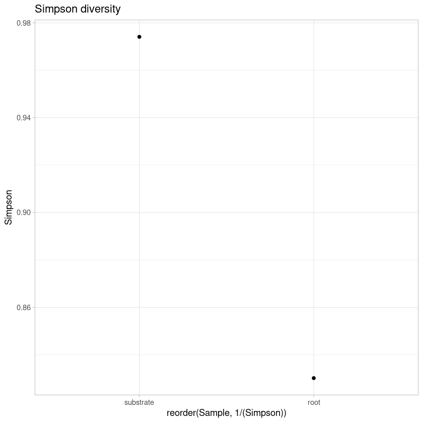
    


```R
#Estimate relative abundance
rel_its <- transform_sample_counts(its, function(x) x / sum(x))
```


```R
#Most abundant phylum
#Tax glom at Phylum level
phy_its <- tax_glom(rel_its, "Phylum")
phy_its
```


    phyloseq-class experiment-level object
    otu_table()   OTU Table:         [ 10 taxa and 2 samples ]
    tax_table()   Taxonomy Table:    [ 10 taxa by 7 taxonomic ranks ]


```R
#Export the file with taxa names and taxa counts
its_otu_phy <- otu_table(phy_its)
its_tax_phy <- tax_table(phy_its)
phy_its_tab <- cbind(its_otu_phy, its_tax_phy)
phy_its_tab <- phy_its_tab[, 1:4]
write.table(phy_its_tab, "phy_its_tab.tsv", sep = "\t")
phy_its_tab <- read.table("phy_its_tab.tsv", header=TRUE, row.names=1, stringsAsFactors = FALSE)
m_phy_its_tab <- melt(phy_its_tab)
colnames(m_phy_its_tab) <- c("Kingdom", "Phylum", "Sample", "Relative_abundance")
m_phy_its_tab <- m_phy_its_tab[, 2:4]

#Collapse Phylum with low abundance
m_phy_its_tab$Phylum[m_phy_its_tab$Relative_abundance <= 0.015] <- "Low_abundance"
cm_phy_its_tab <- aggregate(m_phy_its_tab$Relative_abundance 
                                          ,by=list(m_phy_its_tab$Phylum, 
                                           m_phy_its_tab$Sample),sum)
colnames(cm_phy_its_tab) <- c("Phylum", "Sample", "Relative_abundance")
cm_phy_its_tab

#Plot phylum
print("Most abundant Phylum")
phylum_plot <- ggplot(cm_phy_its_tab, aes(x=Sample, y=Relative_abundance,
                                          fill=fct_reorder(Phylum, Relative_abundance))) + 
       scale_fill_manual(values=colorRampPalette(brewer.pal(n = 5, name = "Set3"))(5)) +
       geom_bar(stat="identity", color="black", width=0.8) + scale_y_continuous(expand = c(0 ,0)) + 
       theme_light(base_size = 7) + theme(axis.text.y = element_text(size = 15),
                                          axis.text.x = element_text(size= 15)) 
ggsave("phylum_plot.pdf", width=20, height=20, units="cm")

phylum_plot
```

    Using Kingdom, Phylum as id variables
    


<table class="dataframe">
<caption>A data.frame: 10 × 3</caption>
<thead>
	<tr><th scope=col>Phylum</th><th scope=col>Sample</th><th scope=col>Relative_abundance</th></tr>
	<tr><th scope=col>&lt;chr&gt;</th><th scope=col>&lt;fct&gt;</th><th scope=col>&lt;dbl&gt;</th></tr>
</thead>
<tbody>
	<tr><td>Low_abundance   </td><td>substrate</td><td>0.012885906</td></tr>
	<tr><td>p__Ascomycota   </td><td>substrate</td><td>0.546756152</td></tr>
	<tr><td>p__Basidiomycota</td><td>substrate</td><td>0.158657718</td></tr>
	<tr><td>p__Glomeromycota</td><td>substrate</td><td>0.233646532</td></tr>
	<tr><td>p__Mucoromycota </td><td>substrate</td><td>0.048053691</td></tr>
	<tr><td>Low_abundance   </td><td>root     </td><td>0.003230869</td></tr>
	<tr><td>p__Ascomycota   </td><td>root     </td><td>0.860149543</td></tr>
	<tr><td>p__Basidiomycota</td><td>root     </td><td>0.027877781</td></tr>
	<tr><td>p__Glomeromycota</td><td>root     </td><td>0.016892827</td></tr>
	<tr><td>p__Mucoromycota </td><td>root     </td><td>0.091848980</td></tr>
</tbody>
</table>


    [1] "Most abundant Phylum"


    
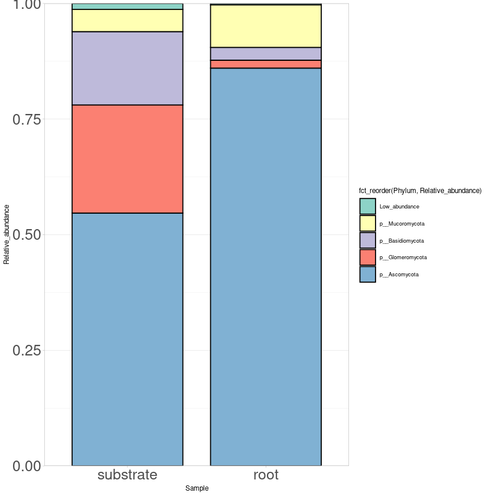
    


```R
#Most abundant phylum
#Tax glom at genus level
sp_its <- tax_glom(rel_its, "Specie")
sp_its
```


    phyloseq-class experiment-level object
    otu_table()   OTU Table:         [ 182 taxa and 2 samples ]
    tax_table()   Taxonomy Table:    [ 182 taxa by 7 taxonomic ranks ]


```R
#Export table from all fungal species
its_sp_otu <- otu_table(sp_its)
its_sp_tax <- tax_table(sp_its)
sp_fung_tab <- cbind(its_sp_otu, its_sp_tax)
write.table(sp_fung_tab, "sp_fung_tab.tsv", sep = "\t")
```


```R
#Export the file with taxa names and taxa counts
its_otu_sp <- otu_table(sp_its)
its_tax_sp <- tax_table(sp_its)
sp_its_tab <- cbind(its_otu_sp, its_tax_sp)
sp_its_tab <- sp_its_tab[, 1:9]
write.table(sp_its_tab, "sp_its_tab.tsv", sep = "\t")
sp_its_tab <- read.table("sp_its_tab.tsv", header=TRUE, row.names=1, stringsAsFactors = FALSE)
m_sp_its_tab <- melt(sp_its_tab)

colnames(m_sp_its_tab) <- c("Kingdom", "Phylum", "Class", "Order", "Family", "Genus", "Specie", 
                             "Sample", "Relative_abundance")

m_sp_its_tab$Specie[m_sp_its_tab$Relative_abundance <= 0.01] <- "Low_abundance"
cm_sp_its_tab <- aggregate(m_sp_its_tab$Relative_abundance 
                                          ,by=list(m_sp_its_tab$Specie, 
                                           m_sp_its_tab$Sample),sum)
colnames(cm_sp_its_tab) <- c("Specie", "Sample", "Relative_abundance")
cm_sp_its_tab

#Plot phylum
print("Most abundant Phylum")
specie_plot <- ggplot(cm_sp_its_tab, aes(x=Sample, y=Relative_abundance, 
                                         fill=fct_reorder(Specie, Relative_abundance))) + 
       scale_fill_manual(values=rev(colorRampPalette(brewer.pal(n = 8, name = "Set3"))(17))) +
       geom_bar(stat="identity", color="black", width=0.8) + scale_y_continuous(expand = c(0 ,0)) + 
       theme_light(base_size = 7) + theme(axis.text.y = element_text(size = 20),
                                          axis.text.x = element_text(angle = 90, size= 20)) 
ggsave("specie_plot.pdf", width=20, height=30, units="cm")
specie_plot
```

    Using Kingdom, Phylum, Class, Order, Family, Genus, Specie as id variables
    


<table class="dataframe">
<caption>A data.frame: 23 × 3</caption>
<thead>
	<tr><th scope=col>Specie</th><th scope=col>Sample</th><th scope=col>Relative_abundance</th></tr>
	<tr><th scope=col>&lt;chr&gt;</th><th scope=col>&lt;fct&gt;</th><th scope=col>&lt;dbl&gt;</th></tr>
</thead>
<tbody>
	<tr><td>Low_abundance                 </td><td>substrate</td><td>0.25333333</td></tr>
	<tr><td>s__Aspergillus_subversicolor  </td><td>substrate</td><td>0.06272931</td></tr>
	<tr><td>s__Atractiella_rhizophila     </td><td>substrate</td><td>0.01029083</td></tr>
	<tr><td>s__Didymella_exigua           </td><td>substrate</td><td>0.01700224</td></tr>
	<tr><td>s__Diversispora_celata        </td><td>substrate</td><td>0.02997763</td></tr>
	<tr><td>s__Edenia_gomezpompae         </td><td>substrate</td><td>0.04894855</td></tr>
	<tr><td>s__Gigaspora_margarita        </td><td>substrate</td><td>0.01029083</td></tr>
	<tr><td>s__Mycosphaerella_tassiana    </td><td>substrate</td><td>0.04161074</td></tr>
	<tr><td>s__Pseudotomentella_alobata   </td><td>substrate</td><td>0.06049217</td></tr>
	<tr><td>s__Rhizopus_arrhizus          </td><td>substrate</td><td>0.03803132</td></tr>
	<tr><td>s__Rhizopus_microsporus       </td><td>substrate</td><td>0.01002237</td></tr>
	<tr><td>s__Scutellospora_heterogama   </td><td>substrate</td><td>0.08993289</td></tr>
	<tr><td>s__Talaromyces_marneffei      </td><td>substrate</td><td>0.08232662</td></tr>
	<tr><td>s__unidentified               </td><td>substrate</td><td>0.24501119</td></tr>
	<tr><td>Low_abundance                 </td><td>root     </td><td>0.06369427</td></tr>
	<tr><td>s__Bipolaris_sorokiniana      </td><td>root     </td><td>0.01153882</td></tr>
	<tr><td>s__Curvularia_lunata          </td><td>root     </td><td>0.01338503</td></tr>
	<tr><td>s__Didymella_exigua           </td><td>root     </td><td>0.02741623</td></tr>
	<tr><td>s__Edenia_gomezpompae         </td><td>root     </td><td>0.04504754</td></tr>
	<tr><td>s__Pyrenochaetopsis_leptospora</td><td>root     </td><td>0.08197175</td></tr>
	<tr><td>s__Rhizopus_arrhizus          </td><td>root     </td><td>0.08714114</td></tr>
	<tr><td>s__Talaromyces_marneffei      </td><td>root     </td><td>0.04560140</td></tr>
	<tr><td>s__unidentified               </td><td>root     </td><td>0.62420382</td></tr>
</tbody>
</table>


    [1] "Most abundant Phylum"


    
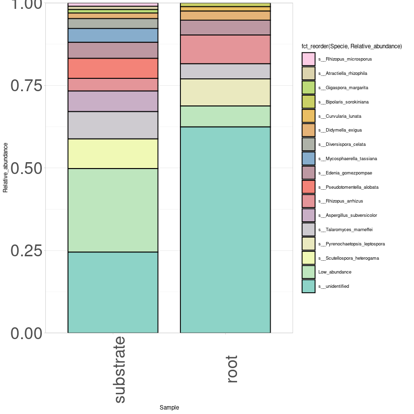
    


```R
#Heat map of top abundant species in both samples
top50 <- prune_taxa(names(sort(taxa_sums(sp_its),TRUE)[1:50]), sp_its)
sp_heat_plot <- plot_heatmap(top50, taxa.label = "Specie", method = NULL, low = "#f9f8f9ff", 
                              high ="black", na.value = "white", 
                              sample.order = c("substrate", "root"),
                              taxa.order  = names(sort(taxa_sums(top50))))+ theme_light()
ggsave("sp_heat_plot.pdf", width=20, height=25, units="cm")
sp_heat_plot
```

    Warning message:
    “Transformation introduced infinite values in discrete y-axis”
    Warning message:
    “Transformation introduced infinite values in discrete y-axis”


    
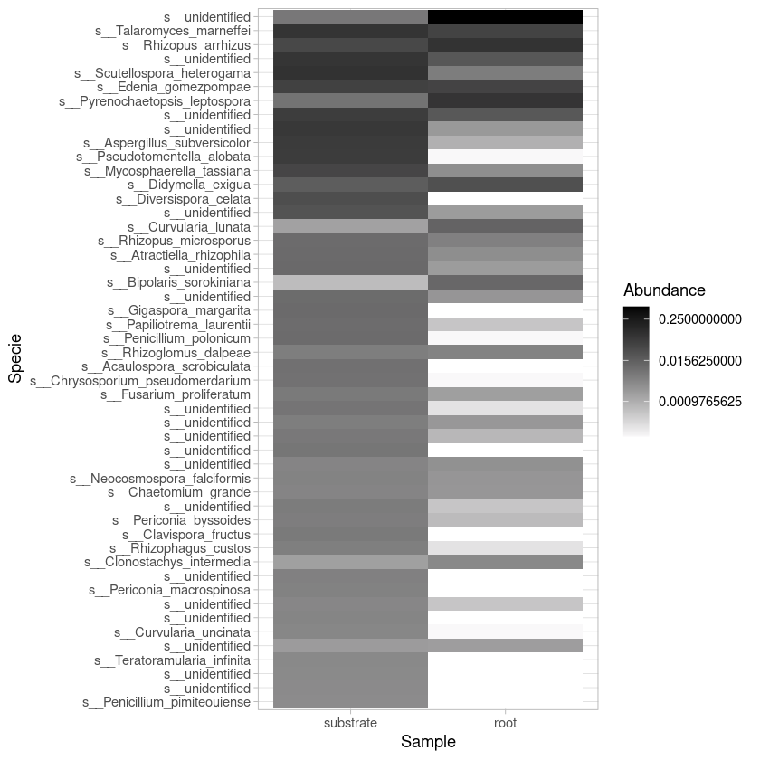
    


```R
#Absolute abundance of most abundant genus
#Tax glom at genus level
sp_fungi <- tax_glom(its, "Specie")
sp_fungi
```


    phyloseq-class experiment-level object
    otu_table()   OTU Table:         [ 182 taxa and 2 samples ]
    tax_table()   Taxonomy Table:    [ 182 taxa by 7 taxonomic ranks ]


```R
#Heatmap
top50 <- prune_taxa(names(sort(taxa_sums(sp_fungi),TRUE)[1:50]), sp_fungi)
gen_heat_plot <- plot_heatmap(top50, taxa.label = "Genus", method = NULL, low = "#f9f8f9ff",  trans = log_trans(2),
                              high ="black", na.value = "white", 
                              sample.order = c("substrate", "root"),
                              taxa.order  = names(sort(taxa_sums(top50))))+ theme_light()
ggsave("gen_heat_plot.pdf", width=20, height=22, units="cm")
gen_heat_plot
```

    Warning message:
    “Transformation introduced infinite values in discrete y-axis”
    Warning message:
    “Transformation introduced infinite values in discrete y-axis”


    
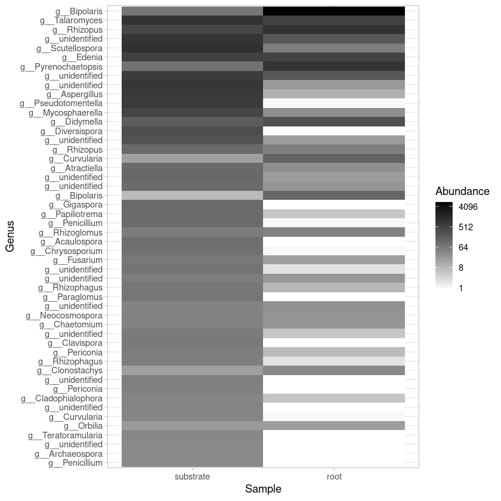
    


```R
#Venn diagram
otu_list <- otu_table(sp_its)

substrate <- otu_list[, 1]
substrate[substrate==0] <- NA
substrate2 <- substrate[complete.cases(substrate),]
write.table(rownames(substrate2) ,"its_substrate_list.tsv", sep="\t")

root <- otu_list[, 2]
root[root==0] <- NA
root2 <- root[complete.cases(root),]
write.table(rownames(root2),"its_root_list.tsv", sep="\t")


head(substrate2)
head(root2)

#The files are used as input list to make Venn diagrams with the online tool:
#http://bioinformatics.psb.ugent.be/webtools/Venn/
```


<table class="dataframe">
<caption>A otu_table: 6 × 1 of type dbl</caption>
<thead>
	<tr><th></th><th scope=col>substrate</th></tr>
</thead>
<tbody>
	<tr><th scope=row>23</th><td>0.0065324385</td></tr>
	<tr><th scope=row>24</th><td>0.0380313199</td></tr>
	<tr><th scope=row>30</th><td>0.0604921700</td></tr>
	<tr><th scope=row>36</th><td>0.0041163311</td></tr>
	<tr><th scope=row>44</th><td>0.0708724832</td></tr>
	<tr><th scope=row>46</th><td>0.0002684564</td></tr>
</tbody>
</table>


<table class="dataframe">
<caption>A otu_table: 6 × 1 of type dbl</caption>
<thead>
	<tr><th></th><th scope=col>root</th></tr>
</thead>
<tbody>
	<tr><th scope=row>14</th><td>1.569279e-03</td></tr>
	<tr><th scope=row>23</th><td>5.825718e-01</td></tr>
	<tr><th scope=row>24</th><td>8.714114e-02</td></tr>
	<tr><th scope=row>30</th><td>9.231053e-05</td></tr>
	<tr><th scope=row>36</th><td>2.677005e-03</td></tr>
	<tr><th scope=row>44</th><td>2.030832e-03</td></tr>
</tbody>
</table>


### All eukaryotic diversity


```R
# Load OTU table
all_otu <- as.matrix(read.table("all_biofert_ITS_otu.tsv", header=T, row.names=1))
colnames(all_otu) <- c("root","substrate")
all_otu <- all_otu[, c("substrate", "root")]
all_OTU <- otu_table(all_otu, taxa_are_rows=T)
```


```R
# Load taxonomy table
all_taxa <- as.matrix(read.table("all_biofert_ITS_tax.tsv", row.names=1))
all_TAXA <- tax_table(all_taxa)
colnames(all_TAXA) <- c("Kingdom", "Phylum", "Class", "Order", "Family", "Genus", "Specie")
```


```R
# Create phyloseq object with taxonomy and OTU tables 
all_its <-phyloseq(all_OTU,all_TAXA)
all_its
```


    phyloseq-class experiment-level object
    otu_table()   OTU Table:         [ 1319 taxa and 2 samples ]
    tax_table()   Taxonomy Table:    [ 1319 taxa by 7 taxonomic ranks ]


```R
#Estimate relative abundance
all_rel_its <- transform_sample_counts(all_its, function(x) x / sum(x))
```


```R
#Most abundant phylum
#Tax glom at Phylum level
all_phy_its <- tax_glom(all_rel_its, "Phylum")
all_phy_its
```


    phyloseq-class experiment-level object
    otu_table()   OTU Table:         [ 26 taxa and 2 samples ]
    tax_table()   Taxonomy Table:    [ 26 taxa by 7 taxonomic ranks ]


```R
#Export the file with taxa names and taxa counts
all_its_otu_phy <- otu_table(all_phy_its)
all_its_tax_phy <- tax_table(all_phy_its)
all_phy_its_tab <- cbind(all_its_otu_phy, all_its_tax_phy)
all_phy_its_tab <- all_phy_its_tab[, 1:4]
write.table(all_phy_its_tab, "all_phy_its_tab.tsv", sep = "\t")
all_phy_its_tab <- read.table("all_phy_its_tab.tsv", header=TRUE, row.names=1, stringsAsFactors = FALSE)
mall_phy_its_tab <- melt(all_phy_its_tab)
colnames(mall_phy_its_tab) <- c("Kingdom", "Phylum", "Sample", "Relative_abundance")
mall_phy_its_tab <- mall_phy_its_tab[, 2:4]

#Collapse Phylum with low abundance
mall_phy_its_tab$Phylum[mall_phy_its_tab$Relative_abundance <= 0.015] <- "Low_abundance"
cmall_phy_its_tab <- aggregate(mall_phy_its_tab$Relative_abundance 
                                          ,by=list(mall_phy_its_tab$Phylum, 
                                           mall_phy_its_tab$Sample),sum)
colnames(cmall_phy_its_tab) <- c("Phylum", "Sample", "Relative_abundance")
cmall_phy_its_tab

#Plot phylum
print("All most abundant Phylum")
all_phylum_plot <- ggplot(cmall_phy_its_tab, aes(x=Sample, y=Relative_abundance,
                                          fill=fct_reorder(Phylum, Relative_abundance))) + 
       scale_fill_manual(values=colorRampPalette(brewer.pal(n = 8, name = "Set3"))(8)) +
       geom_bar(stat="identity", color="black", width=0.8) + scale_y_continuous(expand = c(0 ,0)) + 
       theme_light(base_size = 7) + theme(axis.text.y = element_text(size = 15),
                                          axis.text.x = element_text(size= 15)) 
ggsave("All_phylum_plot.pdf", width=20, height=20, units="cm")

all_phylum_plot
```

    Using Kingdom, Phylum as id variables
    


<table class="dataframe">
<caption>A data.frame: 13 × 3</caption>
<thead>
	<tr><th scope=col>Phylum</th><th scope=col>Sample</th><th scope=col>Relative_abundance</th></tr>
	<tr><th scope=col>&lt;chr&gt;</th><th scope=col>&lt;fct&gt;</th><th scope=col>&lt;dbl&gt;</th></tr>
</thead>
<tbody>
	<tr><td>Low_abundance   </td><td>substrate</td><td>0.04257045</td></tr>
	<tr><td>p__Anthophyta   </td><td>substrate</td><td>0.12311354</td></tr>
	<tr><td>p__Ascomycota   </td><td>substrate</td><td>0.33050252</td></tr>
	<tr><td>p__Basidiomycota</td><td>substrate</td><td>0.09590523</td></tr>
	<tr><td>p__Ciliophora   </td><td>substrate</td><td>0.15535241</td></tr>
	<tr><td>p__Glomeromycota</td><td>substrate</td><td>0.14123438</td></tr>
	<tr><td>p__Mucoromycota </td><td>substrate</td><td>0.02904744</td></tr>
	<tr><td>p__unidentified </td><td>substrate</td><td>0.08227403</td></tr>
	<tr><td>Low_abundance   </td><td>root     </td><td>0.03437407</td></tr>
	<tr><td>p__Anthophyta   </td><td>root     </td><td>0.33434434</td></tr>
	<tr><td>p__Ascomycota   </td><td>root     </td><td>0.55414808</td></tr>
	<tr><td>p__Basidiomycota</td><td>root     </td><td>0.01796015</td></tr>
	<tr><td>p__Mucoromycota </td><td>root     </td><td>0.05917336</td></tr>
</tbody>
</table>


    [1] "All most abundant Phylum"


    
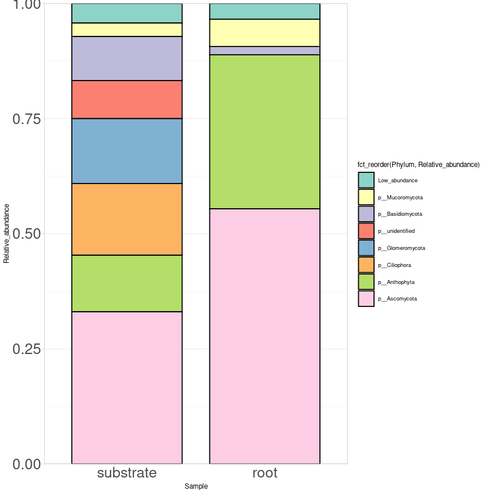
    


```R
#Most abundant genus
#Tax glom at genus level
all_gen_its <- tax_glom(all_rel_its, "Genus")
all_gen_its
```


    phyloseq-class experiment-level object
    otu_table()   OTU Table:         [ 174 taxa and 2 samples ]
    tax_table()   Taxonomy Table:    [ 174 taxa by 7 taxonomic ranks ]


```R
#Export table from all fungal species
all_its_gen_otu <- otu_table(all_gen_its)
all_its_gen_tax <- tax_table(all_gen_its)
all_gen_fung_tab <- cbind(all_its_gen_otu, all_its_gen_tax)
write.table(all_gen_fung_tab, "all_gen_fung_tab.tsv", sep = "\t")
```


```R
#Export the file with taxa names and taxa counts
all_its_otu_gen <- otu_table(all_gen_its)
all_its_tax_gen <- tax_table(all_gen_its)
all_gen_its_tab <- cbind(all_its_otu_gen, all_its_tax_gen)
all_gen_its_tab <- all_gen_its_tab[, 1:8]
write.table(all_gen_its_tab, "all_gen_its_tab.tsv", sep = "\t")
all_gen_its_tab <- read.table("all_gen_its_tab.tsv", header=TRUE, row.names=1, stringsAsFactors = FALSE)
mall_gen_its_tab <- melt(all_gen_its_tab)
colnames(mall_gen_its_tab) <- c("Kingdom", "Phylum", "Class", "Order", "Family", "Genus", "Sample", 
                                "Relative_abundance")

#Collapse Phylum with low abundance
mall_gen_its_tab$Genus[mall_gen_its_tab$Relative_abundance <= 0.015] <- "Low_abundance"
cmall_gen_its_tab <- aggregate(mall_gen_its_tab$Relative_abundance 
                                          ,by=list(mall_gen_its_tab$Genus, 
                                           mall_gen_its_tab$Sample),sum)
colnames(cmall_gen_its_tab) <- c("Genus", "Sample", "Relative_abundance")
cmall_gen_its_tab

#Plot genlum
print("All most abundant Genus")
all_genus_plot <- ggplot(cmall_gen_its_tab, aes(x=Sample, y=Relative_abundance,
                                          fill=fct_reorder(Genus, Relative_abundance))) + 
       scale_fill_manual(values=colorRampPalette(brewer.pal(n = 15, name = "Spectral"))(15)) +
       geom_bar(stat="identity", color="black", width=0.8) + scale_y_continuous(expand = c(0 ,0)) + 
       theme_light(base_size = 7) + theme(axis.text.y = element_text(size = 15),
                                          axis.text.x = element_text(size= 15)) 
ggsave("All_genus_plot.pdf", width=20, height=20, units="cm")

all_genus_plot
```

    Using Kingdom, Phylum, Class, Order, Family, Genus as id variables
    


<table class="dataframe">
<caption>A data.frame: 21 × 3</caption>
<thead>
	<tr><th scope=col>Genus</th><th scope=col>Sample</th><th scope=col>Relative_abundance</th></tr>
	<tr><th scope=col>&lt;chr&gt;</th><th scope=col>&lt;fct&gt;</th><th scope=col>&lt;dbl&gt;</th></tr>
</thead>
<tbody>
	<tr><td>g__Aspergillus     </td><td>substrate</td><td>0.03927084</td></tr>
	<tr><td>g__Canavalia       </td><td>substrate</td><td>0.04159680</td></tr>
	<tr><td>g__Crotalaria      </td><td>substrate</td><td>0.07740574</td></tr>
	<tr><td>g__Diversispora    </td><td>substrate</td><td>0.01882404</td></tr>
	<tr><td>g__Edenia          </td><td>substrate</td><td>0.02958836</td></tr>
	<tr><td>g__Mycosphaerella  </td><td>substrate</td><td>0.02515281</td></tr>
	<tr><td>g__Pseudotomentella</td><td>substrate</td><td>0.03656624</td></tr>
	<tr><td>g__Rhizopus        </td><td>substrate</td><td>0.02904744</td></tr>
	<tr><td>g__Scutellospora   </td><td>substrate</td><td>0.05457889</td></tr>
	<tr><td>g__Talaromyces     </td><td>substrate</td><td>0.04998107</td></tr>
	<tr><td>g__unidentified    </td><td>substrate</td><td>0.37561530</td></tr>
	<tr><td>Low_abundance      </td><td>substrate</td><td>0.22237248</td></tr>
	<tr><td>g__Bipolaris       </td><td>root     </td><td>0.38287244</td></tr>
	<tr><td>g__Canavalia       </td><td>root     </td><td>0.14921201</td></tr>
	<tr><td>g__Crotalaria      </td><td>root     </td><td>0.18340767</td></tr>
	<tr><td>g__Didymella       </td><td>root     </td><td>0.01766280</td></tr>
	<tr><td>g__Edenia          </td><td>root     </td><td>0.02902171</td></tr>
	<tr><td>g__Pyrenochaetopsis</td><td>root     </td><td>0.05280999</td></tr>
	<tr><td>g__Rhizopus        </td><td>root     </td><td>0.05917336</td></tr>
	<tr><td>g__Talaromyces     </td><td>root     </td><td>0.02937853</td></tr>
	<tr><td>Low_abundance      </td><td>root     </td><td>0.09646149</td></tr>
</tbody>
</table>


    [1] "All most abundant Genus"


    Warning message in brewer.pal(n = 15, name = "Spectral"):
    “n too large, allowed maximum for palette Spectral is 11
    Returning the palette you asked for with that many colors
    ”


    
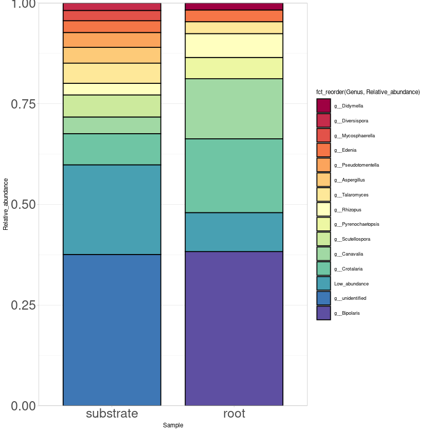
    


```R
#Heat map of top abundant genus in both samples
all_top50 <- prune_taxa(names(sort(taxa_sums(all_gen_its),TRUE)[1:50]), all_gen_its)
all_sp_heat_plot <- plot_heatmap(all_top50, taxa.label = "Genus", method = NULL, low = "#f9f8f9ff", 
                              trans = NULL, high ="black", na.value = "white", 
                              sample.order = c("substrate", "root"),
                              taxa.order  = names(sort(taxa_sums(all_top50))))+ theme_light()
ggsave("all_sp_heat_plot.pdf", width=20, height=25, units="cm")
all_sp_heat_plot
```


    
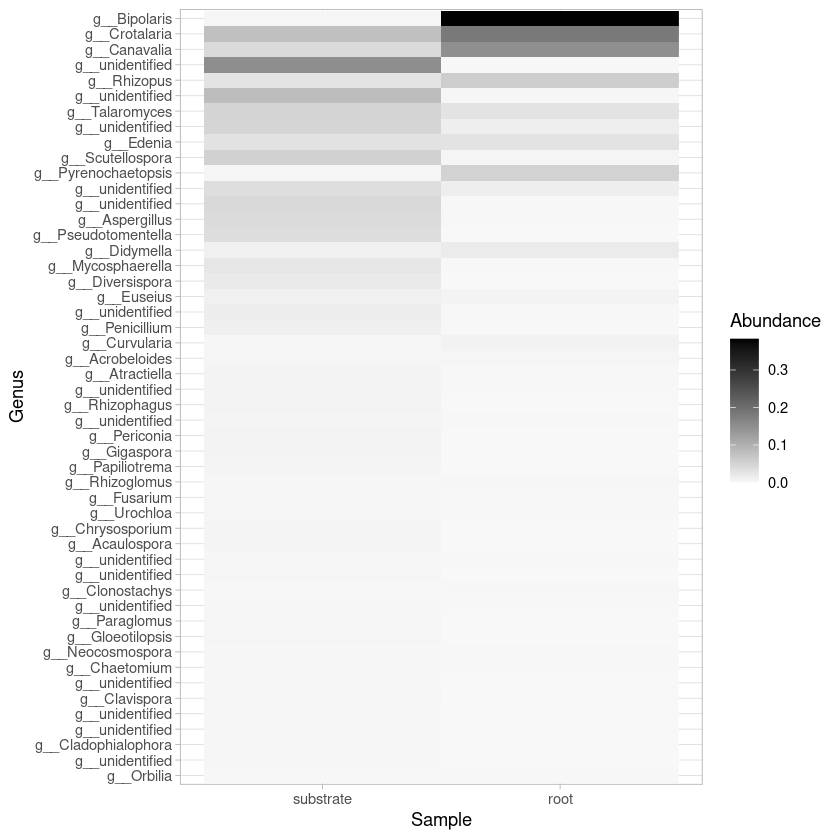
    


```R
#Not fungal diversity
```


```R
#$grep -v 'k__Fungi' all_biofert_ITS_tax.tsv > nf_biofert_ITS_tax.tsv
#Está linea va para el otro script
```


```R
# Load taxonomy table
nf_taxa <- as.matrix(read.table("nf_biofert_ITS_tax.tsv", row.names=1))
nf_TAXA <- tax_table(nf_taxa)
colnames(nf_TAXA) <- c("Kingdom", "Phylum", "Class", "Order", "Family", "Genus", "Specie")
```


```R
# Create phyloseq object of not fungal diversity
nf_its <-phyloseq(all_OTU, nf_TAXA)
nf_its
```


    phyloseq-class experiment-level object
    otu_table()   OTU Table:         [ 575 taxa and 2 samples ]
    tax_table()   Taxonomy Table:    [ 575 taxa by 7 taxonomic ranks ]


```R
#Estimate relative abundance
nf_rel_its <- transform_sample_counts(nf_its, function(x) x / sum(x))
```


```R
#Most abundant genus
#Tax glom at genus level
nf_gen_its <- tax_glom(nf_rel_its, "Genus")
nf_gen_its
```


    phyloseq-class experiment-level object
    otu_table()   OTU Table:         [ 35 taxa and 2 samples ]
    tax_table()   Taxonomy Table:    [ 35 taxa by 7 taxonomic ranks ]


```R
#Heat map of top abundant genus in both samples
nf_top50 <- prune_taxa(names(sort(taxa_sums(nf_gen_its),TRUE)[1:50]), nf_gen_its)
nf_sp_heat_plot <- plot_heatmap(nf_top50, taxa.label = "Genus", method = NULL, low = "#f9f8f9ff", 
                              trans = NULL, high ="black", na.value = "white", 
                              sample.order = c("substrate", "root"),
                              taxa.order  = names(sort(taxa_sums(nf_top50))))+ theme_light()
ggsave("nf_sp_heat_plot.pdf", width=20, height=20, units="cm")
nf_sp_heat_plot
```


    
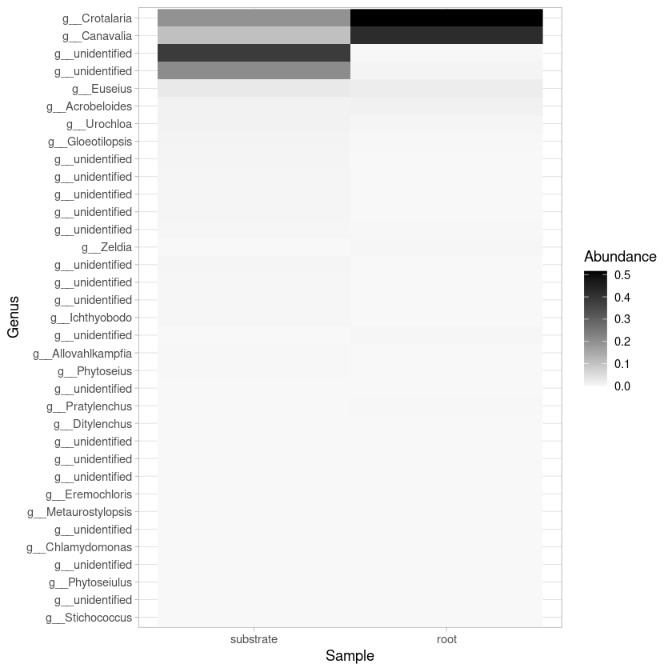
    

