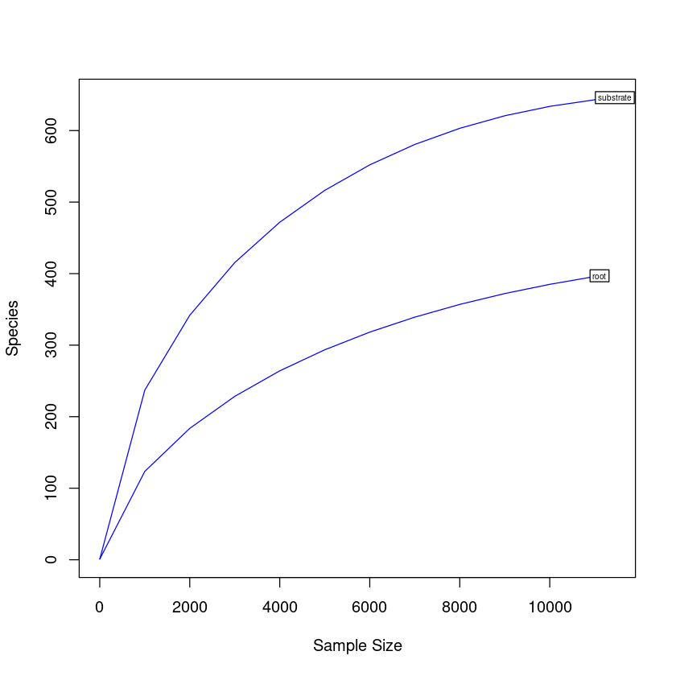
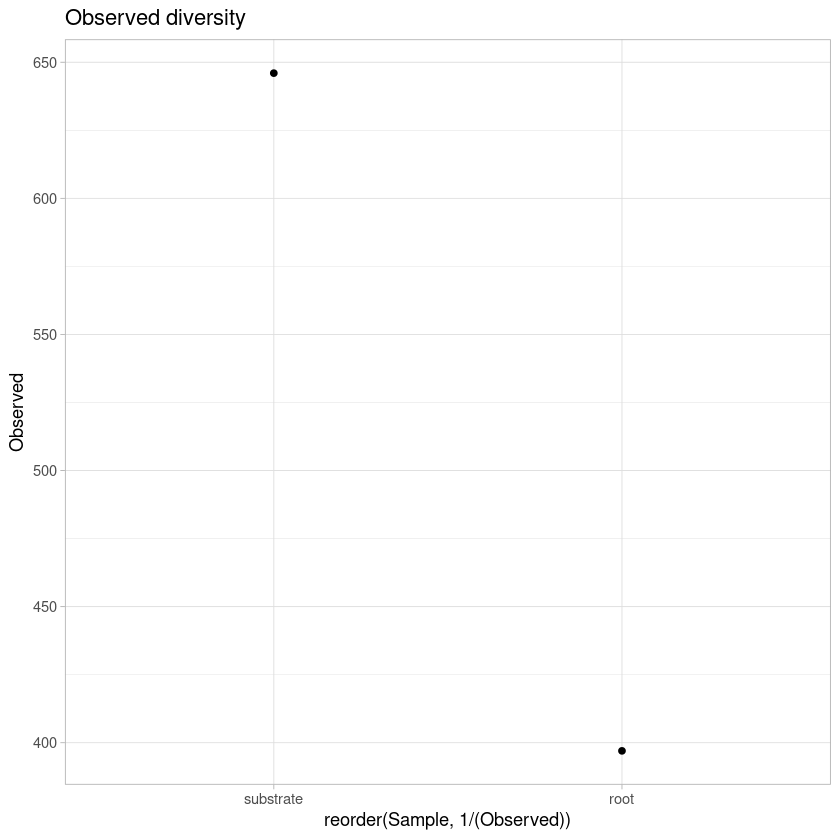
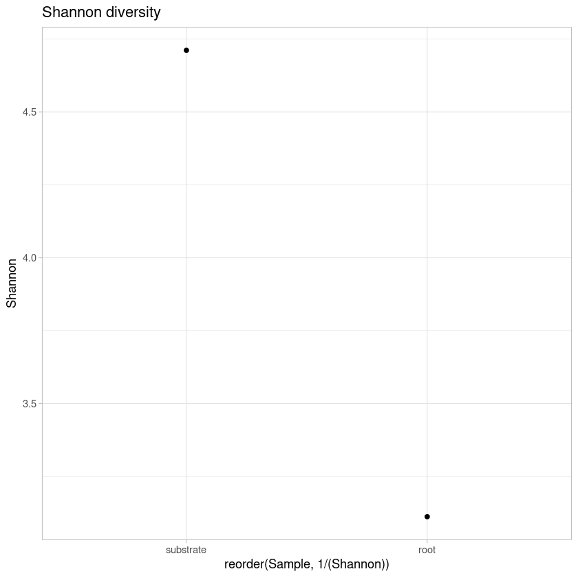
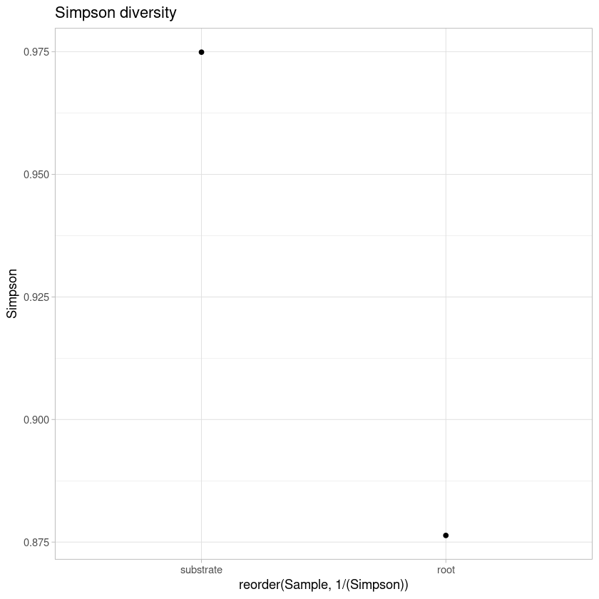
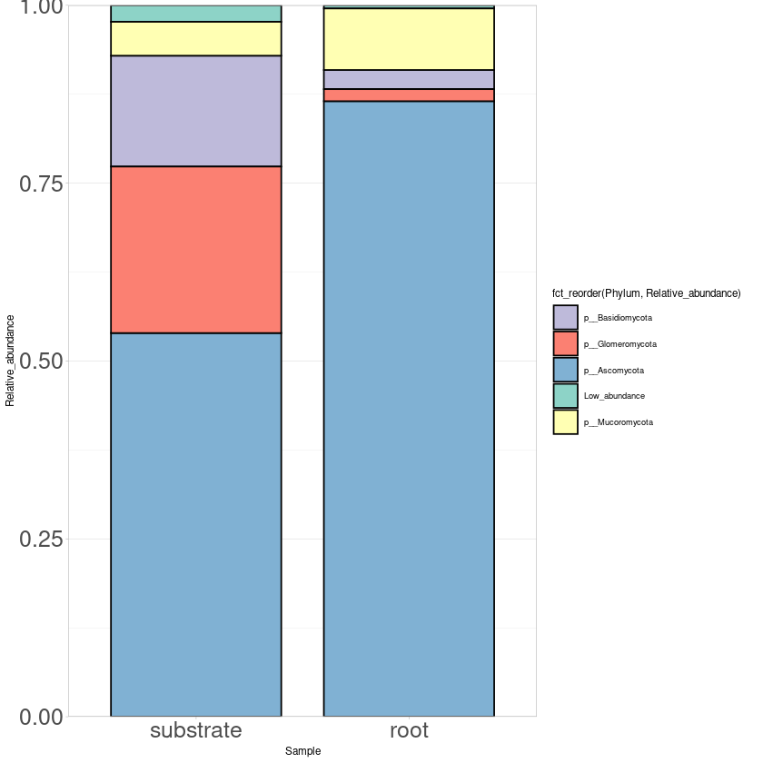
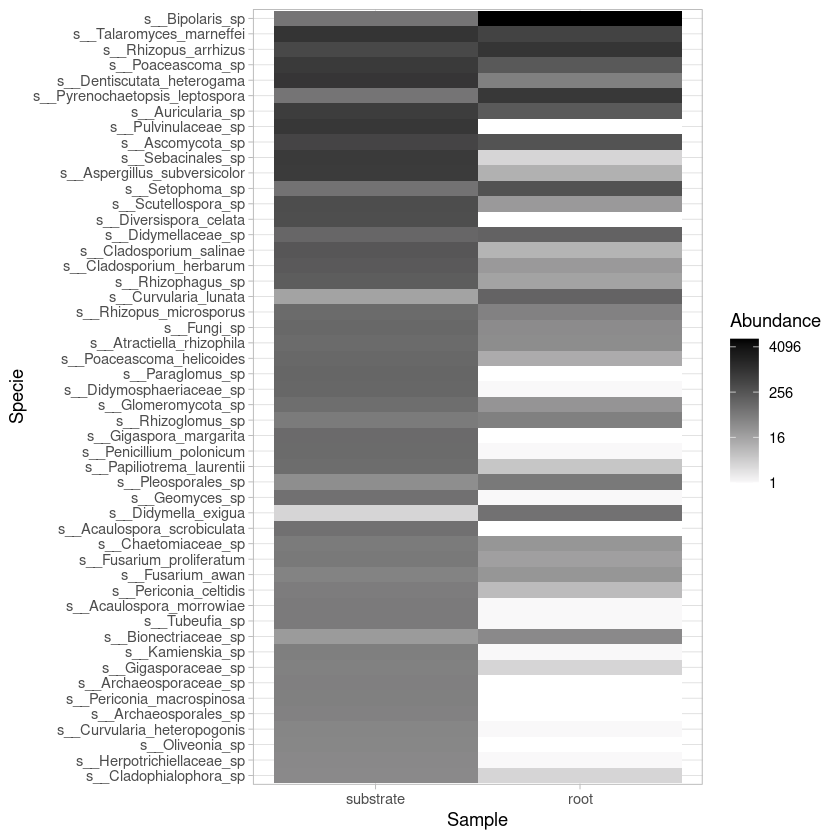

# Analyses of fungal diversity


```R
#Load libraries
library(phyloseq)
library(ggplot2)
library(ape)
library(vegan)
library(gridExtra)
library(phylogeo)
library(ggrepel)
library(reshape2)
library(RColorBrewer)
library(forcats)
library(microbiomeSeq)
library(microbiome)
```

    Loading required package: permute
    
    Loading required package: lattice
    
    This is vegan 2.5-7
    
    Warning message:
    “replacing previous import ‘dplyr::combine’ by ‘gridExtra::combine’ when loading ‘phylogeo’”
    Registered S3 methods overwritten by 'adegraphics':
      method         from
      biplot.dudi    ade4
      kplot.foucart  ade4
      kplot.mcoa     ade4
      kplot.mfa      ade4
      kplot.pta      ade4
      kplot.sepan    ade4
      kplot.statis   ade4
      scatter.coa    ade4
      scatter.dudi   ade4
      scatter.nipals ade4
      scatter.pco    ade4
      score.acm      ade4
      score.mix      ade4
      score.pca      ade4
      screeplot.dudi ade4
    
    Registered S3 method overwritten by 'spdep':
      method   from
      plot.mst ape 
    
    Registered S3 methods overwritten by 'adespatial':
      method             from       
      plot.multispati    adegraphics
      print.multispati   ade4       
      summary.multispati ade4       
    
    
    microbiome R package (microbiome.github.com)
        
    
    
     Copyright (C) 2011-2019 Leo Lahti, 
        Sudarshan Shetty et al. <microbiome.github.io>
    
    
    
    Attaching package: ‘microbiome’
    
    
    The following object is masked from ‘package:vegan’:
    
        diversity
    
    
    The following object is masked from ‘package:ggplot2’:
    
        alpha
    
    
    The following object is masked from ‘package:base’:
    
        transform
    
    


```R
# Load OTU table
otu <- as.matrix(read.table("biofert_ITS_otu.tsv", header=T, row.names=1))
colnames(otu) <- c("root","substrate")
otu <- otu[, c("substrate", "root")]
OTU <- otu_table(otu, taxa_are_rows=T)
```


```R
# Load taxonomy table
taxa <- as.matrix(read.table("biofert_ITS_tax.tsv", row.names=1))
TAXA <- tax_table(taxa)
colnames(TAXA) <- c("Kingdom", "Phylum", "Class", "Order", "Family", "Genus", "Specie")
```


```R
# Create phyloseq object with taxonomy and OTU tables 
its <-phyloseq(OTU,TAXA)
its
```


    phyloseq-class experiment-level object
    otu_table()   OTU Table:         [ 786 taxa and 2 samples ]
    tax_table()   Taxonomy Table:    [ 786 taxa by 7 taxonomic ranks ]


```R
# Rarefaction curves
pdf("rarefaction.pdf")
rarefaction <- rarecurve(t(otu), step=1000, cex=0.5, col="blue")
dev.off()

rarecurve(t(otu), step=1000, cex=0.5, col="blue")
```


<strong>png:</strong> 2


    

    


```R
# Diversity estimations
estimate_richness(its)
write.table(estimate_richness(its), file="its_diversity.tsv",append = FALSE, quote = TRUE, sep = "\t")

```


<table class="dataframe">
<caption>A data.frame: 2 × 9</caption>
<thead>
	<tr><th></th><th scope=col>Observed</th><th scope=col>Chao1</th><th scope=col>se.chao1</th><th scope=col>ACE</th><th scope=col>se.ACE</th><th scope=col>Shannon</th><th scope=col>Simpson</th><th scope=col>InvSimpson</th><th scope=col>Fisher</th></tr>
	<tr><th></th><th scope=col>&lt;dbl&gt;</th><th scope=col>&lt;dbl&gt;</th><th scope=col>&lt;dbl&gt;</th><th scope=col>&lt;dbl&gt;</th><th scope=col>&lt;dbl&gt;</th><th scope=col>&lt;dbl&gt;</th><th scope=col>&lt;dbl&gt;</th><th scope=col>&lt;dbl&gt;</th><th scope=col>&lt;dbl&gt;</th></tr>
</thead>
<tbody>
	<tr><th scope=row>substrate</th><td>646</td><td>655.9148</td><td> 4.038774</td><td>677.5884</td><td>11.24611</td><td>4.711616</td><td>0.9749239</td><td>39.878571</td><td>148.16819</td></tr>
	<tr><th scope=row>root</th><td>397</td><td>452.0093</td><td>13.967851</td><td>487.1234</td><td>10.80108</td><td>3.112338</td><td>0.8763509</td><td> 8.087401</td><td> 80.44836</td></tr>
</tbody>
</table>


```R
#Estimate eveness diversity indeces
evenness(its, index = "all")
```


<table class="dataframe">
<caption>A data.frame: 2 × 5</caption>
<thead>
	<tr><th></th><th scope=col>camargo</th><th scope=col>pielou</th><th scope=col>simpson</th><th scope=col>evar</th><th scope=col>bulla</th></tr>
	<tr><th></th><th scope=col>&lt;dbl&gt;</th><th scope=col>&lt;dbl&gt;</th><th scope=col>&lt;dbl&gt;</th><th scope=col>&lt;dbl&gt;</th><th scope=col>&lt;dbl&gt;</th></tr>
</thead>
<tbody>
	<tr><th scope=row>substrate</th><td>0.3620828</td><td>0.7281351</td><td>0.06173153</td><td>0.3548832</td><td>0.3307790</td></tr>
	<tr><th scope=row>root</th><td>0.2709036</td><td>0.5201155</td><td>0.02037129</td><td>0.3223631</td><td>0.1988888</td></tr>
</tbody>
</table>


```R
div <- read.table("its_diversity.tsv", header=TRUE, row.names = NULL)
colnames(div) <- c("Sample", "Observed", "Chao1", "SE.Chao1", 
                    "ACE", "SE.ACE", "Shannon", "Simpson", "InvSimpson", "Fisher")

observed_plot <- ggplot(div, aes(reorder(Sample, 1/(Observed)), y=Observed))  + geom_point() + 
                        theme_light() +  ggtitle("Observed diversity") 
ggsave("observed_plot.pdf", width=10, height=5, units="cm")
observed_plot


shannon_plot <- ggplot(div, aes(reorder(Sample, 1/(Shannon)), y=Shannon))  + geom_point() + 
                        theme_light() + ggtitle("Shannon diversity")
ggsave("shannon_plot.pdf", width=10, height=5, units="cm")
shannon_plot

simpson_plot <- ggplot(div, aes(reorder(Sample, 1/(Simpson)), y=Simpson))  + geom_point() + 
                        theme_light() + ggtitle("Simpson diversity")
ggsave("simpson_plot.pdf", width=10, height=5, units="cm")
simpson_plot
```


    

    


    

    


    

    


```R
#Estimate relative abundance
rel_its <- transform_sample_counts(its, function(x) x / sum(x))
```


```R
#Most abundant phylum
#Tax glom at Phylum level
phy_its <- tax_glom(rel_its, "Phylum")
phy_its
```


    phyloseq-class experiment-level object
    otu_table()   OTU Table:         [ 11 taxa and 2 samples ]
    tax_table()   Taxonomy Table:    [ 11 taxa by 7 taxonomic ranks ]


```R
#Export the file with taxa names and taxa counts
its_otu_phy <- otu_table(phy_its)
its_tax_phy <- tax_table(phy_its)
phy_its_tab <- cbind(its_otu_phy, its_tax_phy)
phy_its_tab <- phy_its_tab[, 1:4]
write.table(phy_its_tab, "phy_its_tab.tsv", sep = "\t")
phy_its_tab <- read.table("phy_its_tab.tsv", header=TRUE, row.names=1, stringsAsFactors = FALSE)
m_phy_its_tab <- melt(phy_its_tab)
colnames(m_phy_its_tab) <- c("Kingdom", "Phylum", "Sample", "Relative_abundance")
m_phy_its_tab <- m_phy_its_tab[, 2:4]

#Collapse Phylum with low abundance
m_phy_its_tab$Phylum[m_phy_its_tab$Relative_abundance <= 0.015] <- "Low_abundance"
cm_phy_its_tab <- aggregate(m_phy_its_tab$Relative_abundance 
                                          ,by=list(m_phy_its_tab$Phylum, 
                                           m_phy_its_tab$Sample),sum)
colnames(cm_phy_its_tab) <- c("Phylum", "Sample", "Relative_abundance")
cm_phy_its_tab

#Plot phylum
print("Most abundant Phylum")
phylum_plot <- ggplot(cm_phy_its_tab, aes(x=Sample, y=Relative_abundance,
                                          fill=fct_reorder(Phylum, Relative_abundance))) + 
              scale_fill_manual(values = c("p__Basidiomycota" = "#bebadaff",
                                  "p__Glomeromycota" = "#fb8072ff",
                                  "p__Ascomycota" = "#80b1d3ff",
                                   "Low_abundance" = "#8dd3c7ff",
                                    "p__Mucoromycota" = "#ffffb3ff" )) + 
       geom_bar(stat="identity", color="black", width=0.8) + scale_y_continuous(expand = c(0 ,0)) + 
       theme_light(base_size = 7) + theme(axis.text.y = element_text(size = 15),
                                          axis.text.x = element_text(size= 15)) 
ggsave("phylum_plot.pdf", width=20, height=20, units="cm")

phylum_plot
```

    Using Kingdom, Phylum as id variables
    


<table class="dataframe">
<caption>A data.frame: 10 × 3</caption>
<thead>
	<tr><th scope=col>Phylum</th><th scope=col>Sample</th><th scope=col>Relative_abundance</th></tr>
	<tr><th scope=col>&lt;chr&gt;</th><th scope=col>&lt;fct&gt;</th><th scope=col>&lt;dbl&gt;</th></tr>
</thead>
<tbody>
	<tr><td>Low_abundance   </td><td>substrate</td><td>0.023239560</td></tr>
	<tr><td>p__Ascomycota   </td><td>substrate</td><td>0.539315045</td></tr>
	<tr><td>p__Basidiomycota</td><td>substrate</td><td>0.155862310</td></tr>
	<tr><td>p__Glomeromycota</td><td>substrate</td><td>0.233968198</td></tr>
	<tr><td>p__Mucoromycota </td><td>substrate</td><td>0.047614887</td></tr>
	<tr><td>Low_abundance   </td><td>root     </td><td>0.004502071</td></tr>
	<tr><td>p__Ascomycota   </td><td>root     </td><td>0.865207996</td></tr>
	<tr><td>p__Basidiomycota</td><td>root     </td><td>0.026922384</td></tr>
	<tr><td>p__Glomeromycota</td><td>root     </td><td>0.016927787</td></tr>
	<tr><td>p__Mucoromycota </td><td>root     </td><td>0.086439762</td></tr>
</tbody>
</table>


    [1] "Most abundant Phylum"


    

    


```R
#Most abundant phylum
#Tax glom at genus level
sp_its <- tax_glom(rel_its, "Specie")
sp_its
```


    phyloseq-class experiment-level object
    otu_table()   OTU Table:         [ 163 taxa and 2 samples ]
    tax_table()   Taxonomy Table:    [ 163 taxa by 7 taxonomic ranks ]


```R
#Export table from all fungal species
its_gen_otu <- otu_table(rel_its)
its_gen_tax <- tax_table(rel_its)
gen_fung_tab <- cbind(its_gen_otu, its_gen_tax)
gen_fung_tab
write.table(gen_fung_tab, "gen_fung_tab.tsv", sep = "\t")
```


<table class="dataframe">
<caption>A matrix: 786 × 9 of type chr</caption>
<thead>
	<tr><th></th><th scope=col>substrate</th><th scope=col>root</th><th scope=col>Kingdom</th><th scope=col>Phylum</th><th scope=col>Class</th><th scope=col>Order</th><th scope=col>Family</th><th scope=col>Genus</th><th scope=col>Specie</th></tr>
</thead>
<tbody>
	<tr><th scope=row>10</th><td>0.00200943561069369 </td><td>0.226184044660544   </td><td>k__Fungi</td><td>p__Ascomycota              </td><td>c__Dothideomycetes                   </td><td>o__Pleosporales                     </td><td>f__Pleosporaceae                    </td><td>g__Bipolaris                            </td><td>s__Bipolaris_sp            </td></tr>
	<tr><th scope=row>11</th><td>0.00681460772322209 </td><td>0.0100846389339096  </td><td>k__Fungi</td><td>p__Mucoromycota            </td><td>c__Mucoromycetes                     </td><td>o__Mucorales                        </td><td>f__Rhizopodaceae                    </td><td>g__Rhizopus                             </td><td>s__Rhizopus_arrhizus       </td></tr>
	<tr><th scope=row>16</th><td>0                   </td><td>0.000180082838105529</td><td>k__Fungi</td><td>p__Glomeromycota           </td><td>c__Glomeromycetes                    </td><td>o__Gigasporales                     </td><td>f__Gigasporaceae                    </td><td>g__Scutellospora                        </td><td>s__Scutellospora_sp        </td></tr>
	<tr><th scope=row>34</th><td>0                   </td><td>0.00135062128579146 </td><td>k__Fungi</td><td>p__Basidiomycota           </td><td>c__Agaricomycetes                    </td><td>o__Cantharellales                   </td><td>f__Ceratobasidiaceae                </td><td>g__Thanatephorus                        </td><td>s__Thanatephorus_sp        </td></tr>
	<tr><th scope=row>55</th><td>0.000961034422505679</td><td>0.105258418872681   </td><td>k__Fungi</td><td>p__Ascomycota              </td><td>c__Dothideomycetes                   </td><td>o__Pleosporales                     </td><td>f__Pleosporaceae                    </td><td>g__Bipolaris                            </td><td>s__Bipolaris_sp            </td></tr>
	<tr><th scope=row>57</th><td>0.0164249519482789  </td><td>0.0403385557356384  </td><td>k__Fungi</td><td>p__Mucoromycota            </td><td>c__Mucoromycetes                     </td><td>o__Mucorales                        </td><td>f__Rhizopodaceae                    </td><td>g__Rhizopus                             </td><td>s__Rhizopus_arrhizus       </td></tr>
	<tr><th scope=row>67</th><td>0.0583609994757994  </td><td>9.00414190527643e-05</td><td>k__Fungi</td><td>p__Basidiomycota           </td><td>c__Agaricomycetes                    </td><td>o__Sebacinales                      </td><td>f__Sebacinales_fam_Incertae_sedis   </td><td>g__Sebacinales_gen_Incertae_sedis       </td><td>s__Sebacinales_sp          </td></tr>
	<tr><th scope=row>88</th><td>8.73667656823344e-05</td><td>9.00414190527643e-05</td><td>k__Fungi</td><td>p__Chytridiomycota         </td><td>c__Spizellomycetes                   </td><td>o__Spizellomycetales                </td><td>f__Spizellomycetaceae               </td><td>g__Spizellomyces                        </td><td>s__Spizellomyces_acuminatus</td></tr>
	<tr><th scope=row>94</th><td>0.00410623798706972 </td><td>0.0136862956960202  </td><td>k__Fungi</td><td>p__Mucoromycota            </td><td>c__Mucoromycetes                     </td><td>o__Mucorales                        </td><td>f__Rhizopodaceae                    </td><td>g__Rhizopus                             </td><td>s__Rhizopus_arrhizus       </td></tr>
	<tr><th scope=row>116</th><td>0.0583609994757994  </td><td>0                   </td><td>k__Fungi</td><td>p__Ascomycota              </td><td>c__Pezizomycetes                     </td><td>o__Pezizales                        </td><td>f__Pulvinulaceae                    </td><td>g__Pulvinulaceae_gen_Incertae_sedis     </td><td>s__Pulvinulaceae_sp        </td></tr>
	<tr><th scope=row>118</th><td>0.00192206884501136 </td><td>0                   </td><td>k__Fungi</td><td>p__Chytridiomycota         </td><td>c__Chytridiomycetes                  </td><td>o__Chytridiales                     </td><td>f__Chytridiales_fam_Incertae_sedis  </td><td>g__Chytridiales_gen_Incertae_sedis      </td><td>s__Chytridiales_sp         </td></tr>
	<tr><th scope=row>119</th><td>0.000174733531364669</td><td>0.000180082838105529</td><td>k__Fungi</td><td>p__Chytridiomycota         </td><td>c__Spizellomycetes                   </td><td>o__Spizellomycetales                </td><td>f__Spizellomycetaceae               </td><td>g__Spizellomyces                        </td><td>s__Spizellomyces_acuminatus</td></tr>
	<tr><th scope=row>125</th><td>0.000873667656823344</td><td>0                   </td><td>k__Fungi</td><td>p__Basidiomycota           </td><td>c__Agaricomycetes                    </td><td>o__Sebacinales                      </td><td>f__Sebacinales_fam_Incertae_sedis   </td><td>g__Sebacinales_gen_Incertae_sedis       </td><td>s__Sebacinales_sp          </td></tr>
	<tr><th scope=row>133</th><td>0.000436833828411672</td><td>0                   </td><td>k__Fungi</td><td>p__Basidiomycota           </td><td>c__Agaricomycetes                    </td><td>o__Sebacinales                      </td><td>f__Sebacinales_fam_Incertae_sedis   </td><td>g__Sebacinales_gen_Incertae_sedis       </td><td>s__Sebacinales_sp          </td></tr>
	<tr><th scope=row>138</th><td>0.000349467062729338</td><td>0                   </td><td>k__Fungi</td><td>p__Glomeromycota           </td><td>c__Paraglomeromycetes                </td><td>o__Paraglomerales                   </td><td>f__Paraglomeraceae                  </td><td>g__Paraglomus                           </td><td>s__Paraglomus_sp           </td></tr>
	<tr><th scope=row>140</th><td>0.000262100297047003</td><td>0                   </td><td>k__Fungi</td><td>p__Fungi_phy_Incertae_sedis</td><td>c__Fungi_cls_Incertae_sedis          </td><td>o__Fungi_ord_Incertae_sedis         </td><td>f__Fungi_fam_Incertae_sedis         </td><td>g__Fungi_gen_Incertae_sedis             </td><td>s__Fungi_sp                </td></tr>
	<tr><th scope=row>143</th><td>0.000262100297047003</td><td>0                   </td><td>k__Fungi</td><td>p__Basidiomycota           </td><td>c__Agaricomycetes                    </td><td>o__Sebacinales                      </td><td>f__Sebacinales_fam_Incertae_sedis   </td><td>g__Sebacinales_gen_Incertae_sedis       </td><td>s__Sebacinales_sp          </td></tr>
	<tr><th scope=row>155</th><td>0.00235890267342303 </td><td>0.000180082838105529</td><td>k__Fungi</td><td>p__Ascomycota              </td><td>c__Eurotiomycetes                    </td><td>o__Chaetothyriales                  </td><td>f__Herpotrichiellaceae              </td><td>g__Cladophialophora                     </td><td>s__Cladophialophora_sp     </td></tr>
	<tr><th scope=row>165</th><td>0.000262100297047003</td><td>0                   </td><td>k__Fungi</td><td>p__Basidiomycota           </td><td>c__Atractiellomycetes                </td><td>o__Atractiellales                   </td><td>f__Hoehnelomycetaceae               </td><td>g__Atractiella                          </td><td>s__Atractiella_rhizophila  </td></tr>
	<tr><th scope=row>166</th><td>0.000349467062729338</td><td>0                   </td><td>k__Fungi</td><td>p__Basidiomycota           </td><td>c__Agaricomycetes                    </td><td>o__Hymenochaetales                  </td><td>f__Schizoporaceae                   </td><td>g__Lyomyces                             </td><td>s__Lyomyces_crustosus      </td></tr>
	<tr><th scope=row>173</th><td>0.00314520356456404 </td><td>0.00180082838105529 </td><td>k__Fungi</td><td>p__Mucoromycota            </td><td>c__Mucoromycetes                     </td><td>o__Mucorales                        </td><td>f__Rhizopodaceae                    </td><td>g__Rhizopus                             </td><td>s__Rhizopus_arrhizus       </td></tr>
	<tr><th scope=row>182</th><td>0.000262100297047003</td><td>0                   </td><td>k__Fungi</td><td>p__Ascomycota              </td><td>c__Pezizomycetes                     </td><td>o__Pezizales                        </td><td>f__Pulvinulaceae                    </td><td>g__Pulvinulaceae_gen_Incertae_sedis     </td><td>s__Pulvinulaceae_sp        </td></tr>
	<tr><th scope=row>187</th><td>0.000262100297047003</td><td>0                   </td><td>k__Fungi</td><td>p__Basidiomycota           </td><td>c__Agaricomycetes                    </td><td>o__Sebacinales                      </td><td>f__Sebacinales_fam_Incertae_sedis   </td><td>g__Sebacinales_gen_Incertae_sedis       </td><td>s__Sebacinales_sp          </td></tr>
	<tr><th scope=row>189</th><td>0.00777564214572777 </td><td>9.00414190527643e-05</td><td>k__Fungi</td><td>p__Ascomycota              </td><td>c__Dothideomycetes                   </td><td>o__Pleosporales                     </td><td>f__Didymosphaeriaceae               </td><td>g__Didymosphaeriaceae_gen_Incertae_sedis</td><td>s__Didymosphaeriaceae_sp   </td></tr>
	<tr><th scope=row>196</th><td>0.000262100297047003</td><td>0                   </td><td>k__Fungi</td><td>p__Basidiomycota           </td><td>c__Agaricomycetes                    </td><td>o__Sebacinales                      </td><td>f__Sebacinales_fam_Incertae_sedis   </td><td>g__Sebacinales_gen_Incertae_sedis       </td><td>s__Sebacinales_sp          </td></tr>
	<tr><th scope=row>218</th><td>0.00078630089114101 </td><td>0                   </td><td>k__Fungi</td><td>p__Ascomycota              </td><td>c__Pezizomycetes                     </td><td>o__Pezizales                        </td><td>f__Pulvinulaceae                    </td><td>g__Pulvinulaceae_gen_Incertae_sedis     </td><td>s__Pulvinulaceae_sp        </td></tr>
	<tr><th scope=row>220</th><td>0.000262100297047003</td><td>0                   </td><td>k__Fungi</td><td>p__Basidiomycota           </td><td>c__Agaricomycetes                    </td><td>o__Sebacinales                      </td><td>f__Sebacinales_fam_Incertae_sedis   </td><td>g__Sebacinales_gen_Incertae_sedis       </td><td>s__Sebacinales_sp          </td></tr>
	<tr><th scope=row>221</th><td>0.000174733531364669</td><td>0                   </td><td>k__Fungi</td><td>p__Basidiomycota           </td><td>c__Agaricomycetes                    </td><td>o__Agaricomycetes_ord_Incertae_sedis</td><td>f__Agaricomycetes_fam_Incertae_sedis</td><td>g__Agaricomycetes_gen_Incertae_sedis    </td><td>s__Agaricomycetes_sp       </td></tr>
	<tr><th scope=row>235</th><td>0.000174733531364669</td><td>0                   </td><td>k__Fungi</td><td>p__Basidiomycota           </td><td>c__Agaricomycetes                    </td><td>o__Sebacinales                      </td><td>f__Sebacinales_fam_Incertae_sedis   </td><td>g__Sebacinales_gen_Incertae_sedis       </td><td>s__Sebacinales_sp          </td></tr>
	<tr><th scope=row>247</th><td>0.000174733531364669</td><td>0                   </td><td>k__Fungi</td><td>p__Rozellomycota           </td><td>c__Rozellomycotina_cls_Incertae_sedis</td><td>o__GS05                             </td><td>f__GS05_fam_Incertae_sedis          </td><td>g__GS05_gen_Incertae_sedis              </td><td>s__GS05_sp                 </td></tr>
	<tr><th scope=row>⋮</th><td>⋮</td><td>⋮</td><td>⋮</td><td>⋮</td><td>⋮</td><td>⋮</td><td>⋮</td><td>⋮</td><td>⋮</td></tr>
	<tr><th scope=row>21267</th><td>0.000174733531364669</td><td>0                   </td><td>k__Fungi</td><td>p__Glomeromycota           </td><td>c__Glomeromycetes                  </td><td>o__Gigasporales                    </td><td>f__Gigasporaceae                   </td><td>g__Gigasporaceae_gen_Incertae_sedis</td><td>s__Gigasporaceae_sp       </td></tr>
	<tr><th scope=row>21270</th><td>0.000174733531364669</td><td>0                   </td><td>k__Fungi</td><td>p__Glomeromycota           </td><td>c__Glomeromycetes                  </td><td>o__Gigasporales                    </td><td>f__Gigasporaceae                   </td><td>g__Scutellospora                   </td><td>s__Scutellospora_sp       </td></tr>
	<tr><th scope=row>21295</th><td>0.000524200594094007</td><td>9.00414190527643e-05</td><td>k__Fungi</td><td>p__Glomeromycota           </td><td>c__Glomeromycetes                  </td><td>o__Gigasporales                    </td><td>f__Gigasporaceae                   </td><td>g__Gigasporaceae_gen_Incertae_sedis</td><td>s__Gigasporaceae_sp       </td></tr>
	<tr><th scope=row>21306</th><td>0.000349467062729338</td><td>0                   </td><td>k__Fungi</td><td>p__Glomeromycota           </td><td>c__Glomeromycetes                  </td><td>o__Gigasporales                    </td><td>f__Gigasporaceae                   </td><td>g__Scutellospora                   </td><td>s__Scutellospora_sp       </td></tr>
	<tr><th scope=row>21307</th><td>0.000174733531364669</td><td>0                   </td><td>k__Fungi</td><td>p__Glomeromycota           </td><td>c__Glomeromycetes                  </td><td>o__Gigasporales                    </td><td>f__Gigasporaceae                   </td><td>g__Scutellospora                   </td><td>s__Scutellospora_sp       </td></tr>
	<tr><th scope=row>21324</th><td>0.000262100297047003</td><td>0                   </td><td>k__Fungi</td><td>p__Glomeromycota           </td><td>c__Glomeromycetes                  </td><td>o__Gigasporales                    </td><td>f__Gigasporaceae                   </td><td>g__Gigaspora                       </td><td>s__Gigaspora_margarita    </td></tr>
	<tr><th scope=row>21328</th><td>0.000174733531364669</td><td>0                   </td><td>k__Fungi</td><td>p__Glomeromycota           </td><td>c__Glomeromycetes                  </td><td>o__Gigasporales                    </td><td>f__Gigasporaceae                   </td><td>g__Dentiscutata                    </td><td>s__Dentiscutata_heterogama</td></tr>
	<tr><th scope=row>21352</th><td>0.000174733531364669</td><td>0                   </td><td>k__Fungi</td><td>p__Glomeromycota           </td><td>c__Glomeromycetes                  </td><td>o__Gigasporales                    </td><td>f__Gigasporaceae                   </td><td>g__Dentiscutata                    </td><td>s__Dentiscutata_heterogama</td></tr>
	<tr><th scope=row>21367</th><td>0.00646514066049275 </td><td>0.000180082838105529</td><td>k__Fungi</td><td>p__Glomeromycota           </td><td>c__Glomeromycetes                  </td><td>o__Gigasporales                    </td><td>f__Gigasporaceae                   </td><td>g__Scutellospora                   </td><td>s__Scutellospora_sp       </td></tr>
	<tr><th scope=row>21369</th><td>0.000174733531364669</td><td>0                   </td><td>k__Fungi</td><td>p__Glomeromycota           </td><td>c__Glomeromycetes                  </td><td>o__Gigasporales                    </td><td>f__Gigasporaceae                   </td><td>g__Gigasporaceae_gen_Incertae_sedis</td><td>s__Gigasporaceae_sp       </td></tr>
	<tr><th scope=row>21448</th><td>0.000174733531364669</td><td>0                   </td><td>k__Fungi</td><td>p__Glomeromycota           </td><td>c__Glomeromycetes                  </td><td>o__Gigasporales                    </td><td>f__Gigasporaceae                   </td><td>g__Gigaspora                       </td><td>s__Gigaspora_margarita    </td></tr>
	<tr><th scope=row>21449</th><td>0.00165996854796435 </td><td>0                   </td><td>k__Fungi</td><td>p__Glomeromycota           </td><td>c__Glomeromycetes                  </td><td>o__Gigasporales                    </td><td>f__Gigasporaceae                   </td><td>g__Gigaspora                       </td><td>s__Gigaspora_margarita    </td></tr>
	<tr><th scope=row>21454</th><td>0                   </td><td>0.000540248514316586</td><td>k__Fungi</td><td>p__Ascomycota              </td><td>c__Sordariomycetes                 </td><td>o__Sordariales                     </td><td>f__Chaetomiaceae                   </td><td>g__Trichocladium                   </td><td>s__Trichocladium_pyriforme</td></tr>
	<tr><th scope=row>21471</th><td>0.000262100297047003</td><td>0                   </td><td>k__Fungi</td><td>p__Ascomycota              </td><td>c__Dothideomycetes                 </td><td>o__Pleosporales                    </td><td>f__Lentitheciaceae                 </td><td>g__Poaceascoma                     </td><td>s__Poaceascoma_sp         </td></tr>
	<tr><th scope=row>21473</th><td>0.000174733531364669</td><td>0                   </td><td>k__Fungi</td><td>p__Ascomycota              </td><td>c__Eurotiomycetes                  </td><td>o__Eurotiales                      </td><td>f__Aspergillaceae                  </td><td>g__Talaromyces                     </td><td>s__Talaromyces_marneffei  </td></tr>
	<tr><th scope=row>21478</th><td>0.000174733531364669</td><td>0                   </td><td>k__Fungi</td><td>p__Fungi_phy_Incertae_sedis</td><td>c__Fungi_cls_Incertae_sedis        </td><td>o__Fungi_ord_Incertae_sedis        </td><td>f__Fungi_fam_Incertae_sedis        </td><td>g__Fungi_gen_Incertae_sedis        </td><td>s__Fungi_sp               </td></tr>
	<tr><th scope=row>21500</th><td>0.000174733531364669</td><td>0                   </td><td>k__Fungi</td><td>p__Glomeromycota           </td><td>c__Glomeromycetes                  </td><td>o__Glomerales                      </td><td>f__Glomeraceae                     </td><td>g__Rhizophagus                     </td><td>s__Rhizophagus_sp         </td></tr>
	<tr><th scope=row>21501</th><td>0.00113576795387035 </td><td>0                   </td><td>k__Fungi</td><td>p__Fungi_phy_Incertae_sedis</td><td>c__Fungi_cls_Incertae_sedis        </td><td>o__Fungi_ord_Incertae_sedis        </td><td>f__Fungi_fam_Incertae_sedis        </td><td>g__Fungi_gen_Incertae_sedis        </td><td>s__Fungi_sp               </td></tr>
	<tr><th scope=row>21503</th><td>0.000174733531364669</td><td>0                   </td><td>k__Fungi</td><td>p__Fungi_phy_Incertae_sedis</td><td>c__Fungi_cls_Incertae_sedis        </td><td>o__Fungi_ord_Incertae_sedis        </td><td>f__Fungi_fam_Incertae_sedis        </td><td>g__Fungi_gen_Incertae_sedis        </td><td>s__Fungi_sp               </td></tr>
	<tr><th scope=row>21505</th><td>0.000174733531364669</td><td>0                   </td><td>k__Fungi</td><td>p__Fungi_phy_Incertae_sedis</td><td>c__Fungi_cls_Incertae_sedis        </td><td>o__Fungi_ord_Incertae_sedis        </td><td>f__Fungi_fam_Incertae_sedis        </td><td>g__Fungi_gen_Incertae_sedis        </td><td>s__Fungi_sp               </td></tr>
	<tr><th scope=row>21507</th><td>0.000262100297047003</td><td>0                   </td><td>k__Fungi</td><td>p__Fungi_phy_Incertae_sedis</td><td>c__Fungi_cls_Incertae_sedis        </td><td>o__Fungi_ord_Incertae_sedis        </td><td>f__Fungi_fam_Incertae_sedis        </td><td>g__Fungi_gen_Incertae_sedis        </td><td>s__Fungi_sp               </td></tr>
	<tr><th scope=row>21508</th><td>0.000524200594094007</td><td>0                   </td><td>k__Fungi</td><td>p__Fungi_phy_Incertae_sedis</td><td>c__Fungi_cls_Incertae_sedis        </td><td>o__Fungi_ord_Incertae_sedis        </td><td>f__Fungi_fam_Incertae_sedis        </td><td>g__Fungi_gen_Incertae_sedis        </td><td>s__Fungi_sp               </td></tr>
	<tr><th scope=row>21511</th><td>0.000262100297047003</td><td>0                   </td><td>k__Fungi</td><td>p__Ascomycota              </td><td>c__Pezizomycetes                   </td><td>o__Pezizales                       </td><td>f__Pezizaceae                      </td><td>g__Pezizaceae_gen_Incertae_sedis   </td><td>s__Pezizaceae_sp          </td></tr>
	<tr><th scope=row>21530</th><td>0.000174733531364669</td><td>0                   </td><td>k__Fungi</td><td>p__Basidiomycota           </td><td>c__Basidiomycota_cls_Incertae_sedis</td><td>o__Basidiomycota_ord_Incertae_sedis</td><td>f__Basidiomycota_fam_Incertae_sedis</td><td>g__Basidiomycota_gen_Incertae_sedis</td><td>s__Basidiomycota_sp       </td></tr>
	<tr><th scope=row>21531</th><td>0.000961034422505679</td><td>0.000180082838105529</td><td>k__Fungi</td><td>p__Rozellomycota           </td><td>c__Rozellomycota_cls_Incertae_sedis</td><td>o__Rozellomycota_ord_Incertae_sedis</td><td>f__Rozellomycota_fam_Incertae_sedis</td><td>g__Rozellomycota_gen_Incertae_sedis</td><td>s__Rozellomycota_sp       </td></tr>
	<tr><th scope=row>21532</th><td>0.000262100297047003</td><td>0                   </td><td>k__Fungi</td><td>p__Rozellomycota           </td><td>c__Rozellomycota_cls_Incertae_sedis</td><td>o__Rozellomycota_ord_Incertae_sedis</td><td>f__Rozellomycota_fam_Incertae_sedis</td><td>g__Rozellomycota_gen_Incertae_sedis</td><td>s__Rozellomycota_sp       </td></tr>
	<tr><th scope=row>21536</th><td>0.000349467062729338</td><td>0                   </td><td>k__Fungi</td><td>p__Rozellomycota           </td><td>c__Rozellomycota_cls_Incertae_sedis</td><td>o__Rozellomycota_ord_Incertae_sedis</td><td>f__Rozellomycota_fam_Incertae_sedis</td><td>g__Rozellomycota_gen_Incertae_sedis</td><td>s__Rozellomycota_sp       </td></tr>
	<tr><th scope=row>21541</th><td>0.000262100297047003</td><td>0                   </td><td>k__Fungi</td><td>p__Fungi_phy_Incertae_sedis</td><td>c__Fungi_cls_Incertae_sedis        </td><td>o__Fungi_ord_Incertae_sedis        </td><td>f__Fungi_fam_Incertae_sedis        </td><td>g__Fungi_gen_Incertae_sedis        </td><td>s__Fungi_sp               </td></tr>
	<tr><th scope=row>21601</th><td>0.000524200594094007</td><td>9.00414190527643e-05</td><td>k__Fungi</td><td>p__Ascomycota              </td><td>c__Eurotiomycetes                  </td><td>o__Eurotiales                      </td><td>f__Aspergillaceae                  </td><td>g__Aspergillus                     </td><td>s__Aspergillus_flavus     </td></tr>
	<tr><th scope=row>21602</th><td>0.000262100297047003</td><td>0                   </td><td>k__Fungi</td><td>p__Ascomycota              </td><td>c__Eurotiomycetes                  </td><td>o__Eurotiales                      </td><td>f__Aspergillaceae                  </td><td>g__Aspergillus                     </td><td>s__Aspergillus_flavus     </td></tr>
</tbody>
</table>


```R
#Most abundant phylum
#Tax glom at genus level
spa_its <- tax_glom(its, "Specie")
spa_its
```


    phyloseq-class experiment-level object
    otu_table()   OTU Table:         [ 163 taxa and 2 samples ]
    tax_table()   Taxonomy Table:    [ 163 taxa by 7 taxonomic ranks ]


```R
#Heat map of top abundant species in both samples
top50 <- prune_taxa(names(sort(taxa_sums(spa_its),TRUE)[1:50]), spa_its)
sp_heat_plot <- plot_heatmap(top50, taxa.label = "Specie", method = NULL, low = "#f9f8f9ff", 
                              high ="black", na.value = "white", 
                              sample.order = c("substrate", "root"),
                              taxa.order  = names(sort(taxa_sums(top50))))+ theme_light()
ggsave("sp_heat_plot.pdf", width=20, height=25, units="cm")
sp_heat_plot
```

    Warning message:
    “Transformation introduced infinite values in discrete y-axis”
    Warning message:
    “Transformation introduced infinite values in discrete y-axis”


    

    


```R
#Venn diagram
otu_list <- otu_table(spa_its)

substrate <- otu_list[, 1]
substrate[substrate==0] <- NA
substrate2 <- substrate[complete.cases(substrate),]
write.table(rownames(substrate2) ,"fung_substrate_list.txt", quote = FALSE, row.names = FALSE, col.names = FALSE)

root <- otu_list[, 2]
root[root==0] <- NA
root2 <- root[complete.cases(root),]
write.table(rownames(root2),"fung_root_list.txt", quote = FALSE,  row.names= FALSE, col.names = FALSE)


head(substrate2)
head(root2)
```


<table class="dataframe">
<caption>A otu_table: 6 × 1 of type dbl</caption>
<thead>
	<tr><th></th><th scope=col>substrate</th></tr>
</thead>
<tbody>
	<tr><th scope=row>57</th><td>430</td></tr>
	<tr><th scope=row>67</th><td>732</td></tr>
	<tr><th scope=row>116</th><td>828</td></tr>
	<tr><th scope=row>118</th><td> 22</td></tr>
	<tr><th scope=row>119</th><td>  3</td></tr>
	<tr><th scope=row>155</th><td> 38</td></tr>
</tbody>
</table>


<table class="dataframe">
<caption>A otu_table: 6 × 1 of type dbl</caption>
<thead>
	<tr><th></th><th scope=col>root</th></tr>
</thead>
<tbody>
	<tr><th scope=row>34</th><td> 17</td></tr>
	<tr><th scope=row>57</th><td>909</td></tr>
	<tr><th scope=row>67</th><td>  3</td></tr>
	<tr><th scope=row>119</th><td>  3</td></tr>
	<tr><th scope=row>155</th><td>  3</td></tr>
	<tr><th scope=row>189</th><td>  1</td></tr>
</tbody>
</table>


