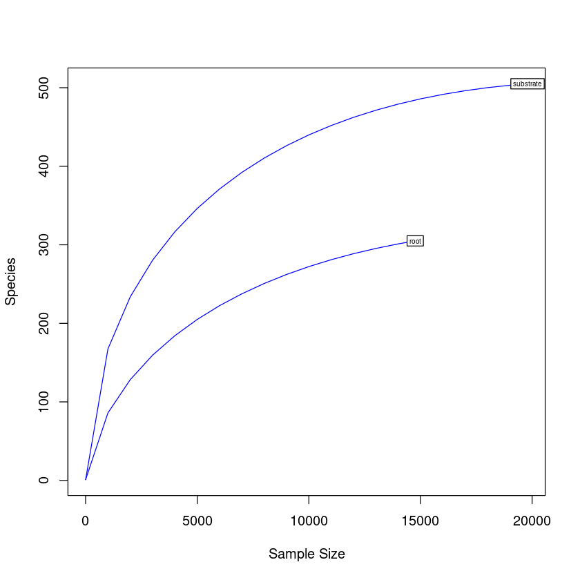

# Analyses of fungal diversity


```R
#Load libraries
library(phyloseq)
library(ggplot2)
library(ape)
library(vegan)
library(gridExtra)
library(phylogeo)
library(ggrepel)
library(reshape2)
library(RColorBrewer)
library(forcats)
library(microbiomeSeq)
library(microbiome)
```

    Loading required package: permute
    
    Loading required package: lattice
    
    This is vegan 2.5-7
    
    Warning message:
    “replacing previous import ‘dplyr::combine’ by ‘gridExtra::combine’ when loading ‘phylogeo’”
    Registered S3 methods overwritten by 'adegraphics':
      method         from
      biplot.dudi    ade4
      kplot.foucart  ade4
      kplot.mcoa     ade4
      kplot.mfa      ade4
      kplot.pta      ade4
      kplot.sepan    ade4
      kplot.statis   ade4
      scatter.coa    ade4
      scatter.dudi   ade4
      scatter.nipals ade4
      scatter.pco    ade4
      score.acm      ade4
      score.mix      ade4
      score.pca      ade4
      screeplot.dudi ade4
    
    Registered S3 method overwritten by 'spdep':
      method   from
      plot.mst ape 
    
    Registered S3 methods overwritten by 'adespatial':
      method             from       
      plot.multispati    adegraphics
      print.multispati   ade4       
      summary.multispati ade4       
    
    
    microbiome R package (microbiome.github.com)
        
    
    
     Copyright (C) 2011-2019 Leo Lahti, 
        Sudarshan Shetty et al. <microbiome.github.io>
    
    
    
    Attaching package: ‘microbiome’
    
    
    The following object is masked from ‘package:vegan’:
    
        diversity
    
    
    The following object is masked from ‘package:ggplot2’:
    
        alpha
    
    
    The following object is masked from ‘package:base’:
    
        transform
    
    


```R
# Load OTU table
otu <- as.matrix(read.table("biofert_ITS_otu.tsv", header=T, row.names=1))
colnames(otu) <- c("root","substrate")
otu <- otu[, c("substrate", "root")]
OTU <- otu_table(otu, taxa_are_rows=T)
```


```R
# Load taxonomy table
taxa <- as.matrix(read.table("biofert_ITS_tax.tsv", row.names=1))
TAXA <- tax_table(taxa)
colnames(TAXA) <- c("Kingdom", "Phylum", "Class", "Order", "Family", "Genus", "Specie")
```


```R
# Create phyloseq object with taxonomy and OTU tables 
its <-phyloseq(OTU,TAXA)
its
```


    phyloseq-class experiment-level object
    otu_table()   OTU Table:         [ 617 taxa and 2 samples ]
    tax_table()   Taxonomy Table:    [ 617 taxa by 7 taxonomic ranks ]


```R
# Rarefaction curves
pdf("rarefaction.pdf")
rarefaction <- rarecurve(t(otu), step=1000, cex=0.5, col="blue")
dev.off()

rarecurve(t(otu), step=1000, cex=0.5, col="blue")
```


<strong>png:</strong> 2


    

    


```R
# Shannon diversity estimations
estimate_richness(its)
write.table(estimate_richness(its), file="its_diversity.tsv",append = FALSE, quote = TRUE, sep = "\t")

```


<table class="dataframe">
<caption>A data.frame: 2 × 9</caption>
<thead>
	<tr><th></th><th scope=col>Observed</th><th scope=col>Chao1</th><th scope=col>se.chao1</th><th scope=col>ACE</th><th scope=col>se.ACE</th><th scope=col>Shannon</th><th scope=col>Simpson</th><th scope=col>InvSimpson</th><th scope=col>Fisher</th></tr>
	<tr><th></th><th scope=col>&lt;dbl&gt;</th><th scope=col>&lt;dbl&gt;</th><th scope=col>&lt;dbl&gt;</th><th scope=col>&lt;dbl&gt;</th><th scope=col>&lt;dbl&gt;</th><th scope=col>&lt;dbl&gt;</th><th scope=col>&lt;dbl&gt;</th><th scope=col>&lt;dbl&gt;</th><th scope=col>&lt;dbl&gt;</th></tr>
</thead>
<tbody>
	<tr><th scope=row>substrate</th><td>505</td><td>510.6944</td><td>3.026742</td><td>523.6280</td><td>10.47117</td><td>4.144461</td><td>0.9617988</td><td>26.177159</td><td>94.38323</td></tr>
	<tr><th scope=row>root</th><td>305</td><td>333.4118</td><td>9.197469</td><td>358.6007</td><td> 8.97240</td><td>2.407354</td><td>0.7584299</td><td> 4.139586</td><td>54.39241</td></tr>
</tbody>
</table>


```R
div <- read.table("its_diversity.tsv", header=TRUE, row.names = NULL)
colnames(div) <- c("Sample", "Observed", "Chao1", "SE.Chao1", 
                    "ACE", "SE.ACE", "Shannon", "Simpson", "InvSimpson", "Fisher")

observed_plot <- ggplot(div, aes(reorder(Sample, 1/(Observed)), y=Observed))  + geom_point() + 
                        theme_light() +  ggtitle("Observed diversity") 
ggsave("observed_plot.pdf", width=10, height=5, units="cm")
observed_plot


shannon_plot <- ggplot(div, aes(reorder(Sample, 1/(Shannon)), y=Shannon))  + geom_point() + 
                        theme_light() + ggtitle("Shannon diversity")
ggsave("shannon_plot.pdf", width=10, height=5, units="cm")
shannon_plot

simpson_plot <- ggplot(div, aes(reorder(Sample, 1/(Simpson)), y=Simpson))  + geom_point() + 
                        theme_light() + ggtitle("Simpson diversity")
ggsave("simpson_plot.pdf", width=10, height=5, units="cm")
simpson_plot
```


    

    


    

    


    

    


```R
#Estimate relative abundance
rel_its <- transform_sample_counts(its, function(x) x / sum(x))
```


```R
#Most abundant phylum
#Tax glom at Phylum level
phy_its <- tax_glom(rel_its, "Phylum")
phy_its
```


    phyloseq-class experiment-level object
    otu_table()   OTU Table:         [ 11 taxa and 2 samples ]
    tax_table()   Taxonomy Table:    [ 11 taxa by 7 taxonomic ranks ]


```R
#Export the file with taxa names and taxa counts
its_otu_phy <- otu_table(phy_its)
its_tax_phy <- tax_table(phy_its)
phy_its_tab <- cbind(its_otu_phy, its_tax_phy)
phy_its_tab <- phy_its_tab[, 1:4]
write.table(phy_its_tab, "phy_its_tab.tsv", sep = "\t")
phy_its_tab <- read.table("phy_its_tab.tsv", header=TRUE, row.names=1, stringsAsFactors = FALSE)
m_phy_its_tab <- melt(phy_its_tab)
colnames(m_phy_its_tab) <- c("Kingdom", "Phylum", "Sample", "Relative_abundance")
m_phy_its_tab <- m_phy_its_tab[, 2:4]

#Collapse Phylum with low abundance
m_phy_its_tab$Phylum[m_phy_its_tab$Relative_abundance <= 0.015] <- "Low_abundance"
cm_phy_its_tab <- aggregate(m_phy_its_tab$Relative_abundance 
                                          ,by=list(m_phy_its_tab$Phylum, 
                                           m_phy_its_tab$Sample),sum)
colnames(cm_phy_its_tab) <- c("Phylum", "Sample", "Relative_abundance")
cm_phy_its_tab

#Plot phylum
print("Most abundant Phylum")
phylum_plot <- ggplot(cm_phy_its_tab, aes(x=Sample, y=Relative_abundance,
                                          fill=fct_reorder(Phylum, Relative_abundance))) + 
                     scale_fill_manual(values = c("p__Basidiomycota" = "#bebadaff",
                                  "p__Glomeromycota" = "#fb8072ff",
                                  "p__Ascomycota" = "#80b1d3ff",
                                   "Low_abundance" = "#8dd3c7ff",
                                    "p__Mucoromycota" = "#ffffb3ff",
                                    "p__Fungi_phy_Incertae_sedis" = "#e9e8c0ff",  
                                     "p__Chytridiomycota" = "#d9f0b9ff")) +  
       geom_bar(stat="identity", color="black", width=0.8) + scale_y_continuous(expand = c(0 ,0)) + 
       theme_light(base_size = 7) + theme(axis.text.y = element_text(size = 15),
                                          axis.text.x = element_text(size= 15)) 
ggsave("phylum_plot.pdf", width=20, height=20, units="cm")

phylum_plot
```

    Using Kingdom, Phylum as id variables
    


<table class="dataframe">
<caption>A data.frame: 12 × 3</caption>
<thead>
	<tr><th scope=col>Phylum</th><th scope=col>Sample</th><th scope=col>Relative_abundance</th></tr>
	<tr><th scope=col>&lt;chr&gt;</th><th scope=col>&lt;fct&gt;</th><th scope=col>&lt;dbl&gt;</th></tr>
</thead>
<tbody>
	<tr><td>Low_abundance              </td><td>substrate</td><td>0.005961402</td></tr>
	<tr><td>p__Ascomycota              </td><td>substrate</td><td>0.488835001</td></tr>
	<tr><td>p__Basidiomycota           </td><td>substrate</td><td>0.241386279</td></tr>
	<tr><td>p__Chytridiomycota         </td><td>substrate</td><td>0.023542488</td></tr>
	<tr><td>p__Fungi_phy_Incertae_sedis</td><td>substrate</td><td>0.042538143</td></tr>
	<tr><td>p__Glomeromycota           </td><td>substrate</td><td>0.119834293</td></tr>
	<tr><td>p__Mucoromycota            </td><td>substrate</td><td>0.077902395</td></tr>
	<tr><td>Low_abundance              </td><td>root     </td><td>0.013749661</td></tr>
	<tr><td>p__Ascomycota              </td><td>root     </td><td>0.704145218</td></tr>
	<tr><td>p__Basidiomycota           </td><td>root     </td><td>0.088187483</td></tr>
	<tr><td>p__Fungi_phy_Incertae_sedis</td><td>root     </td><td>0.024857762</td></tr>
	<tr><td>p__Mucoromycota            </td><td>root     </td><td>0.169059875</td></tr>
</tbody>
</table>


    [1] "Most abundant Phylum"


    

    


```R
#Most abundant phylum
#Tax glom at species level
sp_its <- tax_glom(rel_its, "Specie")
sp_its
```


    phyloseq-class experiment-level object
    otu_table()   OTU Table:         [ 201 taxa and 2 samples ]
    tax_table()   Taxonomy Table:    [ 201 taxa by 7 taxonomic ranks ]


```R
#Export table from all fungal species
its_gen_otu <- otu_table(sp_its)
its_gen_tax <- tax_table(sp_its)
gen_fung_tab <- cbind(its_gen_otu, its_gen_tax)
gen_fung_tab
write.table(gen_fung_tab, "gen_fung_tab_forward.tsv", sep = "\t")
```


<table class="dataframe">
<caption>A matrix: 201 × 9 of type chr</caption>
<thead>
	<tr><th></th><th scope=col>substrate</th><th scope=col>root</th><th scope=col>Kingdom</th><th scope=col>Phylum</th><th scope=col>Class</th><th scope=col>Order</th><th scope=col>Family</th><th scope=col>Genus</th><th scope=col>Specie</th></tr>
</thead>
<tbody>
	<tr><th scope=row>4</th><td>0.00414266949580681 </td><td>0.062313736114874   </td><td>k__Fungi</td><td>p__Ascomycota              </td><td>c__Dothideomycetes              </td><td>o__Pleosporales                 </td><td>f__Cucurbitariaceae                  </td><td>g__Pyrenochaetopsis                      </td><td>s__Pyrenochaetopsis_leptospora</td></tr>
	<tr><th scope=row>5</th><td>0.000959886834394261</td><td>0.0123950149011108  </td><td>k__Fungi</td><td>p__Ascomycota              </td><td>c__Dothideomycetes              </td><td>o__Pleosporales                 </td><td>f__Pleosporaceae                     </td><td>g__Curvularia                            </td><td>s__Curvularia_lunata          </td></tr>
	<tr><th scope=row>7</th><td>0.0705264221481257  </td><td>0.164250880520184   </td><td>k__Fungi</td><td>p__Mucoromycota            </td><td>c__Mucoromycetes                </td><td>o__Mucorales                    </td><td>f__Rhizopodaceae                     </td><td>g__Rhizopus                              </td><td>s__Rhizopus_arrhizus          </td></tr>
	<tr><th scope=row>10</th><td>0.00474891381226634 </td><td>0.484489298293146   </td><td>k__Fungi</td><td>p__Ascomycota              </td><td>c__Dothideomycetes              </td><td>o__Pleosporales                 </td><td>f__Pleosporaceae                     </td><td>g__Bipolaris                             </td><td>s__Bipolaris_sp               </td></tr>
	<tr><th scope=row>14</th><td>0.00176821258967364 </td><td>6.77323218639935e-05</td><td>k__Fungi</td><td>p__Glomeromycota           </td><td>c__Archaeosporomycetes          </td><td>o__Archaeosporales              </td><td>f__Archaeosporaceae                  </td><td>g__Archaeospora                          </td><td>s__Archaeospora_ecuadoriana   </td></tr>
	<tr><th scope=row>16</th><td>0.00500151561079115 </td><td>0.0229612571118938  </td><td>k__Fungi</td><td>p__Ascomycota              </td><td>c__Dothideomycetes              </td><td>o__Pleosporales                 </td><td>f__Phaeosphaeriaceae                 </td><td>g__Setophoma                             </td><td>s__Setophoma_sp               </td></tr>
	<tr><th scope=row>19</th><td>0.0425381428715772  </td><td>0.0184909238688702  </td><td>k__Fungi</td><td>p__Ascomycota              </td><td>c__Dothideomycetes              </td><td>o__Pleosporales                 </td><td>f__Lentitheciaceae                   </td><td>g__Poaceascoma                           </td><td>s__Poaceascoma_sp             </td></tr>
	<tr><th scope=row>20</th><td>0.0141962210770941  </td><td>0.00257382823083175 </td><td>k__Fungi</td><td>p__Glomeromycota           </td><td>c__Glomeromycetes               </td><td>o__Glomerales                   </td><td>f__Glomeraceae                       </td><td>g__Rhizophagus                           </td><td>s__Rhizophagus_sp             </td></tr>
	<tr><th scope=row>21</th><td>0.0057088006466606  </td><td>0.00237063126523977 </td><td>k__Fungi</td><td>p__Ascomycota              </td><td>c__Eurotiomycetes               </td><td>o__Eurotiales                   </td><td>f__Aspergillaceae                    </td><td>g__Penicillium                           </td><td>s__Penicillium_dodgei         </td></tr>
	<tr><th scope=row>22</th><td>0.00267757906436294 </td><td>0.0020997019777838  </td><td>k__Fungi</td><td>p__Ascomycota              </td><td>c__Eurotiomycetes               </td><td>o__Chaetothyriales              </td><td>f__Chaetothyriales_fam_Incertae_sedis</td><td>g__Chaetothyriales_gen_Incertae_sedis    </td><td>s__Chaetothyriales_sp         </td></tr>
	<tr><th scope=row>29</th><td>0.00176821258967364 </td><td>0.00358981305879166 </td><td>k__Fungi</td><td>p__Ascomycota              </td><td>c__Sordariomycetes              </td><td>o__Hypocreales                  </td><td>f__Bionectriaceae                    </td><td>g__Bionectriaceae_gen_Incertae_sedis     </td><td>s__Bionectriaceae_sp          </td></tr>
	<tr><th scope=row>34</th><td>0.00687076891987471 </td><td>0.00480899485234354 </td><td>k__Fungi</td><td>p__Mucoromycota            </td><td>c__Mucoromycetes                </td><td>o__Mucorales                    </td><td>f__Rhizopodaceae                     </td><td>g__Rhizopus                              </td><td>s__Rhizopus_microsporus       </td></tr>
	<tr><th scope=row>41</th><td>0.0278872385571385  </td><td>0.0178136006502303  </td><td>k__Fungi</td><td>p__Ascomycota              </td><td>c__Ascomycota_cls_Incertae_sedis</td><td>o__Ascomycota_ord_Incertae_sedis</td><td>f__Ascomycota_fam_Incertae_sedis     </td><td>g__Ascomycota_gen_Incertae_sedis         </td><td>s__Ascomycota_sp              </td></tr>
	<tr><th scope=row>46</th><td>0.0608265130847732  </td><td>0.0458547819019236  </td><td>k__Fungi</td><td>p__Ascomycota              </td><td>c__Eurotiomycetes               </td><td>o__Eurotiales                   </td><td>f__Aspergillaceae                    </td><td>g__Talaromyces                           </td><td>s__Talaromyces_marneffei      </td></tr>
	<tr><th scope=row>54</th><td>0.000303122158229767</td><td>6.77323218639935e-05</td><td>k__Fungi</td><td>p__Ascomycota              </td><td>c__Dothideomycetes              </td><td>o__Pleosporales                 </td><td>f__Lentitheciaceae                   </td><td>g__Lentitheciaceae_gen_Incertae_sedis    </td><td>s__Lentitheciaceae_sp         </td></tr>
	<tr><th scope=row>55</th><td>0                   </td><td>0.00230289894337578 </td><td>k__Fungi</td><td>p__Basidiomycota           </td><td>c__Agaricomycetes               </td><td>o__Cantharellales               </td><td>f__Ceratobasidiaceae                 </td><td>g__Thanatephorus                         </td><td>s__Thanatephorus_sp           </td></tr>
	<tr><th scope=row>56</th><td>0.0425381428715772  </td><td>0.0248577621240856  </td><td>k__Fungi</td><td>p__Fungi_phy_Incertae_sedis</td><td>c__Fungi_cls_Incertae_sedis     </td><td>o__Fungi_ord_Incertae_sedis     </td><td>f__Fungi_fam_Incertae_sedis          </td><td>g__Fungi_gen_Incertae_sedis              </td><td>s__Fungi_sp                   </td></tr>
	<tr><th scope=row>69</th><td>0.120945741133677   </td><td>0.0612977512869141  </td><td>k__Fungi</td><td>p__Basidiomycota           </td><td>c__Atractiellomycetes           </td><td>o__Atractiellales               </td><td>f__Hoehnelomycetaceae                </td><td>g__Atractiella                           </td><td>s__Atractiella_rhizophila     </td></tr>
	<tr><th scope=row>80</th><td>0.00212185510760837 </td><td>0.000609590896775942</td><td>k__Fungi</td><td>p__Ascomycota              </td><td>c__Dothideomycetes              </td><td>o__Pleosporales                 </td><td>f__Pleosporaceae                     </td><td>g__Alternaria                            </td><td>s__Alternaria_prunicola       </td></tr>
	<tr><th scope=row>83</th><td>0.00666868748105487 </td><td>0.000270929287455974</td><td>k__Fungi</td><td>p__Ascomycota              </td><td>c__Eurotiomycetes               </td><td>o__Chaetothyriales              </td><td>f__Herpotrichiellaceae               </td><td>g__Herpotrichiellaceae_gen_Incertae_sedis</td><td>s__Herpotrichiellaceae_sp     </td></tr>
	<tr><th scope=row>101</th><td>0.00591088208548045 </td><td>0.000474126253047955</td><td>k__Fungi</td><td>p__Basidiomycota           </td><td>c__Tremellomycetes              </td><td>o__Tremellales                  </td><td>f__Rhynchogastremataceae             </td><td>g__Papiliotrema                          </td><td>s__Papiliotrema_laurentii     </td></tr>
	<tr><th scope=row>120</th><td>0                   </td><td>0.000203196965591981</td><td>k__Fungi</td><td>p__Ascomycota              </td><td>c__Dothideomycetes              </td><td>o__Pleosporales                 </td><td>f__Pleosporaceae                     </td><td>g__Alternaria                            </td><td>s__Alternaria_venezuelensis   </td></tr>
	<tr><th scope=row>135</th><td>0.0348085278367182  </td><td>0.00264156055269575 </td><td>k__Fungi</td><td>p__Glomeromycota           </td><td>c__Glomeromycetes               </td><td>o__Gigasporales                 </td><td>f__Gigasporaceae                     </td><td>g__Dentiscutata                          </td><td>s__Dentiscutata_sp            </td></tr>
	<tr><th scope=row>137</th><td>0.00101040719409922 </td><td>0.00121918179355188 </td><td>k__Fungi</td><td>p__Glomeromycota           </td><td>c__Glomeromycetes               </td><td>o__Glomerales                   </td><td>f__Glomeraceae                       </td><td>g__Glomeraceae_gen_Incertae_sedis        </td><td>s__Glomeraceae_sp             </td></tr>
	<tr><th scope=row>140</th><td>0.0481964231585329  </td><td>0.000948252506095909</td><td>k__Fungi</td><td>p__Ascomycota              </td><td>c__Eurotiomycetes               </td><td>o__Eurotiales                   </td><td>f__Aspergillaceae                    </td><td>g__Aspergillus                           </td><td>s__Aspergillus_niger          </td></tr>
	<tr><th scope=row>141</th><td>0                   </td><td>0.00162557572473584 </td><td>k__Fungi</td><td>p__Ascomycota              </td><td>c__Sordariomycetes              </td><td>o__Magnaporthales               </td><td>f__Magnaporthaceae                   </td><td>g__Arxiella                              </td><td>s__Arxiella_celtidis          </td></tr>
	<tr><th scope=row>158</th><td>0.000555723956754572</td><td>0.000270929287455974</td><td>k__Fungi</td><td>p__Ascomycota              </td><td>c__Eurotiomycetes               </td><td>o__Chaetothyriales              </td><td>f__Cyphellophoraceae                 </td><td>g__Cyphellophora                         </td><td>s__Cyphellophora_fusarioides  </td></tr>
	<tr><th scope=row>160</th><td>0.00444579165403658 </td><td>0.00257382823083175 </td><td>k__Fungi</td><td>p__Ascomycota              </td><td>c__Sordariomycetes              </td><td>o__Sordariales                  </td><td>f__Chaetomiaceae                     </td><td>g__Chaetomiaceae_gen_Incertae_sedis      </td><td>s__Chaetomiaceae_sp           </td></tr>
	<tr><th scope=row>164</th><td>0.0411235727998383  </td><td>0.0181522622595503  </td><td>k__Fungi</td><td>p__Basidiomycota           </td><td>c__Agaricomycetes               </td><td>o__Auriculariales               </td><td>f__Auriculariaceae                   </td><td>g__Auricularia                           </td><td>s__Auricularia_sp             </td></tr>
	<tr><th scope=row>166</th><td>0.000606244316459533</td><td>0.000203196965591981</td><td>k__Fungi</td><td>p__Ascomycota              </td><td>c__Sordariomycetes              </td><td>o__Chaetosphaeriales            </td><td>f__Chaetosphaeriaceae                </td><td>g__Codinaea                              </td><td>s__Codinaea_acaciae           </td></tr>
	<tr><th scope=row>⋮</th><td>⋮</td><td>⋮</td><td>⋮</td><td>⋮</td><td>⋮</td><td>⋮</td><td>⋮</td><td>⋮</td><td>⋮</td></tr>
	<tr><th scope=row>2599</th><td>0.000404162877639689</td><td>6.77323218639935e-05</td><td>k__Fungi</td><td>p__Ascomycota        </td><td>c__Leotiomycetes                        </td><td>o__Helotiales                           </td><td>f__Helotiaceae                          </td><td>g__Hymenoscyphus                        </td><td>s__Hymenoscyphus_sp              </td></tr>
	<tr><th scope=row>2629</th><td>0.00045468323734465 </td><td>0                   </td><td>k__Fungi</td><td>p__Ascomycota        </td><td>c__Orbiliomycetes                       </td><td>o__Orbiliales                           </td><td>f__Orbiliales_fam_Incertae_sedis        </td><td>g__Orbiliales_gen_Incertae_sedis        </td><td>s__Orbiliales_sp                 </td></tr>
	<tr><th scope=row>2638</th><td>0.00045468323734465 </td><td>0                   </td><td>k__Fungi</td><td>p__Chytridiomycota   </td><td>c__Lobulomycetes                        </td><td>o__Lobulomycetales                      </td><td>f__Lobulomycetales_fam_Incertae_sedis   </td><td>g__Lobulomycetales_gen_Incertae_sedis   </td><td>s__Lobulomycetales_sp            </td></tr>
	<tr><th scope=row>2672</th><td>0.000202081438819844</td><td>0                   </td><td>k__Fungi</td><td>p__Ascomycota        </td><td>c__Dothideomycetes                      </td><td>o__Pleosporales                         </td><td>f__Didymellaceae                        </td><td>g__Neoascochyta                         </td><td>s__Neoascochyta_sp               </td></tr>
	<tr><th scope=row>2680</th><td>0.000202081438819844</td><td>0                   </td><td>k__Fungi</td><td>p__Basidiomycota     </td><td>c__Exobasidiomycetes                    </td><td>o__Doassansiales                        </td><td>f__Doassansiaceae                       </td><td>g__Heterodoassansia                     </td><td>s__Heterodoassansia_hygrophilae  </td></tr>
	<tr><th scope=row>2684</th><td>0.000101040719409922</td><td>0                   </td><td>k__Fungi</td><td>p__Glomeromycota     </td><td>c__Glomeromycetes                       </td><td>o__Gigasporales                         </td><td>f__Gigasporaceae                        </td><td>g__Gigaspora                            </td><td>s__Gigaspora_rosea               </td></tr>
	<tr><th scope=row>2715</th><td>0.000202081438819844</td><td>0                   </td><td>k__Fungi</td><td>p__Chytridiomycota   </td><td>c__Rhizophydiomycetes                   </td><td>o__Rhizophydiales                       </td><td>f__Rhizophydiales_fam_Incertae_sedis    </td><td>g__Rhizophydiales_gen_Incertae_sedis    </td><td>s__Rhizophydiales_sp             </td></tr>
	<tr><th scope=row>2777</th><td>0.000101040719409922</td><td>0                   </td><td>k__Fungi</td><td>p__Ascomycota        </td><td>c__Dothideomycetes                      </td><td>o__Mycosphaerellales                    </td><td>f__Mycosphaerellaceae                   </td><td>g__Teratoramularia                      </td><td>s__Teratoramularia_rumicicola    </td></tr>
	<tr><th scope=row>2805</th><td>0.000404162877639689</td><td>0                   </td><td>k__Fungi</td><td>p__Basidiomycota     </td><td>c__Agaricomycetes                       </td><td>o__Polyporales                          </td><td>f__Polyporaceae                         </td><td>g__Trametes                             </td><td>s__Trametes_maxima               </td></tr>
	<tr><th scope=row>2941</th><td>5.05203597049611e-05</td><td>6.77323218639935e-05</td><td>k__Fungi</td><td>p__Ascomycota        </td><td>c__Sordariomycetes                      </td><td>o__Sordariales                          </td><td>f__Chaetomiaceae                        </td><td>g__Thielavia                            </td><td>s__Thielavia_sp                  </td></tr>
	<tr><th scope=row>3216</th><td>0.000151561079114883</td><td>0                   </td><td>k__Fungi</td><td>p__Blastocladiomycota</td><td>c__Blastocladiomycota_cls_Incertae_sedis</td><td>o__Blastocladiomycota_ord_Incertae_sedis</td><td>f__Blastocladiomycota_fam_Incertae_sedis</td><td>g__Blastocladiomycota_gen_Incertae_sedis</td><td>s__Blastocladiomycota_sp         </td></tr>
	<tr><th scope=row>3265</th><td>0.000151561079114883</td><td>0                   </td><td>k__Fungi</td><td>p__Mucoromycota      </td><td>c__Umbelopsidomycetes                   </td><td>o__Umbelopsidales                       </td><td>f__Umbelopsidaceae                      </td><td>g__Umbelopsis                           </td><td>s__Umbelopsis_sp                 </td></tr>
	<tr><th scope=row>3569</th><td>0.000505203597049611</td><td>0.000135464643727987</td><td>k__Fungi</td><td>p__Ascomycota        </td><td>c__Sordariomycetes                      </td><td>o__Hypocreales                          </td><td>f__Bionectriaceae                       </td><td>g__Bionectria                           </td><td>s__Bionectria_grammicospora      </td></tr>
	<tr><th scope=row>3599</th><td>0.000101040719409922</td><td>0.000270929287455974</td><td>k__Fungi</td><td>p__Chytridiomycota   </td><td>c__Rhizophlyctidomycetes                </td><td>o__Rhizophlyctidales                    </td><td>f__Rhizophlyctidales_fam_Incertae_sedis </td><td>g__Rhizophlyctidales_gen_Incertae_sedis </td><td>s__Rhizophlyctidales_sp          </td></tr>
	<tr><th scope=row>3659</th><td>0                   </td><td>0.000135464643727987</td><td>k__Fungi</td><td>p__Ascomycota        </td><td>c__Sordariomycetes                      </td><td>o__Xylariales                           </td><td>f__Amphisphaeriaceae                    </td><td>g__Microdochium                         </td><td>s__Microdochium_colombiense      </td></tr>
	<tr><th scope=row>3832</th><td>0.000555723956754572</td><td>0.000135464643727987</td><td>k__Fungi</td><td>p__Ascomycota        </td><td>c__Sordariomycetes                      </td><td>o__Trichosphaeriales                    </td><td>f__Trichosphaeriaceae                   </td><td>g__Nigrospora                           </td><td>s__Nigrospora_oryzae             </td></tr>
	<tr><th scope=row>4193</th><td>0.00338486410023239 </td><td>0                   </td><td>k__Fungi</td><td>p__Ascomycota        </td><td>c__Dothideomycetes                      </td><td>o__Pleosporales                         </td><td>f__Periconiaceae                        </td><td>g__Periconia                            </td><td>s__Periconia_macrospinosa        </td></tr>
	<tr><th scope=row>4218</th><td>0.000151561079114883</td><td>0                   </td><td>k__Fungi</td><td>p__Ascomycota        </td><td>c__Eurotiomycetes                       </td><td>o__Eurotiales                           </td><td>f__Aspergillaceae                       </td><td>g__Aspergillus                          </td><td>s__Aspergillus_ruber             </td></tr>
	<tr><th scope=row>4230</th><td>0.000606244316459533</td><td>0                   </td><td>k__Fungi</td><td>p__Chytridiomycota   </td><td>c__Rhizophydiomycetes                   </td><td>o__Rhizophydiales                       </td><td>f__Alphamycetaceae                      </td><td>g__Betamyces                            </td><td>s__Betamyces_sp                  </td></tr>
	<tr><th scope=row>4261</th><td>0.00121248863291907 </td><td>0                   </td><td>k__Fungi</td><td>p__Ascomycota        </td><td>c__Eurotiomycetes                       </td><td>o__Eurotiales                           </td><td>f__Aspergillaceae                       </td><td>g__Talaromyces                          </td><td>s__Talaromyces_tiftonensis       </td></tr>
	<tr><th scope=row>4305</th><td>0.000101040719409922</td><td>0                   </td><td>k__Fungi</td><td>p__Ascomycota        </td><td>c__Pezizomycetes                        </td><td>o__Pezizales                            </td><td>f__Pezizaceae                           </td><td>g__Scabropezia                          </td><td>s__Scabropezia_sp                </td></tr>
	<tr><th scope=row>4362</th><td>0.000101040719409922</td><td>0                   </td><td>k__Fungi</td><td>p__Ascomycota        </td><td>c__Dothideomycetes                      </td><td>o__Mycosphaerellales                    </td><td>f__Mycosphaerellaceae                   </td><td>g__Ramularia                            </td><td>s__Ramularia_beticola            </td></tr>
	<tr><th scope=row>4524</th><td>0.000101040719409922</td><td>0                   </td><td>k__Fungi</td><td>p__Ascomycota        </td><td>c__Sordariomycetes                      </td><td>o__Hypocreales                          </td><td>f__Nectriaceae                          </td><td>g__Fusarium                             </td><td>s__Fusarium_proliferatum         </td></tr>
	<tr><th scope=row>4551</th><td>0.000202081438819844</td><td>0                   </td><td>k__Fungi</td><td>p__Ascomycota        </td><td>c__Sordariomycetes                      </td><td>o__Hypocreales                          </td><td>f__Nectriaceae                          </td><td>g__Fusicolla                            </td><td>s__Fusicolla_violacea            </td></tr>
	<tr><th scope=row>4564</th><td>0.000101040719409922</td><td>0                   </td><td>k__Fungi</td><td>p__Basidiomycota     </td><td>c__Agaricomycetes                       </td><td>o__Agaricales                           </td><td>f__Psathyrellaceae                      </td><td>g__Coprinellus                          </td><td>s__Coprinellus_pseudodisseminatus</td></tr>
	<tr><th scope=row>4584</th><td>0.000555723956754572</td><td>0                   </td><td>k__Fungi</td><td>p__Ascomycota        </td><td>c__Dothideomycetes                      </td><td>o__Pleosporales                         </td><td>f__Leptosphaeriaceae                    </td><td>g__Leptosphaeria                        </td><td>s__Leptosphaeria_sp              </td></tr>
	<tr><th scope=row>4613</th><td>0.000101040719409922</td><td>0                   </td><td>k__Fungi</td><td>p__Ascomycota        </td><td>c__Sordariomycetes                      </td><td>o__Hypocreales                          </td><td>f__Hypocreales_fam_Incertae_sedis       </td><td>g__Hypocreales_gen_Incertae_sedis       </td><td>s__Hypocreales_sp                </td></tr>
	<tr><th scope=row>5099</th><td>0                   </td><td>0.000948252506095909</td><td>k__Fungi</td><td>p__Ascomycota        </td><td>c__Dothideomycetes                      </td><td>o__Pleosporales                         </td><td>f__Pleosporaceae                        </td><td>g__Bipolaris                            </td><td>s__Bipolaris_sorokiniana         </td></tr>
	<tr><th scope=row>5309</th><td>0.000202081438819844</td><td>0                   </td><td>k__Fungi</td><td>p__Basidiomycota     </td><td>c__Agaricomycetes                       </td><td>o__Agaricales                           </td><td>f__Schizophyllaceae                     </td><td>g__Schizophyllum                        </td><td>s__Schizophyllum_commune         </td></tr>
	<tr><th scope=row>5315</th><td>0.000101040719409922</td><td>0                   </td><td>k__Fungi</td><td>p__Basidiomycota     </td><td>c__Agaricomycetes                       </td><td>o__Hymenochaetales                      </td><td>f__Hymenochaetaceae                     </td><td>g__Hymenochaetaceae_gen_Incertae_sedis  </td><td>s__Hymenochaetaceae_sp           </td></tr>
</tbody>
</table>


```R
#Most abundant phylum
#Tax glom at genus level
spa_its <- tax_glom(its, "Specie")
spa_its
```


    phyloseq-class experiment-level object
    otu_table()   OTU Table:         [ 201 taxa and 2 samples ]
    tax_table()   Taxonomy Table:    [ 201 taxa by 7 taxonomic ranks ]


```R
#Heat map of top abundant species in both samples
top50 <- prune_taxa(names(sort(taxa_sums(spa_its),TRUE)[1:50]), spa_its)
sp_heat_plot <- plot_heatmap(top50, taxa.label = "Specie", method = NULL, low = "#f9f8f9ff", 
                              high ="black", na.value = "white", 
                              sample.order = c("substrate", "root"),
                              taxa.order  = names(sort(taxa_sums(top50))))+ theme_light()
ggsave("sp_heat_plot.pdf", width=20, height=25, units="cm")
sp_heat_plot
```

    Warning message:
    “Transformation introduced infinite values in discrete y-axis”
    Warning message:
    “Transformation introduced infinite values in discrete y-axis”


    

    

