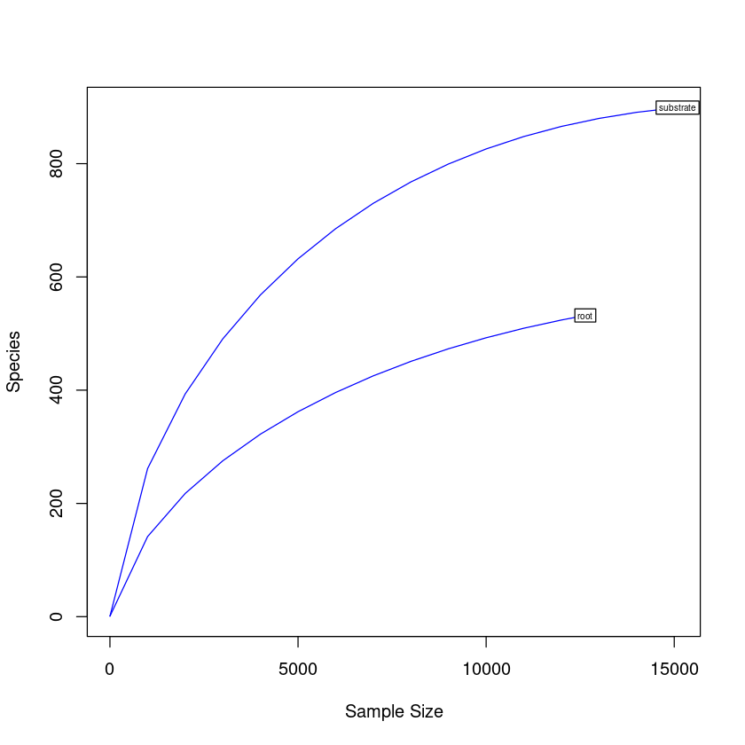
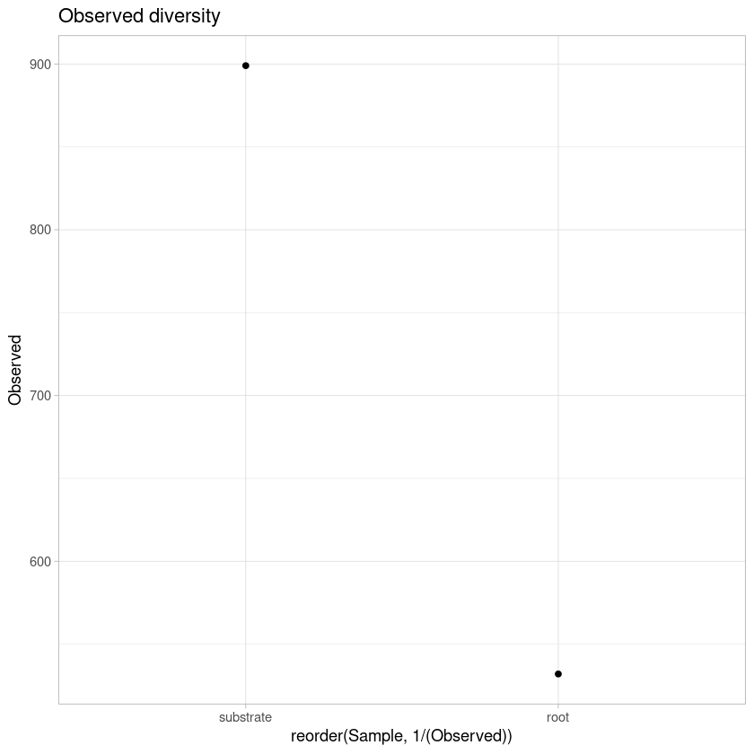
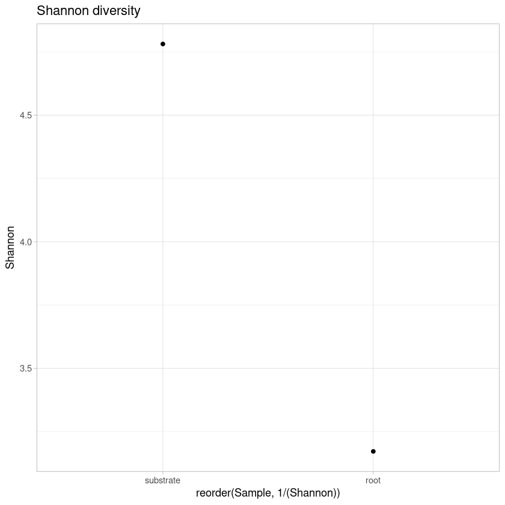
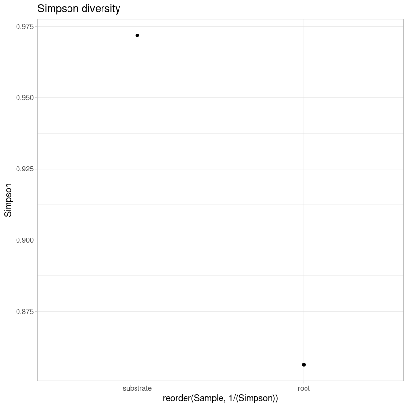
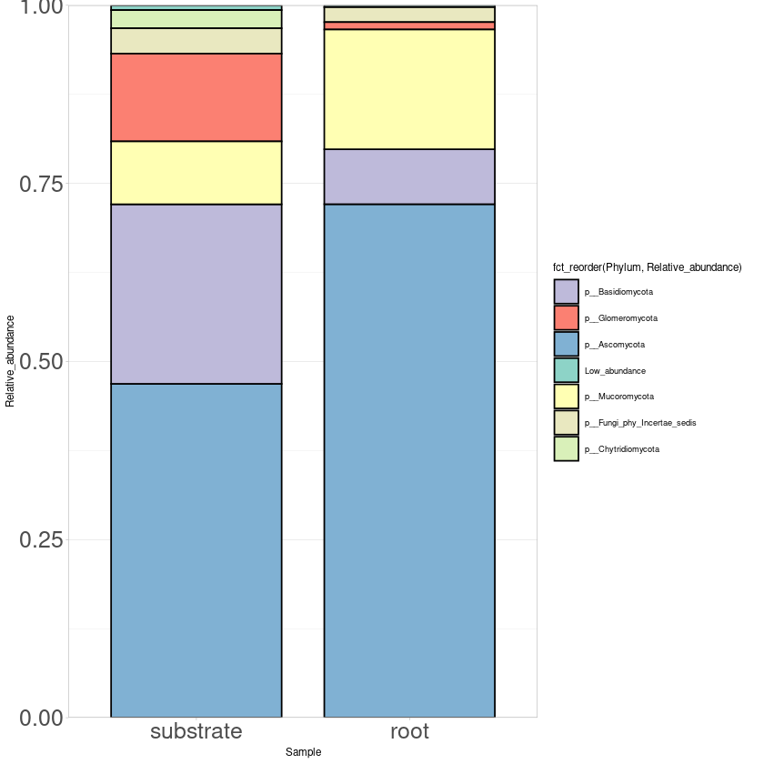
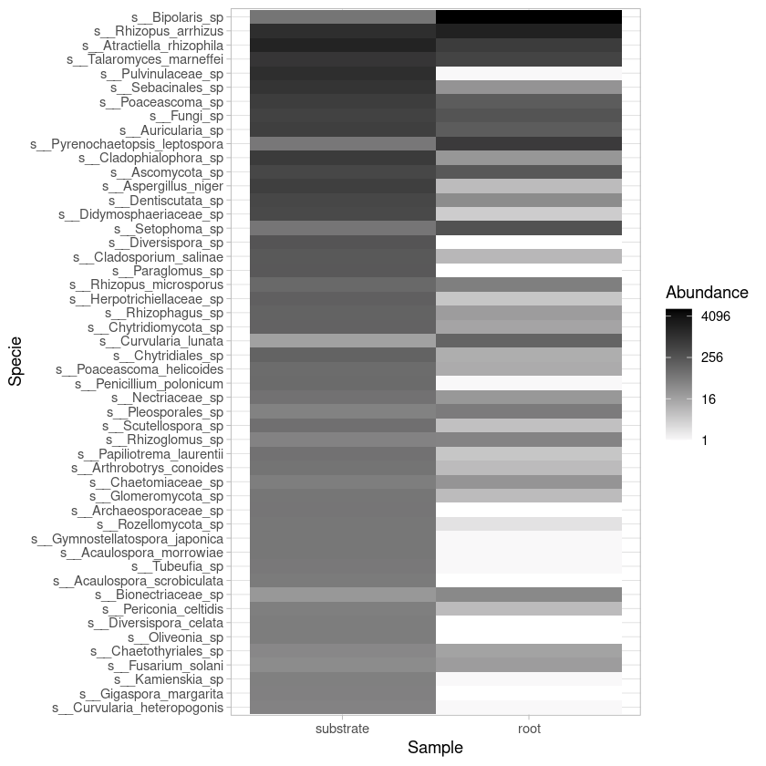

# Analyses of fungal diversity


```R
#Load libraries
library(phyloseq)
library(ggplot2)
library(ape)
library(vegan)
library(gridExtra)
library(phylogeo)
library(ggrepel)
library(reshape2)
library(RColorBrewer)
library(forcats)
library(microbiomeSeq)
library(microbiome)
```

    Loading required package: permute
    
    Loading required package: lattice
    
    This is vegan 2.5-7
    
    Warning message:
    “replacing previous import ‘dplyr::combine’ by ‘gridExtra::combine’ when loading ‘phylogeo’”
    Registered S3 methods overwritten by 'adegraphics':
      method         from
      biplot.dudi    ade4
      kplot.foucart  ade4
      kplot.mcoa     ade4
      kplot.mfa      ade4
      kplot.pta      ade4
      kplot.sepan    ade4
      kplot.statis   ade4
      scatter.coa    ade4
      scatter.dudi   ade4
      scatter.nipals ade4
      scatter.pco    ade4
      score.acm      ade4
      score.mix      ade4
      score.pca      ade4
      screeplot.dudi ade4
    
    Registered S3 method overwritten by 'spdep':
      method   from
      plot.mst ape 
    
    Registered S3 methods overwritten by 'adespatial':
      method             from       
      plot.multispati    adegraphics
      print.multispati   ade4       
      summary.multispati ade4       
    
    
    microbiome R package (microbiome.github.com)
        
    
    
     Copyright (C) 2011-2019 Leo Lahti, 
        Sudarshan Shetty et al. <microbiome.github.io>
    
    
    
    Attaching package: ‘microbiome’
    
    
    The following object is masked from ‘package:vegan’:
    
        diversity
    
    
    The following object is masked from ‘package:ggplot2’:
    
        alpha
    
    
    The following object is masked from ‘package:base’:
    
        transform
    
    


```R
# Load OTU table
otu <- as.matrix(read.table("biofert_ITS_otu.tsv", header=T, row.names=1))
colnames(otu) <- c("root","substrate")
otu <- otu[, c("substrate", "root")]
OTU <- otu_table(otu, taxa_are_rows=T)
```


```R
# Load taxonomy table
taxa <- as.matrix(read.table("biofert_ITS_tax.tsv", row.names=1))
TAXA <- tax_table(taxa)
colnames(TAXA) <- c("Kingdom", "Phylum", "Class", "Order", "Family", "Genus", "Specie")
```


```R
# Create phyloseq object with taxonomy and OTU tables 
its <-phyloseq(OTU,TAXA)
its
```


    phyloseq-class experiment-level object
    otu_table()   OTU Table:         [ 1102 taxa and 2 samples ]
    tax_table()   Taxonomy Table:    [ 1102 taxa by 7 taxonomic ranks ]


```R
# Rarefaction curves
pdf("rarefaction.pdf")
rarefaction <- rarecurve(t(otu), step=1000, cex=0.5, col="blue")
dev.off()

rarecurve(t(otu), step=1000, cex=0.5, col="blue")
```


<strong>png:</strong> 2


    

    


```R
# Shannon diversity estimations
estimate_richness(its)
write.table(estimate_richness(its), file="its_diversity.tsv",append = FALSE, quote = TRUE, sep = "\t")

```


<table class="dataframe">
<caption>A data.frame: 2 × 9</caption>
<thead>
	<tr><th></th><th scope=col>Observed</th><th scope=col>Chao1</th><th scope=col>se.chao1</th><th scope=col>ACE</th><th scope=col>se.ACE</th><th scope=col>Shannon</th><th scope=col>Simpson</th><th scope=col>InvSimpson</th><th scope=col>Fisher</th></tr>
	<tr><th></th><th scope=col>&lt;dbl&gt;</th><th scope=col>&lt;dbl&gt;</th><th scope=col>&lt;dbl&gt;</th><th scope=col>&lt;dbl&gt;</th><th scope=col>&lt;dbl&gt;</th><th scope=col>&lt;dbl&gt;</th><th scope=col>&lt;dbl&gt;</th><th scope=col>&lt;dbl&gt;</th><th scope=col>&lt;dbl&gt;</th></tr>
</thead>
<tbody>
	<tr><th scope=row>substrate</th><td>899</td><td>911.7969</td><td> 4.537117</td><td>943.5975</td><td>12.44865</td><td>4.781327</td><td>0.9717660</td><td>35.418309</td><td>209.5243</td></tr>
	<tr><th scope=row>root</th><td>532</td><td>604.2236</td><td>15.546421</td><td>662.0033</td><td>13.07741</td><td>3.171621</td><td>0.8563148</td><td> 6.959659</td><td>112.4601</td></tr>
</tbody>
</table>


```R
div <- read.table("its_diversity.tsv", header=TRUE, row.names = NULL)
colnames(div) <- c("Sample", "Observed", "Chao1", "SE.Chao1", 
                    "ACE", "SE.ACE", "Shannon", "Simpson", "InvSimpson", "Fisher")

observed_plot <- ggplot(div, aes(reorder(Sample, 1/(Observed)), y=Observed))  + geom_point() + 
                        theme_light() +  ggtitle("Observed diversity") 
ggsave("observed_plot.pdf", width=10, height=5, units="cm")
observed_plot


shannon_plot <- ggplot(div, aes(reorder(Sample, 1/(Shannon)), y=Shannon))  + geom_point() + 
                        theme_light() + ggtitle("Shannon diversity")
ggsave("shannon_plot.pdf", width=10, height=5, units="cm")
shannon_plot

simpson_plot <- ggplot(div, aes(reorder(Sample, 1/(Simpson)), y=Simpson))  + geom_point() + 
                        theme_light() + ggtitle("Simpson diversity")
ggsave("simpson_plot.pdf", width=10, height=5, units="cm")
simpson_plot
```


    

    


    

    


    

    


```R
#Estimate relative abundance
rel_its <- transform_sample_counts(its, function(x) x / sum(x))
```


```R
#Most abundant phylum
#Tax glom at Phylum level
phy_its <- tax_glom(rel_its, "Phylum")
phy_its
```


    phyloseq-class experiment-level object
    otu_table()   OTU Table:         [ 11 taxa and 2 samples ]
    tax_table()   Taxonomy Table:    [ 11 taxa by 7 taxonomic ranks ]


```R
#Export the file with taxa names and taxa counts
its_otu_phy <- otu_table(phy_its)
its_tax_phy <- tax_table(phy_its)
phy_its_tab <- cbind(its_otu_phy, its_tax_phy)
phy_its_tab <- phy_its_tab[, 1:4]
write.table(phy_its_tab, "phy_its_tab.tsv", sep = "\t")
phy_its_tab <- read.table("phy_its_tab.tsv", header=TRUE, row.names=1, stringsAsFactors = FALSE)
m_phy_its_tab <- melt(phy_its_tab)
colnames(m_phy_its_tab) <- c("Kingdom", "Phylum", "Sample", "Relative_abundance")
m_phy_its_tab <- m_phy_its_tab[, 2:4]

#Collapse Phylum with low abundance
m_phy_its_tab$Phylum[m_phy_its_tab$Relative_abundance <= 0.01] <- "Low_abundance"
cm_phy_its_tab <- aggregate(m_phy_its_tab$Relative_abundance 
                                          ,by=list(m_phy_its_tab$Phylum, 
                                           m_phy_its_tab$Sample),sum)
colnames(cm_phy_its_tab) <- c("Phylum", "Sample", "Relative_abundance")
cm_phy_its_tab

#Plot phylum
print("Most abundant Phylum")
phylum_plot <- ggplot(cm_phy_its_tab, aes(x=Sample, y=Relative_abundance,
                                          fill=fct_reorder(Phylum, Relative_abundance))) + 
             scale_fill_manual(values = c("p__Basidiomycota" = "#bebadaff",
                                  "p__Glomeromycota" = "#fb8072ff",
                                  "p__Ascomycota" = "#80b1d3ff",
                                   "Low_abundance" = "#8dd3c7ff",
                                    "p__Mucoromycota" = "#ffffb3ff",
                                    "p__Fungi_phy_Incertae_sedis" = "#e9e8c0ff",
                                     "p__Chytridiomycota" = "#d9f0b9ff"))+
       geom_bar(stat="identity", color="black", width=0.8) + scale_y_continuous(expand = c(0 ,0)) + 
       theme_light(base_size = 7) + theme(axis.text.y = element_text(size = 15),
                                          axis.text.x = element_text(size= 15)) 
ggsave("phylum_plot.pdf", width=20, height=20, units="cm")

phylum_plot
```

    Using Kingdom, Phylum as id variables
    


<table class="dataframe">
<caption>A data.frame: 13 × 3</caption>
<thead>
	<tr><th scope=col>Phylum</th><th scope=col>Sample</th><th scope=col>Relative_abundance</th></tr>
	<tr><th scope=col>&lt;chr&gt;</th><th scope=col>&lt;fct&gt;</th><th scope=col>&lt;dbl&gt;</th></tr>
</thead>
<tbody>
	<tr><td>Low_abundance              </td><td>substrate</td><td>0.006759891</td></tr>
	<tr><td>p__Ascomycota              </td><td>substrate</td><td>0.468619524</td></tr>
	<tr><td>p__Basidiomycota           </td><td>substrate</td><td>0.252037908</td></tr>
	<tr><td>p__Chytridiomycota         </td><td>substrate</td><td>0.025515276</td></tr>
	<tr><td>p__Fungi_phy_Incertae_sedis</td><td>substrate</td><td>0.035588840</td></tr>
	<tr><td>p__Glomeromycota           </td><td>substrate</td><td>0.123202333</td></tr>
	<tr><td>p__Mucoromycota            </td><td>substrate</td><td>0.088276228</td></tr>
	<tr><td>Low_abundance              </td><td>root     </td><td>0.002690725</td></tr>
	<tr><td>p__Ascomycota              </td><td>root     </td><td>0.720797721</td></tr>
	<tr><td>p__Basidiomycota           </td><td>root     </td><td>0.077081355</td></tr>
	<tr><td>p__Fungi_phy_Incertae_sedis</td><td>root     </td><td>0.020971827</td></tr>
	<tr><td>p__Glomeromycota           </td><td>root     </td><td>0.010367205</td></tr>
	<tr><td>p__Mucoromycota            </td><td>root     </td><td>0.168091168</td></tr>
</tbody>
</table>


    [1] "Most abundant Phylum"


    

    


```R
#Most abundant phylum
#Tax glom at genus level
sp_its <- tax_glom(rel_its, "Specie")
sp_its
```


    phyloseq-class experiment-level object
    otu_table()   OTU Table:         [ 180 taxa and 2 samples ]
    tax_table()   Taxonomy Table:    [ 180 taxa by 7 taxonomic ranks ]


```R
#Export table from all fungal species
its_gen_otu <- otu_table(sp_its)
its_gen_tax <- tax_table(sp_its)
gen_fung_tab <- cbind(its_gen_otu, its_gen_tax)
gen_fung_tab
write.table(gen_fung_tab, "gen_fung_tab.tsv", sep = "\t")
```


<table class="dataframe">
<caption>A matrix: 180 × 9 of type chr</caption>
<thead>
	<tr><th></th><th scope=col>substrate</th><th scope=col>root</th><th scope=col>Kingdom</th><th scope=col>Phylum</th><th scope=col>Class</th><th scope=col>Order</th><th scope=col>Family</th><th scope=col>Genus</th><th scope=col>Specie</th></tr>
</thead>
<tbody>
	<tr><th scope=row>19</th><td>0.0797932268539996  </td><td>0.163738524849636   </td><td>k__Fungi</td><td>p__Mucoromycota   </td><td>c__Mucoromycetes                     </td><td>o__Mucorales                         </td><td>f__Rhizopodaceae                     </td><td>g__Rhizopus                          </td><td>s__Rhizopus_arrhizus          </td></tr>
	<tr><th scope=row>24</th><td>0.000861554775001657</td><td>0.00126622348844571 </td><td>k__Fungi</td><td>p__Ascomycota     </td><td>c__Eurotiomycetes                    </td><td>o__Chaetothyriales                   </td><td>f__Herpotrichiellaceae               </td><td>g__Exophiala                         </td><td>s__Exophiala_sp               </td></tr>
	<tr><th scope=row>30</th><td>0.00477168798462456 </td><td>0.0572966128521684  </td><td>k__Fungi</td><td>p__Ascomycota     </td><td>c__Dothideomycetes                   </td><td>o__Pleosporales                      </td><td>f__Cucurbitariaceae                  </td><td>g__Pyrenochaetopsis                  </td><td>s__Pyrenochaetopsis_leptospora</td></tr>
	<tr><th scope=row>37</th><td>0.000463914109616277</td><td>0.00102880658436214 </td><td>k__Fungi</td><td>p__Basidiomycota  </td><td>c__Agaricomycetes                    </td><td>o__Sebacinales                       </td><td>f__Serendipitaceae                   </td><td>g__Serendipita                       </td><td>s__Serendipita_sp             </td></tr>
	<tr><th scope=row>39</th><td>0.00364503943269932 </td><td>0.000553972776194998</td><td>k__Fungi</td><td>p__Ascomycota     </td><td>c__Dothideomycetes                   </td><td>o__Pleosporales                      </td><td>f__Periconiaceae                     </td><td>g__Periconia                         </td><td>s__Periconia_celtidis         </td></tr>
	<tr><th scope=row>44</th><td>0.0461263171847041  </td><td>0.00189933523266857 </td><td>k__Fungi</td><td>p__Ascomycota     </td><td>c__Eurotiomycetes                    </td><td>o__Chaetothyriales                   </td><td>f__Herpotrichiellaceae               </td><td>g__Cladophialophora                  </td><td>s__Cladophialophora_sp        </td></tr>
	<tr><th scope=row>53</th><td>0.0294254092385181  </td><td>0.0179645457423235  </td><td>k__Fungi</td><td>p__Ascomycota     </td><td>c__Ascomycota_cls_Incertae_sedis     </td><td>o__Ascomycota_ord_Incertae_sedis     </td><td>f__Ascomycota_fam_Incertae_sedis     </td><td>g__Ascomycota_gen_Incertae_sedis     </td><td>s__Ascomycota_sp              </td></tr>
	<tr><th scope=row>55</th><td>0.125919544038704   </td><td>0.0539727761949984  </td><td>k__Fungi</td><td>p__Basidiomycota  </td><td>c__Atractiellomycetes                </td><td>o__Atractiellales                    </td><td>f__Hoehnelomycetaceae                </td><td>g__Atractiella                       </td><td>s__Atractiella_rhizophila     </td></tr>
	<tr><th scope=row>56</th><td>0.0100735635230963  </td><td>0.000870528648306426</td><td>k__Fungi</td><td>p__Chytridiomycota</td><td>c__Chytridiomycetes                  </td><td>o__Chytridiales                      </td><td>f__Chytridiales_fam_Incertae_sedis   </td><td>g__Chytridiales_gen_Incertae_sedis   </td><td>s__Chytridiales_sp            </td></tr>
	<tr><th scope=row>58</th><td>0.00636225064616608 </td><td>0.000474833808167142</td><td>k__Fungi</td><td>p__Glomeromycota  </td><td>c__Glomeromycetes                    </td><td>o__Gigasporales                      </td><td>f__Gigasporaceae                     </td><td>g__Scutellospora                     </td><td>s__Scutellospora_sp           </td></tr>
	<tr><th scope=row>84</th><td>0.0292265889058254  </td><td>0.00276986388097499 </td><td>k__Fungi</td><td>p__Glomeromycota  </td><td>c__Glomeromycetes                    </td><td>o__Gigasporales                      </td><td>f__Gigasporaceae                     </td><td>g__Dentiscutata                      </td><td>s__Dentiscutata_sp            </td></tr>
	<tr><th scope=row>98</th><td>0.00079528133077076 </td><td>0.000158277936055714</td><td>k__Fungi</td><td>p__Ascomycota     </td><td>c__Eurotiomycetes                    </td><td>o__Chaetothyriales                   </td><td>f__Cyphellophoraceae                 </td><td>g__Cyphellophora                     </td><td>s__Cyphellophora_oxyspora     </td></tr>
	<tr><th scope=row>100</th><td>0.00503678176154815 </td><td>0.000553972776194998</td><td>k__Fungi</td><td>p__Glomeromycota  </td><td>c__Glomeromycota_cls_Incertae_sedis  </td><td>o__Glomeromycota_ord_Incertae_sedis  </td><td>f__Glomeromycota_fam_Incertae_sedis  </td><td>g__Glomeromycota_gen_Incertae_sedis  </td><td>s__Glomeromycota_sp           </td></tr>
	<tr><th scope=row>102</th><td>0.00815163364040029 </td><td>0.00435264324153213 </td><td>k__Fungi</td><td>p__Mucoromycota   </td><td>c__Mucoromycetes                     </td><td>o__Mucorales                         </td><td>f__Rhizopodaceae                     </td><td>g__Rhizopus                          </td><td>s__Rhizopus_microsporus       </td></tr>
	<tr><th scope=row>112</th><td>0.0398966134269998  </td><td>0.0155903767014878  </td><td>k__Fungi</td><td>p__Basidiomycota  </td><td>c__Agaricomycetes                    </td><td>o__Auriculariales                    </td><td>f__Auriculariaceae                   </td><td>g__Auricularia                       </td><td>s__Auricularia_sp             </td></tr>
	<tr><th scope=row>138</th><td>0.000530187553847173</td><td>0.000633111744222855</td><td>k__Fungi</td><td>p__Basidiomycota  </td><td>c__Agaricomycetes                    </td><td>o__Auriculariales                    </td><td>f__Oliveoniaceae                     </td><td>g__Oliveoniaceae_gen_Incertae_sedis  </td><td>s__Oliveoniaceae_sp           </td></tr>
	<tr><th scope=row>151</th><td>0.00523560209424084 </td><td>0.524849635960747   </td><td>k__Fungi</td><td>p__Ascomycota     </td><td>c__Dothideomycetes                   </td><td>o__Pleosporales                      </td><td>f__Pleosporaceae                     </td><td>g__Bipolaris                         </td><td>s__Bipolaris_sp               </td></tr>
	<tr><th scope=row>229</th><td>0                   </td><td>0.000158277936055714</td><td>k__Fungi</td><td>p__Basidiomycota  </td><td>c__Exobasidiomycetes                 </td><td>o__Exobasidiales                     </td><td>f__Brachybasidiaceae                 </td><td>g__Meira                             </td><td>s__Meira_geulakonigae         </td></tr>
	<tr><th scope=row>233</th><td>0                   </td><td>0.001661918328585   </td><td>k__Fungi</td><td>p__Basidiomycota  </td><td>c__Agaricomycetes                    </td><td>o__Cantharellales                    </td><td>f__Ceratobasidiaceae                 </td><td>g__Thanatephorus                     </td><td>s__Thanatephorus_sp           </td></tr>
	<tr><th scope=row>335</th><td>0.0626284047981974  </td><td>0.00213675213675214 </td><td>k__Fungi</td><td>p__Basidiomycota  </td><td>c__Agaricomycetes                    </td><td>o__Sebacinales                       </td><td>f__Sebacinales_fam_Incertae_sedis    </td><td>g__Sebacinales_gen_Incertae_sedis    </td><td>s__Sebacinales_sp             </td></tr>
	<tr><th scope=row>336</th><td>0.000861554775001657</td><td>0                   </td><td>k__Fungi</td><td>p__Basidiomycota  </td><td>c__Agaricomycetes                    </td><td>o__Agaricales                        </td><td>f__Cortinariaceae                    </td><td>g__Cortinarius                       </td><td>s__Cortinarius_puellaris      </td></tr>
	<tr><th scope=row>343</th><td>0.0585194512558818  </td><td>0.0385406774295663  </td><td>k__Fungi</td><td>p__Ascomycota     </td><td>c__Eurotiomycetes                    </td><td>o__Eurotiales                        </td><td>f__Aspergillaceae                    </td><td>g__Talaromyces                       </td><td>s__Talaromyces_marneffei      </td></tr>
	<tr><th scope=row>344</th><td>0.0404930744250779  </td><td>0.000553972776194998</td><td>k__Fungi</td><td>p__Ascomycota     </td><td>c__Eurotiomycetes                    </td><td>o__Eurotiales                        </td><td>f__Aspergillaceae                    </td><td>g__Aspergillus                       </td><td>s__Aspergillus_niger          </td></tr>
	<tr><th scope=row>351</th><td>0.000265093776923587</td><td>0                   </td><td>k__Fungi</td><td>p__Ascomycota     </td><td>c__Leotiomycetes                     </td><td>o__Leotiomycetes_ord_Incertae_sedis  </td><td>f__Leotiomycetes_fam_Incertae_sedis  </td><td>g__Leotiomycetes_gen_Incertae_sedis  </td><td>s__Leotiomycetes_sp           </td></tr>
	<tr><th scope=row>381</th><td>0.0039101332096229  </td><td>0                   </td><td>k__Fungi</td><td>p__Basidiomycota  </td><td>c__Agaricomycetes                    </td><td>o__Auriculariales                    </td><td>f__Auriculariales_fam_Incertae_sedis </td><td>g__Oliveonia                         </td><td>s__Oliveonia_sp               </td></tr>
	<tr><th scope=row>394</th><td>0.079528133077076   </td><td>7.91389680278569e-05</td><td>k__Fungi</td><td>p__Ascomycota     </td><td>c__Pezizomycetes                     </td><td>o__Pezizales                         </td><td>f__Pulvinulaceae                     </td><td>g__Pulvinulaceae_gen_Incertae_sedis  </td><td>s__Pulvinulaceae_sp           </td></tr>
	<tr><th scope=row>398</th><td>0.001921929882696   </td><td>0                   </td><td>k__Fungi</td><td>p__Chytridiomycota</td><td>c__Spizellomycetes                   </td><td>o__Spizellomycetales                 </td><td>f__Spizellomycetaceae                </td><td>g__Spizellomyces                     </td><td>s__Spizellomyces_punctatus    </td></tr>
	<tr><th scope=row>399</th><td>0.000729007886539863</td><td>0                   </td><td>k__Fungi</td><td>p__Ascomycota     </td><td>c__Sordariomycetes                   </td><td>o__Magnaporthales                    </td><td>f__Pyriculariaceae                   </td><td>g__Pyricularia                       </td><td>s__Pyricularia_oryzae         </td></tr>
	<tr><th scope=row>418</th><td>0.00172310955000331 </td><td>0                   </td><td>k__Fungi</td><td>p__Glomeromycota  </td><td>c__Glomeromycetes                    </td><td>o__Diversisporales                   </td><td>f__Acaulosporaceae                   </td><td>g__Acaulospora                       </td><td>s__Acaulospora_sp             </td></tr>
	<tr><th scope=row>425</th><td>0.00059646099807807 </td><td>0                   </td><td>k__Fungi</td><td>p__Aphelidiomycota</td><td>c__Aphelidiomycota_cls_Incertae_sedis</td><td>o__Aphelidiomycota_ord_Incertae_sedis</td><td>f__Aphelidiomycota_fam_Incertae_sedis</td><td>g__Aphelidiomycota_gen_Incertae_sedis</td><td>s__Aphelidiomycota_sp         </td></tr>
	<tr><th scope=row>⋮</th><td>⋮</td><td>⋮</td><td>⋮</td><td>⋮</td><td>⋮</td><td>⋮</td><td>⋮</td><td>⋮</td><td>⋮</td></tr>
	<tr><th scope=row>23009</th><td>0.00059646099807807 </td><td>0                   </td><td>k__Fungi</td><td>p__Ascomycota           </td><td>c__Eurotiomycetes                    </td><td>o__Eurotiales                            </td><td>f__Aspergillaceae                      </td><td>g__Penicillium                         </td><td>s__Penicillium_multicolor     </td></tr>
	<tr><th scope=row>23260</th><td>0.000463914109616277</td><td>0                   </td><td>k__Fungi</td><td>p__Ascomycota           </td><td>c__Leotiomycetes                     </td><td>o__Helotiales                            </td><td>f__Hyaloscyphaceae                     </td><td>g__Hyaloscypha                         </td><td>s__Hyaloscypha_sp             </td></tr>
	<tr><th scope=row>23261</th><td>0.000132546888461793</td><td>0                   </td><td>k__Fungi</td><td>p__Basidiomycota        </td><td>c__Ustilaginomycetes                 </td><td>o__Ustilaginales                         </td><td>f__Ustilaginaceae                      </td><td>g__Moesziomyces                        </td><td>s__Moesziomyces_parantarcticus</td></tr>
	<tr><th scope=row>23556</th><td>0.00152428921731062 </td><td>0                   </td><td>k__Fungi</td><td>p__Glomeromycota        </td><td>c__Paraglomeromycetes                </td><td>o__Paraglomerales                        </td><td>f__Pervetustaceae                      </td><td>g__Pervetustus                         </td><td>s__Pervetustus_sp             </td></tr>
	<tr><th scope=row>23979</th><td>0.000132546888461793</td><td>0                   </td><td>k__Fungi</td><td>p__Ascomycota           </td><td>c__Eurotiomycetes                    </td><td>o__Eurotiales                            </td><td>f__Aspergillaceae                      </td><td>g__Talaromyces                         </td><td>s__Talaromyces_wortmannii     </td></tr>
	<tr><th scope=row>25265</th><td>0                   </td><td>0.000158277936055714</td><td>k__Fungi</td><td>p__Ascomycota           </td><td>c__Dothideomycetes                   </td><td>o__Pleosporales                          </td><td>f__Pleosporaceae                       </td><td>g__Alternaria                          </td><td>s__Alternaria_venezuelensis   </td></tr>
	<tr><th scope=row>25789</th><td>0.000132546888461793</td><td>0.000316555872111428</td><td>k__Fungi</td><td>p__Ascomycota           </td><td>c__Dothideomycetes                   </td><td>o__Pleosporales                          </td><td>f__Didymellaceae                       </td><td>g__Didymella                           </td><td>s__Didymella_exigua           </td></tr>
	<tr><th scope=row>26960</th><td>0.000265093776923587</td><td>7.91389680278569e-05</td><td>k__Fungi</td><td>p__Ascomycota           </td><td>c__Sordariomycetes                   </td><td>o__Trichosphaeriales                     </td><td>f__Trichosphaeriaceae                  </td><td>g__Nigrospora                          </td><td>s__Nigrospora_oryzae          </td></tr>
	<tr><th scope=row>29724</th><td>0.00112664855192524 </td><td>0                   </td><td>k__Fungi</td><td>p__Ascomycota           </td><td>c__Leotiomycetes                     </td><td>o__Helotiales                            </td><td>f__Helotiales_fam_Incertae_sedis       </td><td>g__Helotiales_gen_Incertae_sedis       </td><td>s__Helotiales_sp              </td></tr>
	<tr><th scope=row>29967</th><td>0.00019882033269269 </td><td>0                   </td><td>k__Fungi</td><td>p__Ascomycota           </td><td>c__Eurotiomycetes                    </td><td>o__Chaetothyriales                       </td><td>f__Herpotrichiellaceae                 </td><td>g__Coniosporium                        </td><td>s__Coniosporium_sp            </td></tr>
	<tr><th scope=row>30148</th><td>0.000132546888461793</td><td>0                   </td><td>k__Fungi</td><td>p__Ascomycota           </td><td>c__Sordariomycetes                   </td><td>o__Hypocreales                           </td><td>f__Hypocreales_fam_Incertae_sedis      </td><td>g__Acremonium                          </td><td>s__Acremonium_persicinum      </td></tr>
	<tr><th scope=row>30200</th><td>0.000265093776923587</td><td>0                   </td><td>k__Fungi</td><td>p__Ascomycota           </td><td>c__Eurotiomycetes                    </td><td>o__Eurotiales                            </td><td>f__Aspergillaceae                      </td><td>g__Aspergillus                         </td><td>s__Aspergillus_terreus        </td></tr>
	<tr><th scope=row>30629</th><td>0.000662734442308967</td><td>0                   </td><td>k__Fungi</td><td>p__Ascomycota           </td><td>c__Dothideomycetes                   </td><td>o__Tubeufiales                           </td><td>f__Tubeufiaceae                        </td><td>g__Helicoma                            </td><td>s__Helicoma_sp                </td></tr>
	<tr><th scope=row>31373</th><td>0.000132546888461793</td><td>0                   </td><td>k__Fungi</td><td>p__Rozellomycota        </td><td>c__Rozellomycotina_cls_Incertae_sedis</td><td>o__GS05                                  </td><td>f__GS05_fam_Incertae_sedis             </td><td>g__GS05_gen_Incertae_sedis             </td><td>s__GS05_sp                    </td></tr>
	<tr><th scope=row>33761</th><td>0.000132546888461793</td><td>0                   </td><td>k__Fungi</td><td>p__Basidiomycota        </td><td>c__Agaricomycetes                    </td><td>o__Agaricales                            </td><td>f__Psathyrellaceae                     </td><td>g__Coprinellus                         </td><td>s__Coprinellus_disseminatus   </td></tr>
	<tr><th scope=row>34674</th><td>0                   </td><td>0.000158277936055714</td><td>k__Fungi</td><td>p__Ascomycota           </td><td>c__Sordariomycetes                   </td><td>o__Xylariales                            </td><td>f__Amphisphaeriaceae                   </td><td>g__Microdochium                        </td><td>s__Microdochium_colombiense   </td></tr>
	<tr><th scope=row>35995</th><td>0.000265093776923587</td><td>0                   </td><td>k__Fungi</td><td>p__Basidiomycota        </td><td>c__Cystobasidiomycetes               </td><td>o__Cystobasidiomycetes_ord_Incertae_sedis</td><td>f__Symmetrosporaceae                   </td><td>g__Symmetrospora                       </td><td>s__Symmetrospora_sp           </td></tr>
	<tr><th scope=row>36113</th><td>0.00099410166346345 </td><td>0                   </td><td>k__Fungi</td><td>p__Chytridiomycota      </td><td>c__Lobulomycetes                     </td><td>o__Lobulomycetales                       </td><td>f__Lobulomycetales_fam_Incertae_sedis  </td><td>g__Lobulomycetales_gen_Incertae_sedis  </td><td>s__Lobulomycetales_sp         </td></tr>
	<tr><th scope=row>36129</th><td>0.00106037510769435 </td><td>0                   </td><td>k__Fungi</td><td>p__Ascomycota           </td><td>c__Dothideomycetes                   </td><td>o__Dothideomycetes_ord_Incertae_sedis    </td><td>f__Dothideomycetes_fam_Incertae_sedis  </td><td>g__Dothideomycetes_gen_Incertae_sedis  </td><td>s__Dothideomycetes_sp         </td></tr>
	<tr><th scope=row>36287</th><td>0.000331367221154483</td><td>0                   </td><td>k__Fungi</td><td>p__Chytridiomycota      </td><td>c__Spizellomycetes                   </td><td>o__Spizellomycetales                     </td><td>f__Spizellomycetales_fam_Incertae_sedis</td><td>g__Spizellomycetales_gen_Incertae_sedis</td><td>s__Spizellomycetales_sp       </td></tr>
	<tr><th scope=row>36445</th><td>0.00019882033269269 </td><td>0                   </td><td>k__Fungi</td><td>p__Ascomycota           </td><td>c__Dothideomycetes                   </td><td>o__Mycosphaerellales                     </td><td>f__Mycosphaerellaceae                  </td><td>g__Ramularia                           </td><td>s__Ramularia_beticola         </td></tr>
	<tr><th scope=row>36654</th><td>0.000132546888461793</td><td>0                   </td><td>k__Fungi</td><td>p__Ascomycota           </td><td>c__Eurotiomycetes                    </td><td>o__Eurotiales                            </td><td>f__Aspergillaceae                      </td><td>g__Aspergillus                         </td><td>s__Aspergillus_udagawae       </td></tr>
	<tr><th scope=row>37310</th><td>0.000463914109616277</td><td>0                   </td><td>k__Fungi</td><td>p__Basidiomycota        </td><td>c__Basidiomycota_cls_Incertae_sedis  </td><td>o__Basidiomycota_ord_Incertae_sedis      </td><td>f__Basidiomycota_fam_Incertae_sedis    </td><td>g__Basidiomycota_gen_Incertae_sedis    </td><td>s__Basidiomycota_sp           </td></tr>
	<tr><th scope=row>39519</th><td>0.00019882033269269 </td><td>0                   </td><td>k__Fungi</td><td>p__Neocallimastigomycota</td><td>c__Neocallimastigomycetes            </td><td>o__Neocallimastigales                    </td><td>f__Neocallimastigaceae                 </td><td>g__Cyllamyces                          </td><td>s__Cyllamyces_sp              </td></tr>
	<tr><th scope=row>39659</th><td>0.000132546888461793</td><td>0                   </td><td>k__Fungi</td><td>p__Basidiomycota        </td><td>c__Agaricomycetes                    </td><td>o__Hymenochaetales                       </td><td>f__Schizoporaceae                      </td><td>g__Xylodon                             </td><td>s__Xylodon_yarraensis         </td></tr>
	<tr><th scope=row>39697</th><td>0.000265093776923587</td><td>0                   </td><td>k__Fungi</td><td>p__Basidiomycota        </td><td>c__Agaricomycetes                    </td><td>o__Hymenochaetales                       </td><td>f__Schizoporaceae                      </td><td>g__Lyomyces                            </td><td>s__Lyomyces_crustosus         </td></tr>
	<tr><th scope=row>40236</th><td>0.00019882033269269 </td><td>0                   </td><td>k__Fungi</td><td>p__Glomeromycota        </td><td>c__Glomeromycetes                    </td><td>o__Glomerales                            </td><td>f__Glomeraceae                         </td><td>g__Funneliformis                       </td><td>s__Funneliformis_mosseae      </td></tr>
	<tr><th scope=row>40841</th><td>0.00019882033269269 </td><td>0                   </td><td>k__Fungi</td><td>p__Basidiomycota        </td><td>c__Agaricomycetes                    </td><td>o__Agaricales                            </td><td>f__Schizophyllaceae                    </td><td>g__Schizophyllum                       </td><td>s__Schizophyllum_commune      </td></tr>
	<tr><th scope=row>43640</th><td>0.000132546888461793</td><td>0                   </td><td>k__Fungi</td><td>p__Basidiomycota        </td><td>c__Agaricomycetes                    </td><td>o__Agaricales                            </td><td>f__Psathyrellaceae                     </td><td>g__Coprinopsis                         </td><td>s__Coprinopsis_calospora      </td></tr>
	<tr><th scope=row>46931</th><td>0.000132546888461793</td><td>0                   </td><td>k__Fungi</td><td>p__Ascomycota           </td><td>c__Eurotiomycetes                    </td><td>o__Eurotiales                            </td><td>f__Aspergillaceae                      </td><td>g__Aspergillus                         </td><td>s__Aspergillus_deflectus      </td></tr>
</tbody>
</table>


```R
#Most abundant phylum
#Tax glom at genus level
spa_its <- tax_glom(its, "Specie")
spa_its
```


    phyloseq-class experiment-level object
    otu_table()   OTU Table:         [ 180 taxa and 2 samples ]
    tax_table()   Taxonomy Table:    [ 180 taxa by 7 taxonomic ranks ]


```R
#Heat map of top abundant species in both samples
top50 <- prune_taxa(names(sort(taxa_sums(spa_its),TRUE)[1:50]), spa_its)
sp_heat_plot <- plot_heatmap(top50, taxa.label = "Specie", method = NULL, low = "#f9f8f9ff", 
                              high ="black", na.value = "white", 
                              sample.order = c("substrate", "root"),
                              taxa.order  = names(sort(taxa_sums(top50))))+ theme_light()
ggsave("sp_heat_plot.pdf", width=20, height=25, units="cm")
sp_heat_plot
```

    Warning message:
    “Transformation introduced infinite values in discrete y-axis”
    Warning message:
    “Transformation introduced infinite values in discrete y-axis”


    

    

